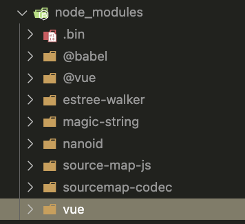
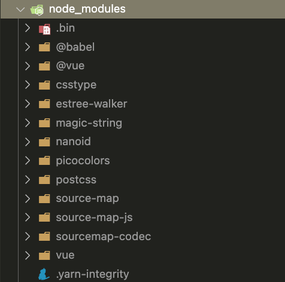
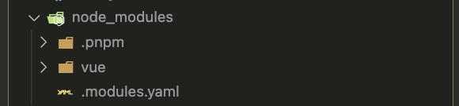
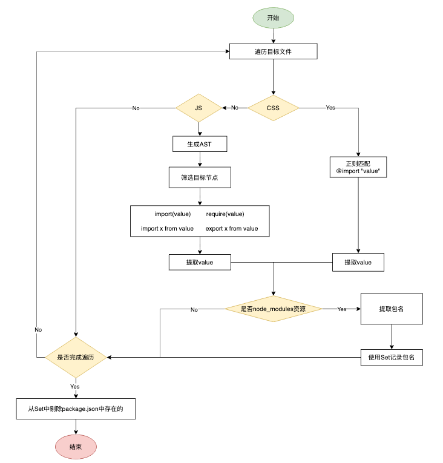
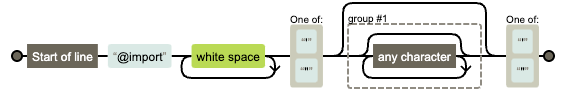
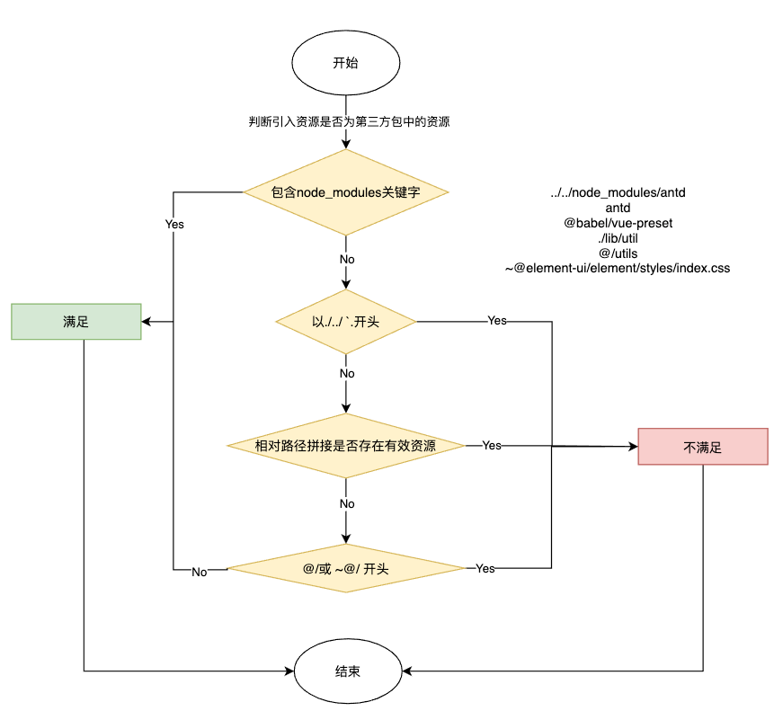

# 实现一个幽灵依赖扫描工具

## 什么是幽灵依赖

**项目中使用了一些没有被定义在其 package.json 文件中的包。**

部分地方也被翻译成了”幻影依赖“，在英文文章中一般称为`phantom dependencies`

## 现状
在现有工程里，除 `pnpm` 外使用的最多的包管理工具就是 `yarn` 其次才是 `npm`。

后两者，在完成依赖安装后，都会有一个依赖提升的动作，也就是依赖的 `扁平化`。

于是装一个库 `vue`，不同包管理器的结果如下

|                                     npm                                     |                                    yarn                                     |                                    pnpm                                     |
| :-------------------------------------------------------------------------: | :-------------------------------------------------------------------------: | :-------------------------------------------------------------------------: |
|  |  |  |

由于依赖的`扁平化`，可以看到前两者会使 `node_modules` 中多出一些其它的东西

也由于这个特性，很多基于 `yarn` 的工程化方案，会将许多常用的依赖或者重要依赖去做一个版本的管控和依赖的收敛，于是项目里需要安装的依赖就少了，看上去就十分清晰。

比如安装`@xx/vue`，同时将相关的`lint`，`test-util`，`git hooks`，`lodash`，`xx-utils`等等包都做了安装，这样在工程里只需要装一个包就能使用这些包的能力。这也算是`幽灵依赖`的好处。

## 背景
### 包管理工具切换pnpm
随着项目的迭代时间越来越长，工程里的依赖包越来越多。依赖安装时间越来越长，即便有安装缓存，还是觉得非常的慢。于是有了换依赖管理工具的诉求。

一番调研后，选择把包管理工具切换为`pnpm`。

### 为什么是 pnpm

通过 pnpm [官方的测评数据](https://www.pnpm.cn/benchmarks) 可以看出，在大多数场景下

安装速度是 `npm/yarn` 的 `2-3`倍，一个项目就算节约`几十秒`，对于承载上前工程的`CI/CD`平台来说，几乎时时刻刻都存在发布的情况，每天的收益是很可观的。对于用户来说等待时间也大幅缩短。

### 为什么做了这个工具
在`yarn`切换到`pnpm`,可以通过`pnpm import`指令实现lock文件的一键转换，避免依赖版本发生变更。

但由于`pnpm`没有依赖扁平化的动作，大部分项目切换后没发直接正常工作，主要原因就是`幽灵依赖`

需要为pnpm项目单独添加[依赖提升的配置](https://www.pnpm.cn/npmrc#public-hoist-pattern)

于是就需要一个扫描幽灵依赖的工具，协助做包管理工具的迁移。网上搜索了一番，没有找到能用的就只好自己🐴一个了。

## 原理介绍
一图胜千言



总结下就是4步
1. 扫文件
2. 提取导入资源路径
3. 提取包名
4. 剔除`package.json`中存在的

## 具体实现
这里只贴几个关键步骤的代码，代码的组织逻辑即上述流程图所示

### 获取扫描目标文件
这块利用`path`与`fs`模块配合即可实现
* 使用`fs.readdirSync`读取文件列表，然后递归即可
* 通过文件后缀`ext`筛选出需要的文件

```ts
type Exclude = string | RegExp

function scanDirFiles(
  dir: string,
  extList: string[] = [],
  exclude: Exclude | Exclude[] = ['node_modules', '.git', '.vscode']
) {
  const files = readdirSync(dir, { withFileTypes: true })
  const res: string[] = []
  for (const file of files) {
    const filename = join(dir, file.name)
    if (isExclude(filename, exclude)) {
      continue
    }

    if (
      file.isFile() &&
      (extList.length === 0 || extList.includes(parse(filename).ext))
    ) {
      res.push(filename)
    }

    if (file.isDirectory()) {
      res.push(...scanDirFiles(filename, extList, exclude))
    }
  }
  return res
}

function isExclude(value: string, exclude: Exclude | Exclude[]) {
  const patterns = [exclude].flat()
  return patterns.find((v) =>
    typeof v === 'string' ? value.includes(v) : v.test(value)
  )
}
```
调用示例
```ts
scanDirFiles(path.join(__dirname))
scanDirFiles(path.join(__dirname), ['.ts'])
scanDirFiles(path.join(__dirname), ['.ts','.js'], 'test')
```

* js 系资源主要包含`.js`,`.jsx`,`.ts`,`.tsx`四类资源
* css 系资源包含`.css`,`.scss`,`.less`,`.sass`
* vue 主要就是`.vue`
  * 只需要把 `script` 和 `style`内容分别拆开处理即可
### JS资源引入路径提取

这里使用 [gogocode](https://github.com/thx/gogocode) 操作AST，配合[astexplorer](https://astexplorer.net/)着使用，操作起来非常简单

导入模块的方式主要有以下4种
```ts
const x = require(value)

const x = import(value)
const x = () => import(value)

import x from value
import value

export x from value
```

`import/export`提取
```ts
import AST, { GoGoAST } from 'gogocode'

const sources: string[] = []
const ast = AST(fileText)

const callback = (node: GoGoAST) => {
  const importPath = node.attr('source.value') as string
  sources.push(importPath)
}
ast.find({ type: 'ImportDeclaration' }).each(callback)
ast.find({ type: 'ExportNamedDeclaration' }).each(callback)
```

`require/import()`提取
```ts
const callback = (node: GoGoAST) => {
  const importPath = node.match[0][0]?.value
  sources.push(importPath)
}
// 处理import('')
ast.find('import($_$)').each(callback)
// 处理require('')
ast.find('require($_$)').each(callback)
```

### CSS资源引入路径提取
针对css，只考虑`@import`场景的情况下，使用正则 `/^@import\s+['"](.*)?['"]/`即可实现提取



```ts
function getCssFileImportSource(fileText: string) {
  const sources: string[] = []
  const importRegexp = /^@import\s+['"](.*)?['"]/
  const lines = fileText.split('\n')
  for (const line of lines) {
    const match = line.trim().match(importRegexp)?.[1]
    if (match) {
      sources.push(match)
    }
  }
  return sources
}
```
### Vue文件中引入路径提取
一个`.vue`文件主要就 `template`, `script`, `style`三部分构成，只需要把`脚本`与`样式`拆开处理即可

```ts
import AST from 'gogocode'

function getVueFileImportSource(fileText: string) {
  const sources: string[] = []
  // 目前发现Vue3 <script lang="ts" setup> 的无法正常解析，所以在解析前先处理一下setup关键字
  const ast = AST(fileText.replace(/<script(.*)setup(.*)>/, '<script$1$2>'), {
    parseOptions: { language: 'vue' }
  })

  // 提取script内容
  const script = ast.find('<script></script>').generate().trim()
  sources.push(...getJsFileImportSource(script))
  // css直接正则处理
  sources.push(...getCssFileImportSource(fileText))
  return sources
}
```

### 第三方依赖判断
资源路径提取出来后，就只需要判断路径是否是node_modules下的资源即可了，流程如下



```ts
import path, { parse } from 'path'
import { existsSync } from 'fs'
function isValidNodeModulesSource(
  filePath: string,
  importSourcePath: string
) {
  const { dir } = parse(filePath)
  if (!importSourcePath) {
    return false
  }
  if (importSourcePath.includes('node_modules')) {
    return true
  }
  if (
    ['./', '../', '@/', '~@/', '`'].some((prefix) =>
      importSourcePath.startsWith(prefix)
    )
  ) {
    return false
  }
  if (
    ['', ...cssExt, ...jsExt].some((ext) =>
      existsSync(join(dir, `${importSourcePath}${ext}`))
    )
  ) {
    return false
  }
  return true
}
```

### 提取包名
接下来就是从筛选出来的`有效资源路径`里提取出包名了，通常就两种场景`pkgName`和`@scope/pkgName`，通过几个常用的API就能搞定

```ts
function getPkgNameBySourcePath(pkgPath: string) {
  const paths = pkgPath
    .replace(/~/g, '')
    .replace(/.*node_modules\//, '')
    .split('/')
  return paths[0].startsWith('@') ? paths.slice(0, 2).join('/') : paths[0]
}
```
```ts
test('getPkgNameBySourcePath', () => {
  expect(getPkgNameBySourcePath('fs')).toBe('fs')
  expect(getPkgNameBySourcePath('@vue/ssr')).toBe('@vue/ssr')
  expect(getPkgNameBySourcePath('vue/dist/index.js')).toBe('vue')
  expect(getPkgNameBySourcePath('../node_modules/vue')).toBe('vue')
  expect(getPkgNameBySourcePath('~@element/ui/dist/index.css')).toBe(
    '@element/ui'
  )
})
```


### 过滤掉不合法的包名
上述规则不能涵盖到所有情况，取到的包名可能有不合法的如`this.xxx`,`xx.resolve(yyy)`,`Node内置的包 fs/path/process/...etc`

针对Node内置的包可以直接写个正则搞定,当然这段正则来源于`Copilot`推荐
```sh
function isNodeLib(v: string) {
  return /^(?:assert|buffer|child_process|cluster|console|constants|crypto|dgram|dns|domain|events|fs|http|https|module|net|os|path|punycode|querystring|readline|repl|stream|string_decoder|sys|timers|tls|tty|url|util|vm|zlib)$/.test(
    v
  )
}
```

当然也有现成的第三方包可以直接使用 [validate-npm-package-name](https://www.npmjs.com/package/validate-npm-package-name) ,这个是官方出品的，用法也就更加简单了
* 不仅仅能过滤掉Node内置包，还能过滤掉不合法命名的包

```ts
import validPkgName from 'validate-npm-package-name'

function isValidPkgName(pkgName: string): boolean {
  const { validForNewPackages, validForOldPackages} = validPkgName(pkgName)

  return validForNewPackages
}
```
```ts
test('isValidPkgName', () => {
  expect(isValidPkgName('vue')).toBe(true)
  expect(isValidPkgName('some-package')).toBe(true)
  expect(isValidPkgName('@jane/foo.js')).toBe(true)
  expect(isValidPkgName('r.resolve("custom-token.js")')).toBe(false)
  expect(isValidPkgName('dayjs/dsds/abc.js')).toBe(false)
})
```

关键一系列方法搞定后，只需要进行逻辑的组织即可，[Github查看最终方法源码](https://github.com/ATQQ/tools/blob/8e0a79d093b3f03a47adff4d7fc0569f19a398e4/packages/cli/ghost/src/util/index.ts#L15-L81)

## 上手体验
已将最终实现整成了`npm`包`@sugarat/ghost`，项目可引入直接使用

为什么叫`ghost`而不是`phantom`？可能大家对`ghost`👻这个单词的意思更加熟悉一些
### CLI 工具
```sh
npm i -g @sugarat/ghost

# default scan src
ghost scan
```
### 项目中调用
```sh
npm i @sugarat/ghost
# or
yarn add @sugarat/ghost
# or
pnpm add @sugarat/ghost
```

```ts
import { findGhost } from '@sugarat/ghost'
// or
import { findPhantom } from '@sugarat/ghost'
```
```ts
const phantomDependency = findGhost(
  path.join(__dirname, 'src'),
  path.join(process.cwd(), 'package.json')
)
```

## 最后
`pnpm` 是个好东西，推荐大家可以用起来了

欢迎评论区交流指正，有 `case` 可以抛出来帮助工具完善得更好
* [项目完整源码](https://github.com/ATQQ/tools/tree/main/packages/cli/ghost)


