# webpack 项目接入Vite的通用方案介绍

## 愿景
希望通过本文，能给读者提供一个存/增量项目（包含但不限于webpack工程）接入Vite的点子，起抛砖引玉的作用，减少这方面能力的建设成本

在阐述过程中同时也会逐渐完善[webpack-vite-serve](https://github.com/ATQQ/webpack-vite-serve)这个工具

读者可直接fork这个工具仓库，针对个人/公司项目场景进行定制化的二次开发，也可在issues中留言遇到的问题

## 1 背景
### 1.1 现状 - Vite诞生背景

>引用自[Vite官方文档](https://cn.vitejs.dev/guide/why.html)的介绍

在浏览器支持 ES 模块之前，JavaScript 并没有提供的原生机制让开发者以模块化的方式进行开发。这也正是我们对 “打包” 这个概念熟悉的原因：使用工具抓取、处理并将我们的源码模块串联成可以在浏览器中运行的文件。

时过境迁，我们见证了诸如 webpack、Rollup 和 Parcel 等工具的变迁，它们极大地改善了前端开发者的开发体验。

然而，当我们开始构建越来越大型的应用时，需要处理的 JavaScript 代码量也呈指数级增长。包含数千个模块的大型项目相当普遍。

我们开始遇到性能瓶颈 —— 使用 JavaScript 开发的工具通常需要很长时间（甚至是几分钟！）才能启动开发服务器，即使使用 HMR，文件修改后的效果也需要几秒钟才能在浏览器中反映出来。

如此循环往复，迟钝的反馈会极大地影响开发者的开发效率和幸福感。

**Vite 旨在利用生态系统中的新进展解决上述问题**
* 浏览器开始原生支持 ES 模块
* 越来越多 JavaScript 工具使用编译型语言编写。

### 1.2 当下流行趋势
#### 1.2.1 SWC与esbuild

突破Node.js的性能瓶颈，出现了用其它语言写的工具，帮助构建/开发提效，如 [SWC（Rust）](https://github.com/swc-project/swc)，[esbuild（Go）](https://github.com/evanw/esbuild)，在部分场景下能替代传统Node.js工具工作，并表现非常好。

<table-base src="swc-esbuild"/>

#### 1.2.2 Vite与snowpack

另一种火热的方案是bundleless，利用浏览器原生支持 ES Module 的特性，让浏览器接管"打包"的部分工作，工具只负责对请求的资源进行简单的转换，从而极大的减少服务的启动时间，提升开发体验与开发幸福感

比较出名的两个产品就是 snowpack 与 Vite

<table-base src="vite-snowpack"/>

### 1.3 问题与诉求
开发者或技术团队为保持框架技术的先进性，将会接入vite，从而提升开发者的工作效率

#### 1.3.1 问题

在当下的业务开发中处处可见[webpack](https://webpack.docschina.org/concepts/)的身影，大部分的业务项目采用的构建工具也都是它，但随着时间的推移，存量老项目体积越来越大，开发启动(dev)/构建(build) 需要的时间越来越长。

存量webpack项目数目庞大，同时项目体积也不小。围绕webpack所建立的周边也是比vite更加丰富，老项目对其依赖性强。

从webpack直接迁移到vite，迁移和回归测试成本都非常大。

#### 1.3.2 诉求
期望提供一个低成本甚至一键接入Vite方案，开发者按需开启使用，无需进行额外的配置，与webpack共存。

### 1.4 为什么选Vite，而不是snowpack
#### 1.4.1 生产构建

Snowpack
* 默认构建输出是未打包的：它将每个文件转换为单独的构建模块，然后将这些模块提供给执行实际绑定的不同“优化器”。这么做的好处是，你可以选择不同终端打包器，以适应不同需求（例如 webpack, Rollup，甚至是 ESbuild）
* 缺点是体验有些支离破碎 —— 例如，esbuild 优化器仍然是不稳定的，Rollup 优化器也不是官方维护，而不同的优化器又有不同的输出和配置。

Vite
* 选择了与单个打包器（Rollup）进行更深入的集成。
* 支持一套通用插件API 扩展了 Rollup 的插件接口，开发和构建两种模式都适用。

#### 1.4.2 Vite支持更多的特性
支持目前在 Snowpack 构建优化器中不可用的多种功能：
* 多页面应用支持
* 库模式
* 自动分割 CSS 代码
* 预优化的异步 chunk 加载
* 对动态导入自动 polyfill
* 官方 兼容模式插件 打包为现代/传统两种产物，并根据浏览器支持自动交付正确的版本。
* 更快的依赖预构建
* Monorepo 支持
* CSS 预处理器支持。。。
## 2 目标

**为webpack项目开发环境提供最简单的Vite接入方案**

待接入项目只需要做极小的变动就能享受到`Vite`带来的开发乐趣

**通过CLI工具为项目提供一个一键接入Vite能力**

Tips：大部分框架都有自己的CLI工具，没有CLI工具也可以CLI工具的形式提供使用Vite的能力，方便维护与升级

## 3 实现方案介绍
### 3.1 再次思考Vite是什么
* 官方：下一代前端开发与构建工具 （feature：💡极速的服务启动、⚡️轻量快速的热重载）
* 祖师爷(yyx)：上层的工具链方案，对标 （webpack + 针对 web 的常用配置 + webpack-dev-server）
* 笔者：一个非常Nice的前端构建工具，能够提高开发者编码幸福感与舒适度
### 3.2 Vite原理介绍
官方文档中有提到
* Vite使用原生 ESM 文件，无需打包!
* Vite 将 index.html 视为源码和模块图的一部分。
* Vite 解析 `<script type="module" src="...">`，这个标签指向你的 JavaScript 源码。
#### 3.2.1 script module
浏览器原生支持的JS的模块能力，遵循ES Module规范，从 [caniuse](https://caniuse.com/?search=script%20module) 上的数据来看，大约95%的浏览器都支持

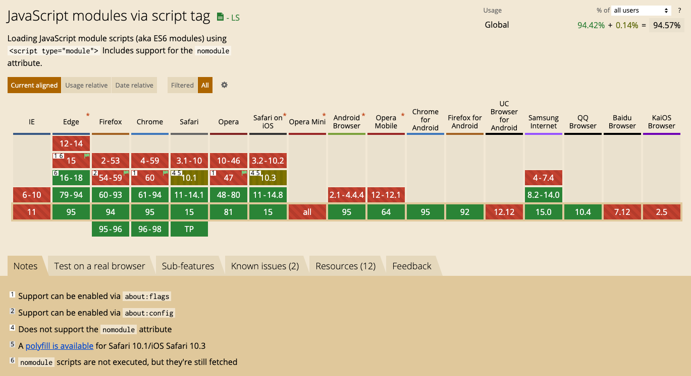

使用示例

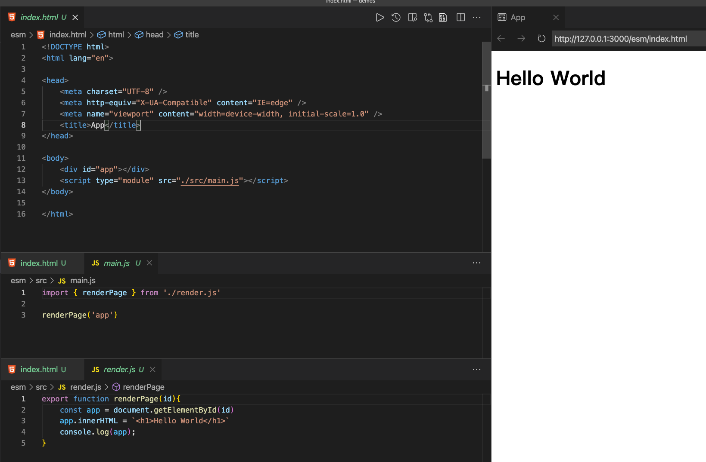

#### 3.2.2 Vite快的原因

<table-base src="vite-webpack"/>

有了浏览器提供模块化的基础，Vite只需要做静态资源的转化工作就可
* ts,jsx转换
* node_modules资源处理
* 。。。and more

#### 3.2.3 实现mini Vite开发服务器
Vite基本原理就是通过Node启动一个HttpServer，拦截浏览器的ES Module请求，根据资源/模块请求路径，在工作目录中查找到对应的文件，再转换成ES Module的形式返回给浏览器。

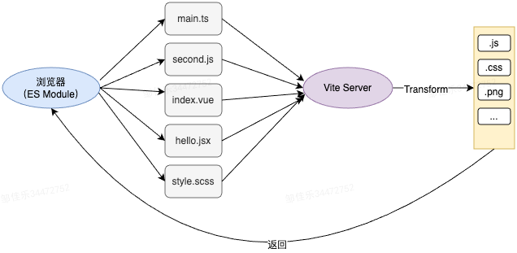

包含 scss/css/ts 的资源处理的一个demo。[在线体验地址（包含源码）](https://stackblitz.com/edit/node-qt2m2e?file=README.md)

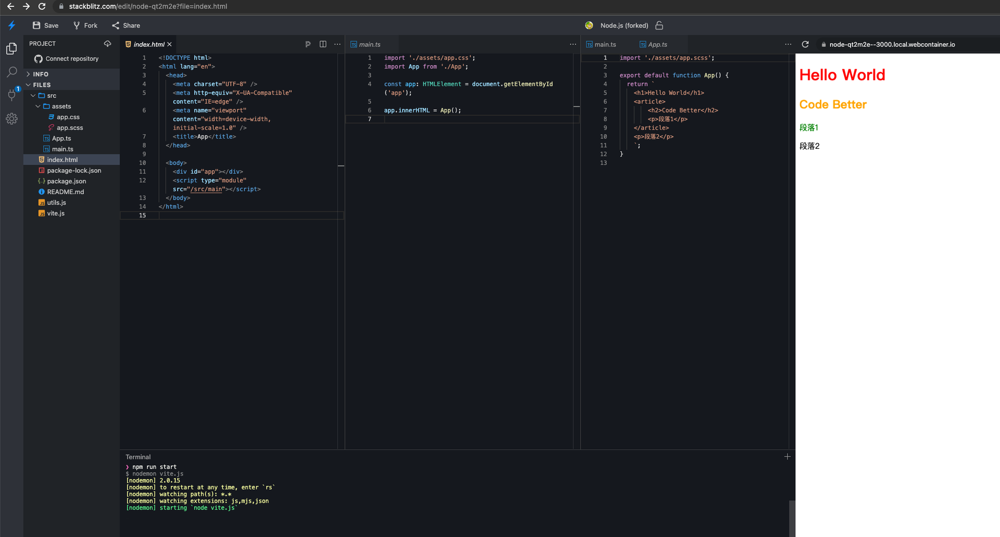

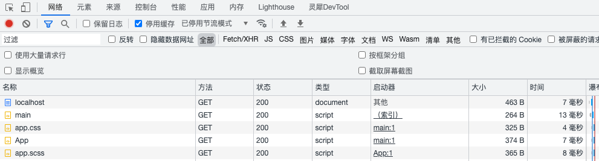

demo的目录结构如下
```sh
├── src
|  ├── App.ts
|  ├── assets
|  |  ├── app.css
|  |  └── app.scss
|  └── main.ts
├── index.html
```

开发服务器的实现如下
* 通过 http 模块，创建一个服务器实例，监听3000端口
* 请求头包含 'text/html', 'application/xhtml+xml' 则认定为请求html文档
* 其余资源，交由 esbuild 与 sass 做进一步处理

<my-details title="点击查看完整源码与实现步骤">

```js
// vite.js
const http = require('http');
const { readFileSync } = require('fs');
const { getSourceType, transformSource } = require('./utils')

const server = http.createServer((req, res) => {
  const htmlAccepts = ['text/html', 'application/xhtml+xml'];
  const isHtml = !!htmlAccepts.find((a) => req.headers?.accept?.includes(a));
  // HTML文档
  if (isHtml) {
    res.end(readFileSync('./index.html'));
    return;
  }
  const url = new URL(req.url, 'http://localhost');
  const { pathname } = url
  // 其它资源
  const type = getSourceType(pathname)
  res.setHeader('content-type','application/javascript')
  res.end(transformSource(type, pathname));
});

server.listen(3000);
```

esbuild 处理js（jsx,ts,cjs,mjs等等）相关的文件

```js
const { transformSync } = require('esbuild')
const res = transformSync(sourceCode, {
    format: 'esm',
    minify: true,
    loader: 'ts'
}).code
```

sass 负责 scss文件的转换
```js
const sass = require('sass')
const css = sass.renderSync({
    data: code
}).css.toString()
```

资源处理逻辑如下：
* 根据请求资源路径，判断资源可能的类型
* 利用对应的转换器，将资源**转换成浏览器可识别的js代码**

```js
// utils.js
const { readFileSync, existsSync } = require('fs');
const path = require('path');
const sass = require('sass')
const { transformSync } = require('esbuild')

const resolved = (...p) => path.join(process.cwd(), ...p);

/**
 * 获取资源类型
 */
function getSourceType(pathname) {
    // TODO: 省略 tsx,jsx
    const jsSourceType = ['ts', 'js']
    // TODO：还有很多其它资源
    const sourceType = [...jsSourceType, 'css', 'scss']
    let type = sourceType.find(t => pathname.endsWith(`.${t}`))

    if (!type && !/\..+$/.test(pathname)) {
        type = jsSourceType.find(t => {
            return existsSync(resolved(`${pathname}.${t}`))
        })
    }
    return type
}

/**
 * 获取资源的源码
 * @returns
 */
function getSourceCode(type, pathname) {
    if (existsSync(resolved(pathname))) {
        return readFileSync(resolved(pathname), { encoding: 'utf-8' })
    }
    if (existsSync(resolved(`${pathname}.${type}`))) {
        return readFileSync(resolved(`${pathname}.${type}`), { encoding: 'utf-8' })
    }
    return ''
}

/**
 * 添加内联样式表
 */
function addInlineStyle(code) {
    return `{
        const style = document.createElement('style')
        style.textContent = \`${code}\`
        document.head.appendChild(style)
    }
    `
}
/**
 * 转换资源
 */
function transformSource(type, pathname) {
    const sourceCode = getSourceCode(type, pathname)

    const ops = {
        css(code) {
            return addInlineStyle(code)
        },
        scss(code) {
            const css = sass.renderSync({
                data: code
            }).css.toString()
            return this.css(css)
        },
        ts(code) {
            return transformSync(code, {
                format: 'esm',
                minify: true,
                loader: 'ts'
            }).code
        },
        js(code) {
            return transformSync(code, {
                format: 'esm',
                minify: true,
                loader: 'js'
            }).code
        },
    }
    return ops[type] ? ops[type](sourceCode) : sourceCode
}

module.exports = {
    resolved,
    getSourceType,
    transformSource
}
```
</my-details>

### 3.3 Vite插件系统简介
Vite 插件扩展了设计出色的 Rollup 接口，带有一些 Vite 独有的配置项。

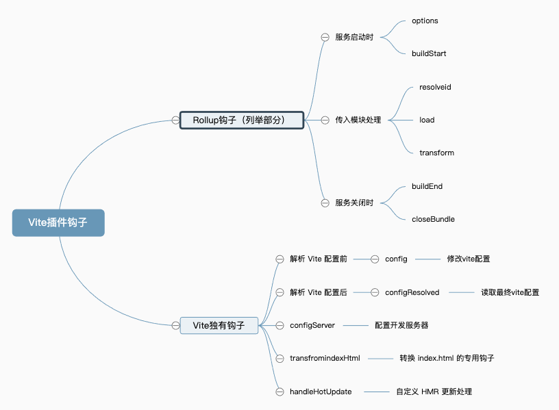

### 3.4 方案概述
#### 3.4.1 要解决的问题
解决这些问题也是方案实现的关键点

<table-base src="vite-problem"/>

#### 3.4.2 CLI结构

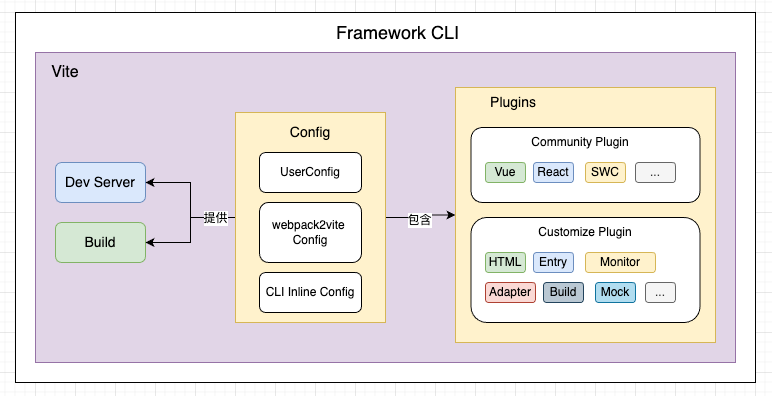

* 通过Plugin拓展Vite的能力，将常用插件全部内置
  * 内置框架相关的Plugin
  * 内置业务常用Plugin
* 将Vite相关的配置全部收敛于插件内，同时支持用户通过外部配置文件 vite.conig.ts 修改&拓展Vite能力
* 内部通过配置转换插件自动将Webpack配置转化为Vite配置
* 通过CLI工具，封装Vite的能力

## 4 方案实现
能力优先通过VIte插件提供，然后将实现的插件进行内置。
### 4.1 Dev-HTML模板处理

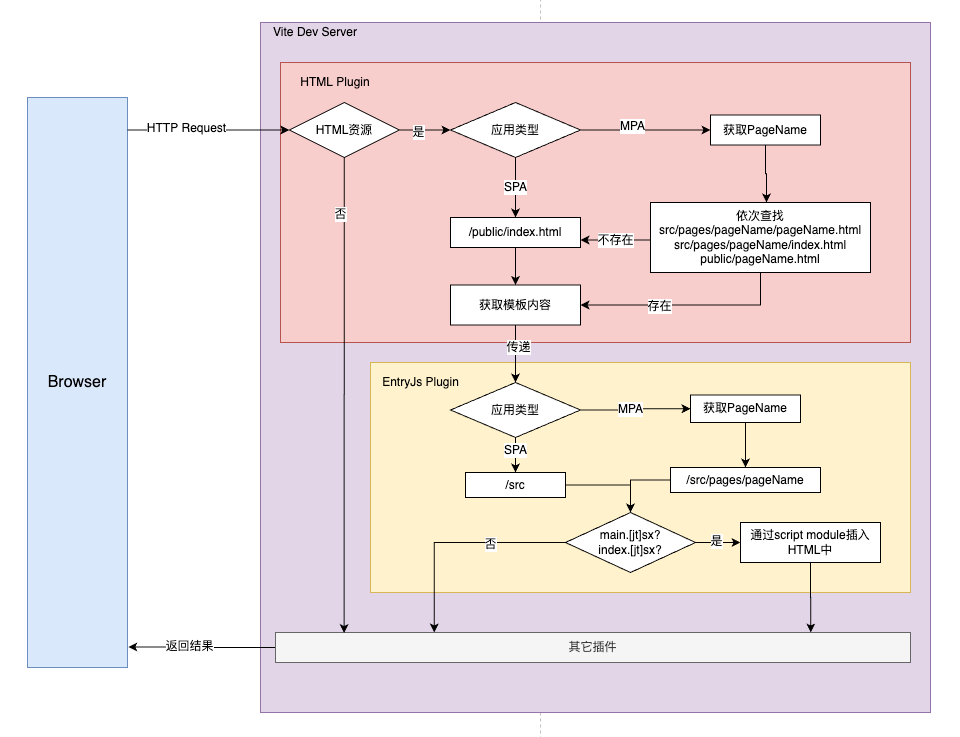

Vite默认是将启动目录下的 index.html的文件，作为启动入口，而在传统的webpack项目中，这个模板文件是在 public/index.html或者src/pages/pageName下

所以需要优先处理Html模板的问题

#### 4.1.1 初始化模板内容

首先通过 configureServer 钩子注册一个自定义的中间件。处理开发服务器的资源请求

当请求头包含 text/html 与 application/xhtml+xml，可以认定为是请求的HTML文档

紧接着根据请求的资源路径查找本地文档

<my-details title="点击展开源码">

```ts
export default function HtmlTemplatePlugin(): PluginOption {
  return {
    name: 'wvs-html-tpl',
    apply: 'serve',
    configureServer(server) {
      const { middlewares: app } = server;
      app.use(async (req, res, next) => {
        const htmlAccepts = ['text/html', 'application/xhtml+xml'];
        const isHtml = !!htmlAccepts.find((a) => req.headers?.accept?.includes(a));
        if (isHtml) {
          const originHtml = loadHtmlContent(req.url);
          const html = await server.transformIndexHtml(req.url, originHtml, req.originalUrl);
          res.end(html);
          return;
        }
        next();
      });
    },
    transformIndexHtml(html) {
      return transformTpl(html);
    },
  };
}
```

</my-details>

SPA 默认使用 public/index.html

MPA默认按照如下路径进行查找
* src/pages/${entryName}/${entryName}.html
* src/pages/${entryName}/index.html
* public/${entryName}.html
* public/index.html

<my-details title="点击展开源码">

```ts
/**
 * 获取原始模板
 */
function loadHtmlContent(reqPath:string) {
  // 兜底页面
  const pages = [path.resolve(__dirname, '../../public/index.html')];
  // 单页/多页默认 public/index.html
  pages.unshift(resolved('public/index.html'));
  // 多页应用可以根据请求的 路径 作进一步的判断
  if (isMPA()) {
    const entryName = getEntryName(reqPath);
    if (entryName) {
    // src/pages/${entryName}/${entryName}.html
    // src/pages/${entryName}/index.html
    // public/${entryName}.html
      pages.unshift(resolved(`public/${entryName}.html`));
      pages.unshift(resolved(`src/pages/${entryName}/index.html`));
      pages.unshift(resolved(`src/pages/${entryName}/${entryName}.html`));
    }
  }
  // TODO：根据框架的配置寻找，可自行进一步拓展
  const page = pages.find((v) => existsSync(v));
  return readFileSync(page, { encoding: 'utf-8' });
}
```
</my-details>

获取到原始的模板内容后，通常原始模板中可能会包含一些EJS的语法

可以通过 transformIndexHtml 钩子对模板内容进行一个进一步的处理

```ts
export default function HtmlTemplatePlugin(): PluginOption {
  return {
    transformIndexHtml(html) {
      return transformTpl(html);
    },
  };
}
```

transformTpl方法的实现，可以根据具体的场景进行实现，这里提供一个简单的正则替换实现

<my-details title="点击展开源码">

```ts
export function transformTpl(tplStr:string, data = {}, ops?:{
 backup?:string
 matches?:RegExp[]
}) {
  data = {
    PUBLIC_URL: '.',
    BASE_URL: './',
    htmlWebpackPlugin: {
      options: {
        title: 'App',
      },
    },
    ...data,
  };
  const { backup = '', matches = [] } = ops || {};
  // match %Name% <%Name%>
  return [/<?%=?(.*)%>?/g].concat(matches).reduce((tpl, r) => tpl.replace(r, (_, $1) => {
    const keys = $1.trim().split('.');
    const v = keys.reduce((pre, k) => (pre instanceof Object ? pre[k] : pre), data);
    return (v === null || v === undefined) ? backup : v;
  }), tplStr);
}
```
</my-details>

#### 4.1.2 插入entryJs

模板处理完成后，需要再模板中通过 script 标签引入entryJs才能正常的进行工作

```html
<script type="module" src="$entryPath"></script>
<!--例如-->
<script type="module" src="/src/main"></script>
<script type="module" src="/src/pages/pageName/index"></script>
```

这部分的处理相对简单，只需要调用 transformIndexHtml 钩子即可

```ts
export default function pageEntryPlugin(): PluginOption {
  return {
    name: 'wvs-page-entry',
    apply: 'serve',
    transformIndexHtml(html, ctx) {
      const entry = getPageEntry(ctx.originalUrl);
      if (!entry) {
        return html;
      }
      return html.replace('</body>', `<script type="module" src="${path.join('/', entry)}"></script>
        </body>
        `);
    },
  };
}
```
entryJs的获取逻辑如下：
* entry命名通过正则 `/(index|main)\.[jt]sx?$/` 进行筛选
* SPA查找目录 `src`
* MPA查找目录 `src/pages/pageName`

<my-details title="点击展开源码">

```ts
function getPageEntry(reqUrl) {
  if (isMPA()) {
    const pageName = getPageName(reqUrl);
    return !!pageName && getEntryFullPath(`src/pages/${pageName}`);
  }
  // 其它场景跟MPA处理类似

  // 默认SPA
  const SPABase = 'src';
  return getEntryFullPath(SPABase);
}

function getEntryFullPath(dirPath) {
  if (!existsSync(resolved(dirPath))) {
    return false;
  }
  // main|index.js|ts|jsx|tsx
  const entryName = /(index|main)\.[jt]sx?$/;
  const entryNames = readdirSync(resolved(dirPath), { withFileTypes: true })
    .filter((v) => {
      entryName.lastIndex = 0;
      return v.isFile() && entryName.test(v.name);
    });
  return entryNames.length > 0 ? path.join(dirPath, entryNames[0].name) : false;
}
```
</my-details>

其中 pageName 根据请求的资源路径，使用 “/ ” 分割，对每个分割内容进行文件目录的存在与否进行判断

```ts
export function getPageName(reqUrl:string) {
  // TODO：兼容webpack配置 historyRewrites
  const { pathname } = new URL(reqUrl, 'http://localhost');
  const paths = pathname.split('/').filter((v) => !!v);
  const entryName = paths.find((p) => existsSync(path.join(getCWD(), 'src/pages', p)));
  return entryName || '';
}
```

### 4.2 Production-Build

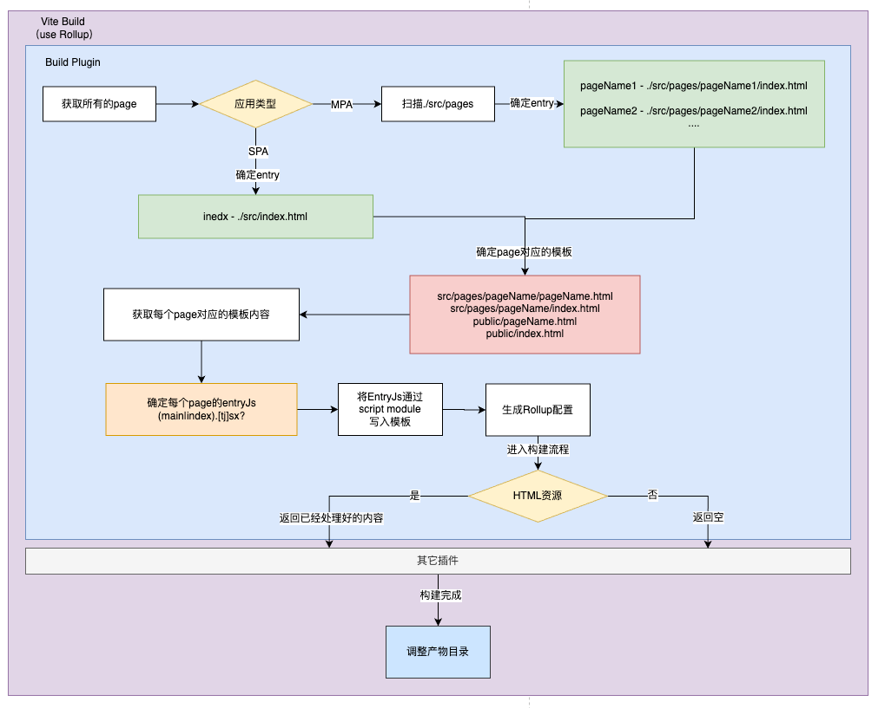

vite构建的入口也是 html，通过 build.rollup.input 属性设置
```ts
// vite.config.ts
import { defineConfig } from 'vite';

export default defineConfig({
  build: {
    rollupOptions: {
      input: {
        index: 'src/pages/index/index.html',
        second: 'src/pages/second/second.html',
      },
    },
  },
});
```
按照如上配置，构建产物中的html目录将会如下
```sh
* dist
  * src/pages/index/index.html
  * src/pages/second/second.html
  * assets
```
不太符合通常的习惯，常规格式如下
```sh
* dist
  * index.html
  * second.html
  * assets
```

所以需要通过插件 处理构建入口文件 和 调整构建后的产物位置

#### 4.2.1 插件结构
通过 configResolved 钩子获取最终配置，配置提供给其它钩子使用

约定pageEntry的目录
* SPA：src
* MPA：src/pages

<my-details title="点击展开源码">

```ts
export default function BuildPlugin(): PluginOption {
  let userConfig:ResolvedConfig = null;
  return {
    name: 'wvs-build',
    // 只在构建阶段生效
    apply: 'build',
    // 获取最终配置
    configResolved(cfg) {
      userConfig = cfg;
    },
    // 插件配置处理
    config() {

    },
    resolveId(id) {

    },
    load(id) {

    },
    // 构建完成后
    closeBundle() {

    },
  };
}
```
</my-details>

#### 4.2.2 获取所有的entry

```ts
const entry = [];
if (isMPA()) {
  entry.push(...getMpaPageEntry());
} else {
  // 单页应用
  entry.push({
    entryName: 'index',
    entryHtml: 'public/index.html',
    entryJs: getEntryFullPath('src'),
  });
}
```

MPA的pageEntry逻辑获取如下:
1. 先获取所有的entryName
2. 再查询遍历每个page对应的 entryJs 与 entryHtml

<my-details title="点击展开源码">

```ts
export function getMpaPageEntry(baseDir = 'src/pages') {
  // 获取所有的EntryName
  const entryNameList = readdirSync(resolved(baseDir), { withFileTypes: true })
    .filter((v) => v.isDirectory())
    .map((v) => v.name);

  return entryNameList
    .map((entryName) => ({ entryName, entryHtml: '', entryJs: getEntryFullPath(path.join(baseDir, entryName)) }))
    .filter((v) => !!v.entryJs)
    .map((v) => {
      const { entryName } = v;
      const entryHtml = [
        // src/pages/${entryName}/${entryName}.html
        resolved(`src/pages/${entryName}/${entryName}.html`),
        // src/pages/${entryName}/index.html
        resolved(`src/pages/${entryName}/index.html`),
        // public/${entryName}.html
        resolved(`public/${entryName}.html`),
        // 应用兜底
        resolved('public/index.html'),
        // CLI兜底页面
        path.resolve(__dirname, '../index.html'),
      ].find((html) => existsSync(html));
      return {
        ...v,
        entryHtml,
      };
    });
}
```
</my-details>

#### 4.2.3 生成Build所需配置
根据获取的所有 entry生成最终构建所需的配置
* 获取每个 entryHtml 的内容,然后使用 map 进行临时的存储
* 构建入口模板路径取 entryJs 的目录加index.html

<my-details title="点击展开源码">

```ts
const htmlContentMap = new Map();
// 省略其它无关代码
{
  config() {
    const input = entry.reduce((pre, v) => {
      const { entryName, entryHtml, entryJs } = v;
      const html = getEntryHtml(resolved(entryHtml), path.join('/', entryJs));
      const htmlEntryPath = resolved(path.parse(entryJs).dir, tempHtmlName);
      // 存储内容
      htmlContentMap.set(htmlEntryPath, html);
      pre[entryName] = htmlEntryPath;
      return pre;
    }, {});
    return {
      build: {
        rollupOptions: {
          input,
        },
      },
    };
  }
}
```
</my-details>

#### 4.2.4 入口HTML内容生成

实际上htmlEntryPath这个路径并不是真实存在的（不存在这个文件）

需要通过 resolveId 与 load 钩子，利用 htmlContentMap 存储的内容进行进一步的处理

```ts
{
  load(id) {
    if (id.endsWith('.html')) {
      return htmlContentMap.get(id);
    }
    return null;
  },
  resolveId(id) {
    if (id.endsWith('.html')) {
      return id;
    }
    return null;
  },
}
```

其中 id 为资源请求的路径，直接从 htmlContentMap 取出模板的内容即可

构建完成后，需要调整html文档的位置，使其符合预期

#### 4.2.5 产物目录调整
使用 closeBundle 钩子，在构建完成后，服务关闭前进行文件调整
* 遍历`entry`将`dist/src/pages/pageName/index.html`移动到`dist`下
* 移除`dist/src`下的内容

```ts
closeBundle() {
  const { outDir } = userConfig.build;
  // 目录调整
  entry.forEach((e) => {
    const { entryName, entryJs } = e;
    const outputHtmlPath = resolved(outDir, path.parse(entryJs).dir, tempHtmlName);
    writeFileSync(resolved(outDir, `${entryName}.html`), readFileSync(outputHtmlPath));
  });
  // 移除临时资源
  rmdirSync(resolved(outDir, 'src'), { recursive: true });
}
```

### 4.3 Vite配置处理
#### 4.3.1 读取用户配置

Vite 提供了一个现成的方法用于读取与解析Vite的配置文件

```ts
import { loadConfigFromFile, ConfigEnv } from 'vite';

export function getUserConfig(configEnv:ConfigEnv, suffix = '') {
  const configName = 'vite.config';
  const _suffix = ['ts', 'js', 'mjs', 'cjs'];
  if (suffix) {
    _suffix.unshift(suffix);
  }
  const configFile = _suffix.map((s) => `${configName}.${s}`).find((s) => existsSync(s));
  return loadConfigFromFile(configEnv, configFile);
}
```

获取配置后通过 config 钩子，将配置并入最终的配置之中

```ts
import type { PluginOption } from 'vite';
import { getUserConfig } from '../utils';

export default function UserConfigPlugin(): PluginOption {
  return {
    name: 'wvs-config',
    async config(cfg, env) {
      const userConfig = await getUserConfig(env);
      return {
        ...userConfig?.config,
      };
    },
  };
}
```

#### 4.3.2 转换webpack配置

目前社区已经有一个CLI工具，[wp2vite](https://github.com/tnfe/wp2vite) 支持常规Vue/React项目的[webpack配置](https://www.webpackjs.com/configuration/)的自动转换到[vite配置](https://cn.vitejs.dev/config/)

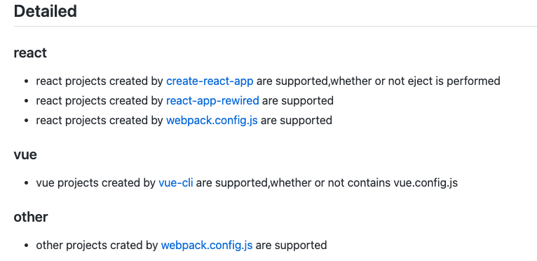

```sh
npm install -g wp2vite
```

根目录执行 wp2vite 即可自动转换
* 但由于是一个CLI工具，并没有将内部转换配置的方法暴露出来
* 工具是开源的。使用方可以对其进行二次的定制，复用其部分能力
* 获取到转换后的配置后，同上通过config钩子并入最终配置即可

### 4.4 CLI工具支持
Vite支持在启动命令中指定配置文件的路径，这为CLI内置Vite能力提供了便利

```sh
vite -c configFilePath
```

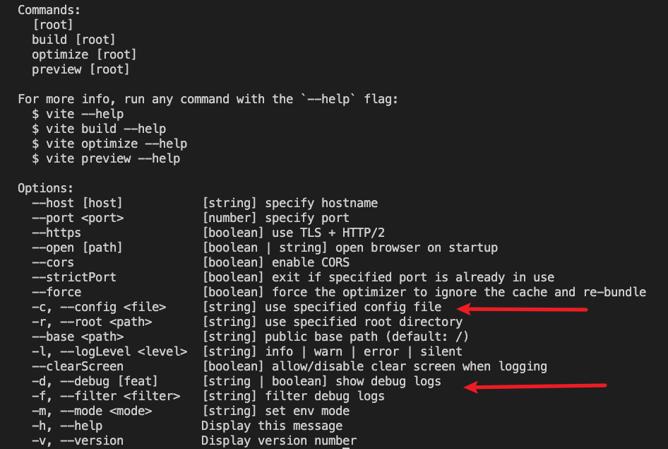

CLI内部可以通过 spawn 创建子进程启动，也可使用vite对外暴露的`createServer`方法

```ts
import spawn from 'cross-spawn';
// 或者
import { spawn } from 'child_process';

const configPath = require.resolve('./../config/vite.js');
const params = ['--config', configPath];

if (debug) {
  // 标志debug
  process.env.DEBUG = 'true';

  // vite debug
  params.push('--debug');
  if (typeof debug === 'string') {
    params.push(debug);
  }
}

const viteService = spawn('vite', params, {
  cwd: process.cwd(),
  stdio: 'inherit',
});
```

## 5 效果 - 接入Vite前后对比
启动提速≈70% - 80% HMR速度碾压
### 5.1 Vue SPA


### 5.2 React SPA


## 6 总结与展望

### 6.1 总结

本文主要讲述了，项目（包含但不限于webpack工程）接入Vite的通用方案与核心部分逻辑的实现。

为读者提供了一种Web工程接入Vite的思路。

企业：大部分是拥有自己的研发框架，在研发框架中只需要加入一个Vite启动的CLI指令，这样对接入方的影响与使用成本是最小的

个人：喜欢折腾/不想改动原来的代码，可以按上述流程自己接一下，新项目可以直接使用Vite官方模板开发

总之：**开发中使用`Vite`还是很香的**

### 6.2 未来展望

Vite是一颗冉冉升起的前端新星，相信随着周边的不断完善。工程使用Vite作为构建工具的比例会大大的增加。

在只兼容现代浏览器的前提下，bundleless方案将会大放异彩，极大的提升产物的构建速度，再也不用发一次版要等几分钟甚至几十分钟才能Build完成，尤其是在需要频繁部署的测试环境之中。

## 后续规划
* [ ] 目前`wp2vite`在配置转换这一块，还不能太满足使用要求，准备提PR增强一下
* [ ] 将内部能力抽成一个个单独的vite插件
* [ ] 将日常所需能力进行内置
* [ ] 将常见问题的解决方案进行内置
* [ ] 减小包体积，加快下载速度
* [ ] 完善文档

## 参考资料
* [掘金：js打包时间缩短90%，bundleless生产环境实践总结](https://juejin.cn/post/7010585760642367496#heading-1)
* [掘金：可能是最完善的 React+Vite 解决方案，阿里飞冰团队发布 icejs 2.0 版本](https://juejin.cn/post/7026616296426962958)
* [近 20k Star的项目说不做就不做了，但总结的内容值得借鉴](https://juejin.cn/post/7010922819143860261)
* [知乎：Vite 的目标不是要干掉 webpack](https://www.zhihu.com/question/477139054/answer/2156019180)
* [知乎：彻底告别编译 OOM，用 esbuild 做压缩器](https://zhuanlan.zhihu.com/p/139219361)
* [Vite官方中文文档](https://cn.vitejs.dev/guide/why.html)


