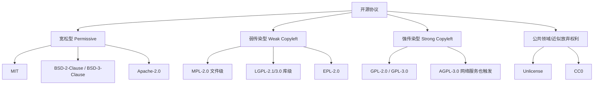
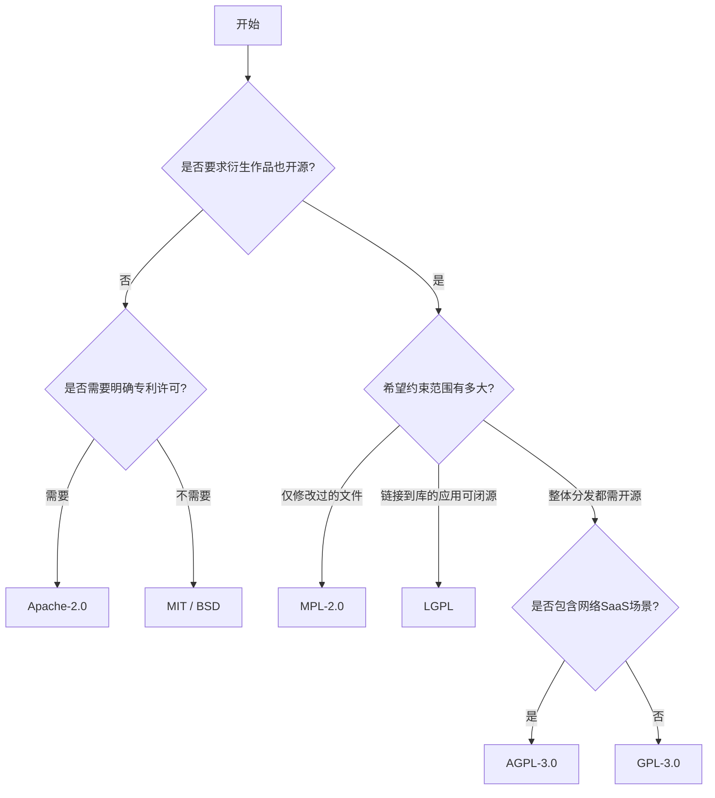
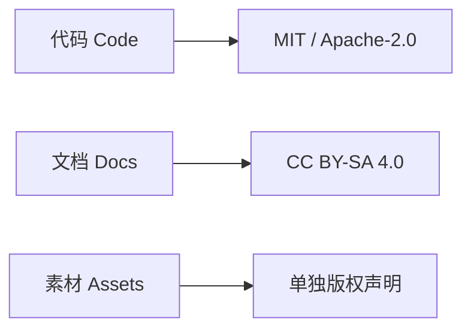

# 开源协议选择指南（含 Mermaid 决策图）

> 本文用于工程实践中的快速决策，不构成法律意见。涉及商业合规、专利风险或跨法域发行时，建议咨询专业律师。

## 1. 为什么要选协议

开源协议核心解决 4 件事：

1. 别人可以做什么（使用、修改、分发、商用）。
2. 别人必须做什么（保留版权声明、开源修改、声明变更等）。
3. 你如何免责（不对使用结果担保）。
4. 你是否授予专利许可（如 Apache-2.0）。

---

## 2. 常见协议全景

---

## 3. 一图决策：我该选哪个

---

## 4. 重点协议对比（工程常用）

| 协议 | 商用 | 修改后闭源 | 分发时要求 | 专利条款 | 适合场景 |
|---|---|---|---|---|---|
| MIT | 允许 | 允许 | 保留版权和许可文本 | 无明确授予 | 最简开放、组件生态 |
| BSD-2/3 | 允许 | 允许 | 保留版权和许可文本 | 无明确授予 | 与 MIT 类似，偏学术/基础库 |
| Apache-2.0 | 允许 | 允许 | 保留声明、NOTICE（如有） | 明确授予+终止机制 | 企业友好、关注专利风险 |
| MPL-2.0 | 允许 | 部分允许 | 改过的 MPL 文件需开源 | 有一定专利安排 | 希望平衡开放与商业 |
| LGPL | 允许 | 部分允许 | 修改库本身需开源 | 取决版本 | SDK/库，希望应用侧可闭源 |
| GPL-3.0 | 允许 | 不允许（分发时） | 衍生分发需 GPL 开源 | 有 | 强社区回馈 |
| AGPL-3.0 | 允许 | 不允许（含网络提供服务） | 网络服务场景也要提供源码 | 有 | 防止 SaaS 闭源“白嫖” |
| Unlicense/CC0 | 允许 | 允许 | 几乎无要求 | 通常无 | 最大化放权（谨慎用于企业） |

---

## 5. 选择路径（按目标）

### 5.1 目标：传播快、接入门槛低
- 首选：MIT
- 备选：BSD-2-Clause

### 5.2 目标：企业采用 + 专利风险可控
- 首选：Apache-2.0

### 5.3 目标：希望改动回流，但不想“全传染”
- 首选：MPL-2.0
- 若是库：LGPL

### 5.4 目标：任何再分发都要开源
- 首选：GPL-3.0
- 若担心 SaaS 绕开分发义务：AGPL-3.0

---

## 6. 代码、文档、素材可以分开授权

很多项目不是只包含代码，还包含文档、图片、视频、示例数据。常见组合：

1. 代码：MIT / Apache-2.0
2. 文档：CC BY-SA 4.0
3. 素材：CC BY-NC 或单独声明

这样做的好处是：代码利于复用，文档保留署名与共享约束，素材可按商业策略单独控制。

---

## 7. 发布前检查清单

1. 根目录有 LICENSE 文件。
2. package.json 或项目元信息里写明 license。
3. 第三方依赖许可证已盘点（尤其前端打包分发场景）。
4. 若使用 Apache-2.0，确认 NOTICE 文件要求。
5. 若混合授权，分别在代码/文档/素材目录声明。
6. README 说明贡献者提交默认遵循项目协议。

---

## 8. 快速结论

- 不想纠结：MIT。
- 想加专利保护：Apache-2.0。
- 想要求修改回流但不过度传染：MPL-2.0。
- 想强制整个衍生项目开源：GPL-3.0。
- 想连云服务场景也约束：AGPL-3.0。

如果你是维护者，先写清楚项目目标，再选协议；不要反过来只看“哪个最流行”。

