# 跨域与跨站

## 同源策略
浏览器有同源策略,如果两个URL的**协议**,**域名**,**端口**完全一致才是同源

有一个不一致就是**跨域**

**示例**

以当前页面为例：`https://www.dmsrs.org/bigWeb/browser/cros.html`
* 协议：https
* 域名：sugarat.top
* 端口：443 (https默认443，http默认80)

|            URL             | 是否同源 |         理由          |
| :------------------------: | :------: | :-------------------: |
|    https://www.dmsrs.org     |    ✅     | 协议,域名,端口 均一致 |
|     http://sugarat.top     |    ❌     |   协议，端口不一致    |
|  https://www.dmsrs.org:8080  |    ❌     |      端口 不一致      |
|   https://ep.sugarat.top   |    ❌     |      域名 不一致      |
| https://imgbed.sugarat.top |    ❌     |      域名 不一致      |

### 同源策略限制
1. DOM: 禁止操作非源页面的DOM与JS对象
   * 这里主要场景是iframe跨域的情况，非同源的iframe是限制互相访问的
2. XmlHttpRequest: 禁止使用XHR对象向不同源的服务器地址发起HTTP请求，即不能发送跨域ajax请求
   * 主要用来防止[CSRF](./safe.md#csrf)（跨站请求伪造）攻击
3. 本地存储: Cookie、LocalStorage 和 IndexDB 无法跨域读取

非同源也有可以通信的方案，后文会做出介绍

### 为什么需要同源策略🤔
这里先列举反例

:::warning 例1
**如果iframe可以跨域，就会有以下攻击场景**

1. 一个假网站`https://a.com`，内部嵌套一个全屏的iframe标签指向一个银行网站 `https://b.com`
2. 用户访问假网站除了域名，别的部分和银行的网站没有任何差别
3. 开发者可以在假网站中注入输入事件监听脚本，跨域访问`https://b.com`节点中的内容
4. 此时用户的输入都能被监听到，这样假网站就拿到了用户的账号密码

这样一次攻击就完成了
:::

:::warning 例2
**如果ajax可以跨域，就会有以下攻击场景**

1. 用户在银行网站`https://b.com`进行了登录，网站使用cookie鉴权
2. 攻击者直接从网站`https://a.com`发起一个指向银行网站的攻击请求，此跨域请求会携带上目标站点上的cookie
3. 银行服务端验证用户cookie无误，返回对应的响应数据
4. 此时就造成了用户信息泄露，用户是无法感知到的

这样一次攻击就完成了
:::

采用同源策略限制跨域访问,主要就是为了用户信息的安全考虑

## 跨域
违反同源策略就是跨域

### 影响
最常见的两种跨域场景就是
* ajax跨域
* iframe跨域

### 跨域示例

**ajax跨域**

执行下面代码会在开发者工具中的 Console面板看到以下错误信息

```js
Access to fetch at 'https://ep.sugarat.top/' from origin 'http://127.0.0.1:5500' has been blocked by CORS policy:
No 'Access-Control-Allow-Origin' header is present on the requested resource.
If an opaque response serves your needs, set the request's mode to 'no-cors' to fetch the resource with CORS disabled.
```

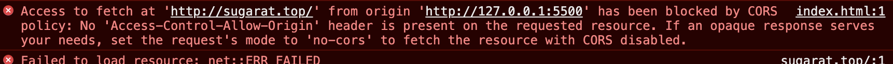

```html
<body>
    <button id="btn">click me</button>
    <script>
        const $btn = document.getElementById('btn')
        $btn.onclick = function () {
            fetch('https://ep.sugarat.top/', {
                method: 'get'
            })
        }
    </script>
</body>
```

**iframe跨域**

无法跨域访问iframe中的DOM元素信息

```html
<body>
    <iframe src="https://www.dmsrs.org/" width="100%" height="1000px" frameborder="0"></iframe>

    <script>
        const iframe = document.getElementsByTagName('iframe')[0]
        console.log(iframe.contentWindow.document.children[0].outerHTML)
        // <html><head></head><body></body></html>
    </script>
</body>
```

## 跨站

Cookie与此息息相关，Cookie实际上遵守的是“同站”策略

### 什么是同站

只要两个 URL 的 eTLD+1 相同即是同站,不需要考虑协议和端口

**eTLD**: (effective top-level domain) 有效顶级域名，注册于 Mozilla 维护的公共后缀列表（Public Suffix List）中,如`.com`、`.co.uk`、`.github.io`,`.top` 等

**eTLD+1**: 有效顶级域名+二级域名，如 `taobao.com`,`baidu.com`,`sugarat.top`

tips: 这里的一级,二级域名主要指计算机网络中规定的，与通常业务开发中所指的一二级域名有些许差异

以当前页面为例：`https://www.dmsrs.org/bigWeb/browser/cros.html`
* eTLD: .top
* eTLD+1: sugarat.top

|             URL             | 是否同站 |    理由     |
| :-------------------------: | :------: | :---------: |
|     https://www.dmsrs.org     |    ✅     | eTLD+1一致  |
|    http://ep.sugarat.top    |    ✅     | eTLD+1一致  |
| https://ep.sugarat.top:8080 |    ✅     | eTLD+1一致  |
|      https://baidu.com      |    ❌     | eTLD 不一致 |

只要eTLD+1不同就是跨站

### 对Cookie的影响
因为Cookie遵循的是同站策略，很多网站都是把一些权限，用户行为，主题，个人的配置信息

所以很多网站会把这些信息存在二级域名下，即让其子域名能够共享这些配置，鉴权信息

**以taobao举例**

打开 `taobao.com`,可以看到其cookie有

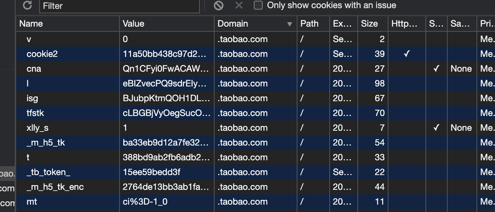

我们在 `ai.taobao,com`下也可看到这些cookie

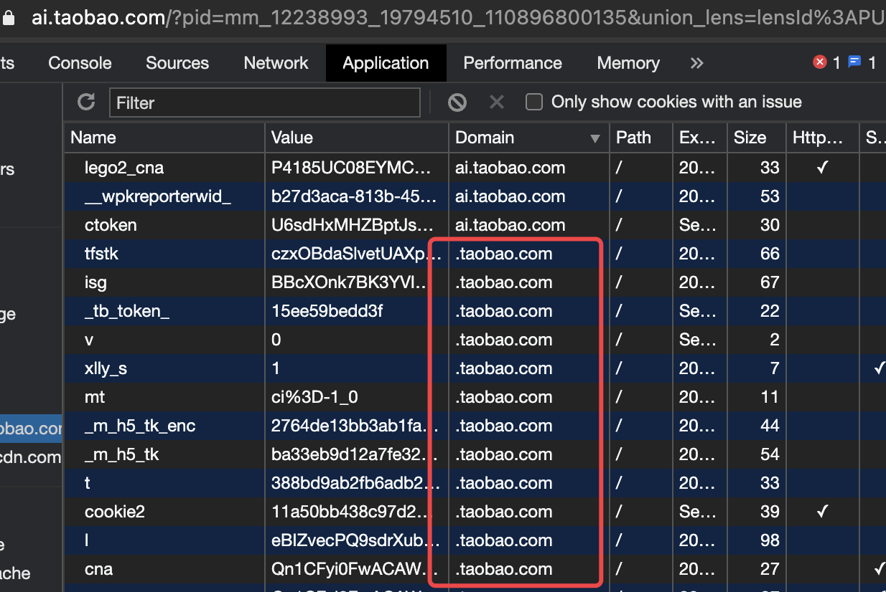

## 预检请求
使用后端开启CORS解决跨域的方式，浏览器会把请求分成两种类型
* 简单请求
* 复杂请求

#### 简单请求
触发简单请求的条件↓

**1.请求方法仅限于**:
* GET
* HEAD
* POST

**2.Content-Type仅限于**:
* text/plain
* multipart/form-data
* application/x-www-form-urlencoded

#### 复杂请求
``非简单请求``的即为复杂请求↓

对于复杂请求，首先会发起一个**预检请求**,请求方法为``options``,通过该请求来判断服务器是否允许跨域

与预检请求有关的以`Access-Control-`开头的响应头：
* Access-Control-Allow-Methods：表明服务器支持的所有跨域请求的方法
* Access-Control-Allow-Headers：表明服务器支持的头信息
* Access-Control-Max-Age：指定本次预检请求的有效期，单位为秒，在此期间，不用再重新发型新的预检请求

## 解决跨域的方案

**Tips:** 对于前端页面的运行可以 使用 [**http-server**](https://www.npmjs.com/package/http-server)

### jsonp

#### 原理

利用 `<script>`标签没有跨域限制的漏洞

通过 `<script>`标签的src属性指向一个需要访问的地址并提供一个回调函数来接收回调数据

script获取到的内容会被当做js脚本进行执行

所以需要服务端在回调上做一个字符串拼接操作 `callbackFunName(内容)`

可以通过url传递需要的参数

如需要发送一个get请求`http://sugarat.top/path1/path2?param1=1`

1. 客户端注册一个全局方法`function callbackFunName(res){}`
2. 服务端收到请求后获取到url上的参数
3. 服务端返回字符串`callbackFunName({"name":"sugar","age":18})`
4. 客户端当做js脚本直接解析执行
5. 就调用了方法`callbackFunName`并把里面的`{"name":"sugar","age":18}` 当做一个对象进行了传递

**只支持get请求**

#### 简单使用示例

服务端代码
```js
// 以Node.js为例
const http = require('http')
const app = http.createServer((req, res) => {
  const jsonData = {
    name: 'sugar',
    age: 18
  }
  res.end(`diyCallBackFun(${JSON.stringify(jsonData)})`)
})
app.listen(3000)
```

客户端代码
```html
<script>
    // jsonp的回调函数
    function diyCallBackFun(data) {
    	console.log(data)
	}
</script>

<script>
let $srcipt = document.createElement('script')
$srcipt.src = 'http://localhost:3000/path1/path2?param1=1&param2=2'
document.body.appendChild($srcipt)
</script>
<!-- 最终构造出的标签 -->
<!-- <script src="localhost:3000/path1/path2?param1=1&param2=2"></script> -->
```
页面中插入上述代码并运行可以在控制台看机输出

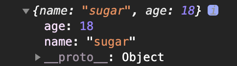

#### 通用方法封装

```js
/**
 * JSONP方法
 * @param {string} url 请求路径
 * @param {string} callbackName 全局函数名称（后端拼接的方法名称）
 * @param {Function} success 响应的回调函数
 */
function jsonp(url, callbackName, success) {
  const $script = document.createElement('script')
  $script.src = `${url}&callback=${callbackName}`
  $script.async = true
  $script.type = 'text/javascript'
  window[callbackName] = function (data) {
    success && success(data)
  }
  document.body.appendChild($script)
}
```

### CORS
跨域资源共享（Cross-origin resource sharing）

允许浏览器向跨域服务器发送ajax请求

实现CORS通信的关键是服务器。只要服务器实现了CORS接口，就可以跨源通信

服务端在响应头设置 Access-Control-Allow-Origin 就可以开启 CORS

#### 原理
如果发起的跨域AJAX请求是[简单请求](./cors.md#简单请求)，浏览器就会自动在头信息之中，添加一个Origin字段，
用来表示 请求来自哪个源

如:`origin: http://localhost:8080`

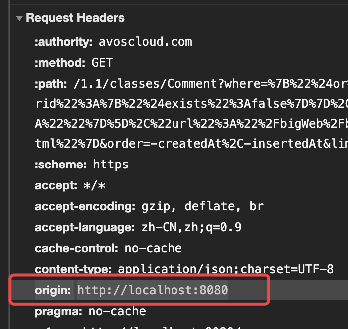

如果Origin的内容不包含在请求的响应头`Access-Control-Allow-Origin`中,就会抛出以下错误


与CORS有关的以`Access-Control-`开头的响应头：
* Access-Control-Allow-Origin：该字段是CORS中必须有的字段，它的值是请求时Origin字段的值以`,`分割多个域名，或者是`*`，表示对所有请求都放行
* Access-Control-Expose-Headers：列出了哪些首部可以作为响应的一部分暴露给外部（XMLHttpRequest）
  * 默认情况下，只有七种 simple response headers （简单响应首部）可以暴露给外部：
    * Cache-Control：控制缓存
    * Content-Language：资源的语言组
    * Content-Length：资源长度
    * Content-Type：支持的媒体类型
    * Expires：资源过期时间
    * Last-Modified：资源最后修改时间
    * Pragma：报文指令
* Access-Control-Allow-Credentials：值类型是布尔类型，表示跨域请求是否允许携带cookie
  * CORS请求默认不携带cookie
  * 还需要设置xhr（XMLHttpRequest）对象的withCredentials属性为true

#### 简单示例
以Node.js为例子
```js
const http = require('http')

const server = http.createServer(async (req, res) => {
  //  -------跨域支持-----------
  // 放行指定域名
  res.setHeader('Access-Control-Allow-Origin', '*')
  // 跨域允许的header类型
  res.setHeader("Access-Control-Allow-Headers", "*")
  // 允许跨域携带cookie
  res.setHeader("Access-Control-Allow-Credentials", "true")
  // 允许的方法
  res.setHeader('Access-Control-Allow-Methods', 'PUT, GET, POST, DELETE, OPTIONS')

  const { method, url } = req
  // 对预检请求放行
  if (method === 'OPTIONS') {
    return res.end()
  }
  console.log(method, url)
  res.end('success')
})

// 启动
server.listen(3000, (err) => {
  console.log(`listen 3000 success`)
})
```
### 反向代理
因为跨域是针对浏览器做出的限制

对后端服务没有影响

可以使用 Nginx,Node Server，Apache等技术方案为请求做一个转发

下面是一些示例
#### Nginx配置
```sh
server {
    listen 80;
	listen 443 ssl http2;
    server_name test.sugarat.top;
    index index.php index.html index.htm default.php default.htm default.html;
    root /xxx/aaa;
    # 省略其它配置
    location /api {
        proxy_pass http://a.b.com;
        # 防止缓存
    	add_header Cache-Control no-cache;
    }
}
```
访问 `http://test.sugarat.top/api/user/login`,实际是nginx服务器 访问`http://a.b.com/api/user/login`

关于`proxy_pass`属性，更多详细内容可参考[proxy_pass url 反向代理的坑](https://xuexb.github.io/learn-nginx/example/proxy_pass.html)

#### Node Server
这里采用Node原生http模块+axios实现请求的转发
```js
const http = require('http')
const axios = require('axios').default

// 要转发到哪里去
const BASE_URL = 'http://www.baidu.com'
// 启动服务的端口
const PORT = 3000

const app = http.createServer(async (req, res) => {
  const { url, method } = req
  console.log(url)
  // 对预检请求放行
  if (method === 'OPTIONS') {
    return res.end()
  }
  // 获取传递的参数
  const reqData = await getBodyContent(req)
  console.log(reqData)
  const { data } = await axios.request({
    method,
    url,
    baseURL: BASE_URL,
    data: reqData
  })
  res.setHeader('Access-Control-Allow-Origin', '*')
  res.setHeader('Content-Type', 'application/json;charset=utf-8')
  res.end(JSON.stringify(data))
})

app.listen(PORT, () => {
  console.log(`listen ${PORT} success`)
})

function getBodyContent(req) {
  return new Promise((resolve, reject) => {
    let buffer = Buffer.alloc(0)

    req.on('data', (chunk) => {
      try {
        buffer = Buffer.concat([buffer, chunk])
      }
      catch (err) {
        console.error(err)
      }
    })

    req.on('end', () => {
      let data = {}
      try {
        data = JSON.parse(buffer.toString('utf-8'))
      }
      catch (error) {
        data = {}
      }
      finally {
        resolve(data)
      }
    })
  })
}
```
测试页面
```html
<h1>测试</h1>
<script>
    fetch('http://localhost:3000/sugrec?name=test').then(res=>res.json()).then(console.log)
</script>
```
运行结果，请求被成功转发

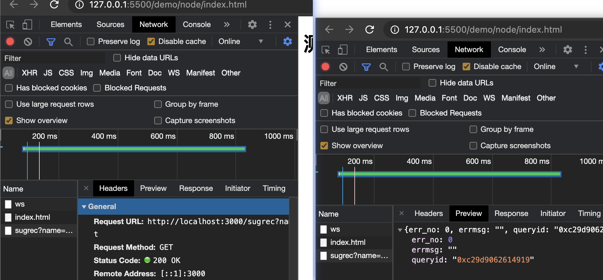

### websocket
WebSocket protocol是HTML5一种新的协议。它实现了浏览器与服务器全双工通信，同时允许跨域通讯，是server push技术的一种很好的实现

**使用示例**

#### 客户端
```html
<body>
    <p><span>链接状态：</span><span id="status">断开</span></p>
    <label for="content">
        内容
        <input id="content" type="text">
    </label>
    <button id="send">发送</button>
    <button id="close">断开</button>
    <script>
        const ws = new WebSocket('ws:localhost:3000', 'echo-protocol')
        let status = false
        const $status = document.getElementById('status')
        const $send = document.getElementById('send')
        const $close = document.getElementById('close')
        $send.onclick = function () {
            const text = document.getElementById('content').value
            console.log('发送: ', text);
            ws.send(text)
        }
        ws.onopen = function (e) {
            console.log('connection open ...');
            ws.send('Hello')
            status = true
            $status.textContent = '链接成功'
        }
        $close.onclick = function () {
            ws.close()
        }
        ws.onmessage = function (e) {
            console.log('client received: ', e.data);
        }
        ws.onclose = function () {
            console.log('close');
            status = false
            $status.textContent = '断开连接'
        }
        ws.onerror = function (e) {
            console.error(e);
            status = false
            $status.textContent = '链接发生错误'
        }
    </script>
</body>
```

#### 服务端
这里采用Node实现，需安装`websocket`模块
```js
const WebSocketServer = require('websocket').server
const http = require('http')

const server = http.createServer((request, response) => {
  console.log(`${new Date()} Received request for ${request.url}`)
  response.writeHead(200)
  response.end()
})
server.listen(3000, () => {
  console.log(`${new Date()} Server is listening on port 3000`)
})

const wsServer = new WebSocketServer({
  httpServer: server,
  autoAcceptConnections: false
})

function originIsAllowed(origin) {
  return true
}

wsServer.on('request', (request) => {
  if (!originIsAllowed(request.origin)) {
    request.reject()
    console.log(`${new Date()} Connection from origin ${request.origin} rejected.`)
    return
  }

  const connection = request.accept('echo-protocol', request.origin)
  console.log(`${new Date()} Connection accepted.`)
  connection.on('message', (message) => {
    if (message.type === 'utf8') {
      console.log(`Received Message: ${message.utf8Data}`)
      connection.sendUTF(`${new Date().toLocaleString()}:${message.utf8Data}`)
    }
  })
  connection.on('close', (reasonCode, description) => {
    console.log(`${new Date()} Peer ${connection.remoteAddress} disconnected.`)
  })
})
```

#### 运行结果

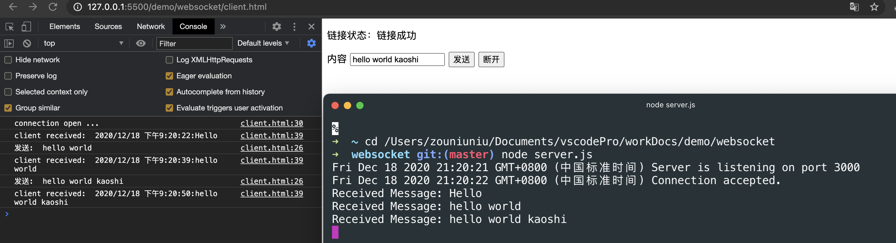

### location.hash
location的hash值发生变化，页面不会刷新，且浏览器提供了hashchange事件

主要用于iframe跨域通信

**示例**

父页面
```html
<body>
    <h1>父页面</h1>
    <button id="send">send</button>
    <iframe id="iframe1" src="http://localhost:3001/2.html"></iframe>
    <script>
        const $send = document.getElementById('send')
        const $iframe = document.getElementById('iframe1')
        const oldSrc = $iframe.src
        $send.onclick = function () {
            $iframe.src = oldSrc + '#' + Math.random() * 100
        }
    </script>
</body>
```
子页面
```html
<body>
    <h1>子页面</h1>
    <script>
        window.addEventListener('hashchange',function(e){
            console.log(e);
            console.log(location.hash);
        })
    </script>
</body>
```

运行结果

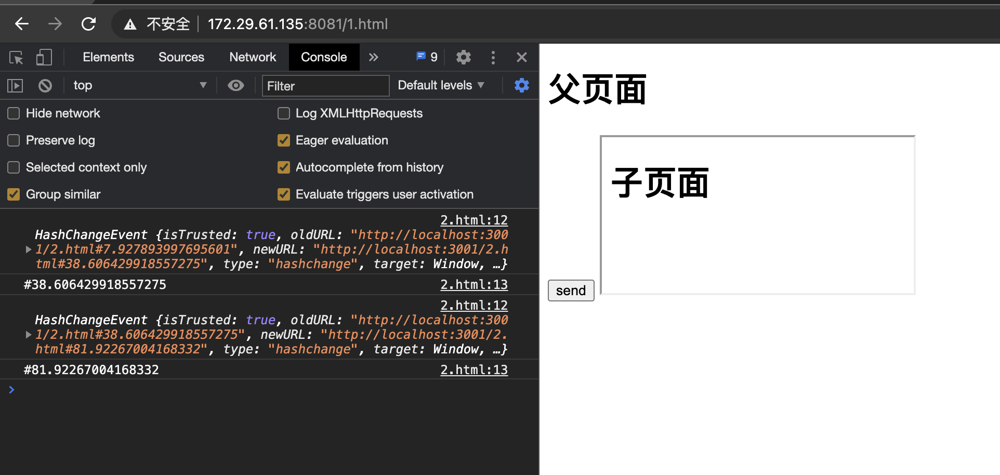

### window.name
只要当前的这个浏览器tab没有关闭，无论tab内的网页如何变动，这个name值都可以保持，并且tab内的网页都有权限访问到这个值

iframe中的页面利用上述特性，实现任意页面的window.name的读取

**使用示例**

**父页面 1.html**
```html
<body>
    <h1>父页面</h1>
    <button id="send">send</button>

    <script>
        document.getElementById('send').addEventListener('click', function () {
            getCrossIframeName('http://localhost:3000/2.html', console.log)
        })
        function getCrossIframeName(url, callback) {
            let ok = false
            const iframe = document.createElement('iframe')
            iframe.src = url
            iframe.style.width = '0px'
            iframe.style.height = '0px'
            iframe.onload = function () {
                if (ok) {
                    // 第二次触发时，同域的页面加载完成
                    callback(iframe.contentWindow.name)
                    // 移除
                    document.body.removeChild(iframe)
                } else {
                    // 第一次触发onload事件,定向到同域的中间页面
                    // 经测试 中间页面不存在也可以，如存在页面内容为空也可
                    iframe.contentWindow.location.href = '/proxy.html'
                    ok = !ok
                }
            }
            document.body.appendChild(iframe)
        }
    </script>
</body>
```

**中间页面 proxy.html**
```html
<!-- 空文件即可 -->
```

**目标页面 2.html**
```html
<body>
    <script>
        const data = { name: '传输的数据', status: 'success', num: Math.random() * 100 }
        window.name = JSON.stringify(data)
    </script>
</body>
```

运行结果

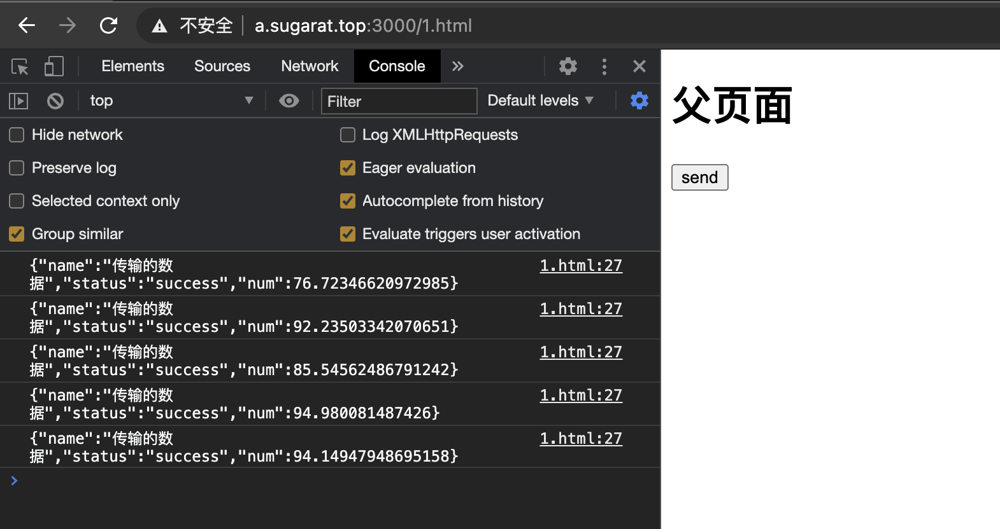

### window.postMessage
window.postMessage 方法可以安全地实现跨源通信,可以适用的场景:
* 与其它页面之间的消息传递
* 与内嵌iframe通信

用法
```js
otherWindow.postMessage(message, targetOrigin)
```
targetOrigin值示例:
* 协议+主机+端口：只有三者完全匹配，消息才会被发送
* *：传递给任意窗口
* /：和当前窗口同源的窗口

**使用示例**

父页面
```html
<body>
    <h1>父页面</h1>
    <button id="send">send</button>
    <iframe id="iframe1" src="http://localhost:3001/2.html"></iframe>
    <script>
        const $send = document.getElementById('send')
        const $iframe = document.getElementById('iframe1')
        const oldSrc = $iframe.src
        $send.onclick = function () {
            $iframe.contentWindow.postMessage(JSON.stringify({ num: Math.random() }),'*')
        }
    </script>
</body>
```

子页面
```html
<body>
    <h1>子页面</h1>
    <script>
        window.addEventListener('message', function (e) {
            console.log('receive', e.data);
        })
    </script>
</body>
```

**运行结果**
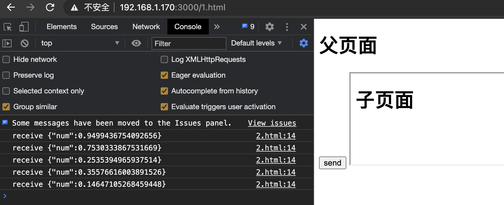
### document.domain
二级域名相同的情况下，比如 a.sugarat.top 和 b.sugarat.top 适用于该方式。

只需要给页面添加 document.domain = 'sugarat.top' 表示二级域名都相同就可以实现跨域

**简单示例**

首先修改host文件,添加两个自定义的域名，模拟跨域环境

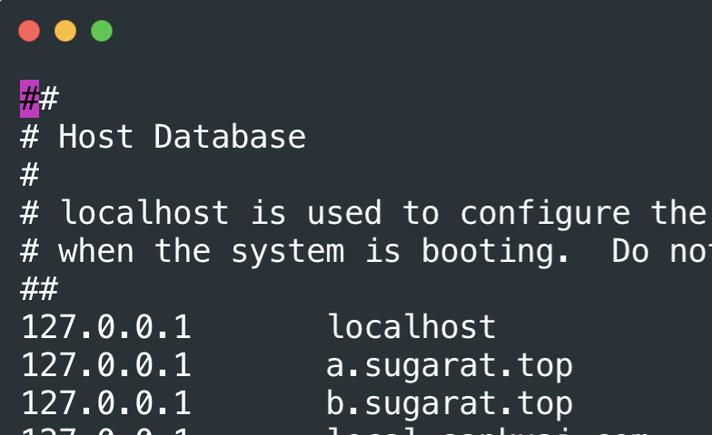

父页面
```html
<body>
    <h1>父页面</h1>
    <iframe id="iframe1" src="http://b.sugarat.top:3000/2.html"></iframe>
    <script>
        document.domain = 'sugarat.top'
        var a = 666
    </script>
</body>
```

子页面
```html
<body>
    <h1>子页面</h1>
    <script>
        document.domain = 'sugarat.top'
        console.log('get parent data a:', window.parent.a);
    </script>
</body>
```

**运行结果**

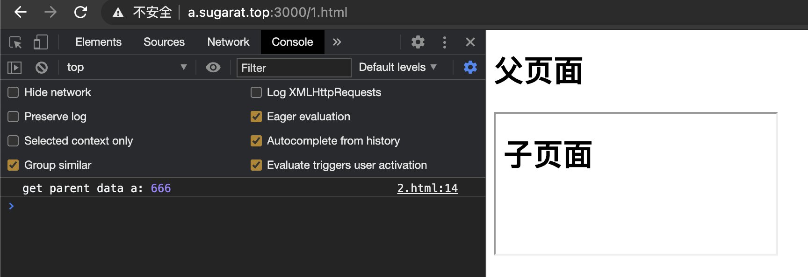

## 总结
上文只是介绍了常见的一些跨域方案，并配上了能直接复制粘贴运行的示例，方便读者理解与上手体验

在实际生产环境中需针对特定的场景进行方案的pick

面试中这也是一道经典考题，望能帮助读者加深理解

## 参考
* [wangningbo -浅谈几种跨域的方法](https://wangningbo93.github.io/2017/06/16/%E6%B5%85%E8%B0%88%E5%87%A0%E7%A7%8D%E8%B7%A8%E5%9F%9F%E7%9A%84%E6%96%B9%E6%B3%95/)
* [MDN - 浏览器的同源策略](https://developer.mozilla.org/zh-CN/docs/Web/Security/Same-origin_policy)
* [跨域资源共享 CORS 详解](http://www.ruanyifeng.com/blog/2016/04/cors.html)
* [浏览器同源政策及其规避方法](https://www.ruanyifeng.com/blog/2016/04/same-origin-policy.html)
* [前端常见跨域解决方案](https://segmentfault.com/a/1190000011145364)
* [WebSocket-Node](https://github.com/theturtle32/WebSocket-Node)


