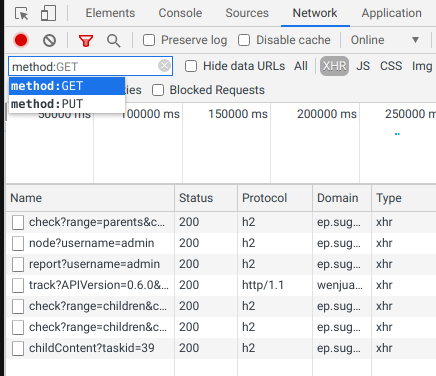
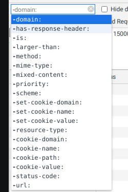
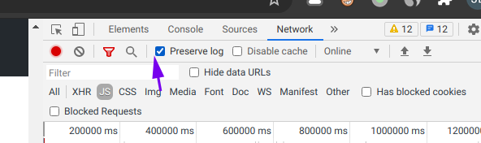
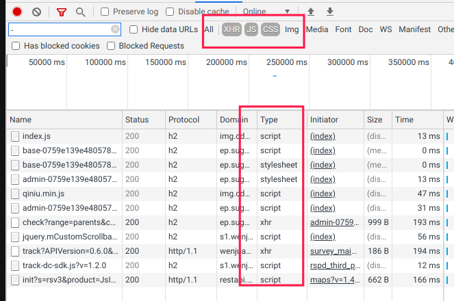
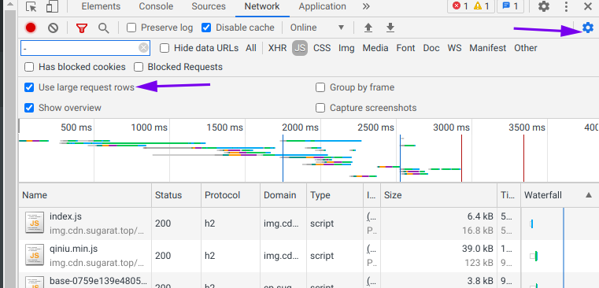
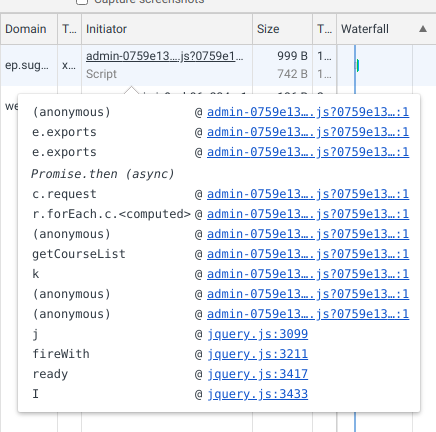
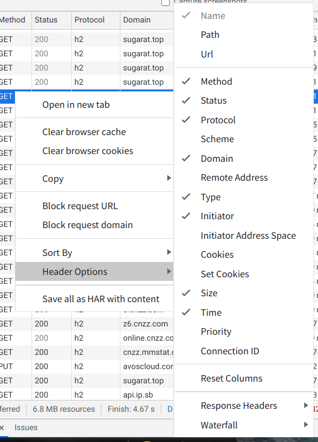
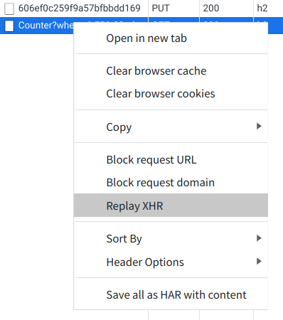

# Chrome 调试技巧-Network

在调试网络请求时,离不开Network面板的使用

## Filter

用于过滤请求

通过 `-` 查看所有筛选条件

## Preserve log

会一直保留之前的日志，无论是刷新还是页面的跳转

## 多类型筛选

Ctrl + 鼠标左键选择要添加的类目

## 查看资源未压缩前大小

## Initiator 查看调用堆栈信息

## 自定义请求表中展示的项

## 重新发送请求

