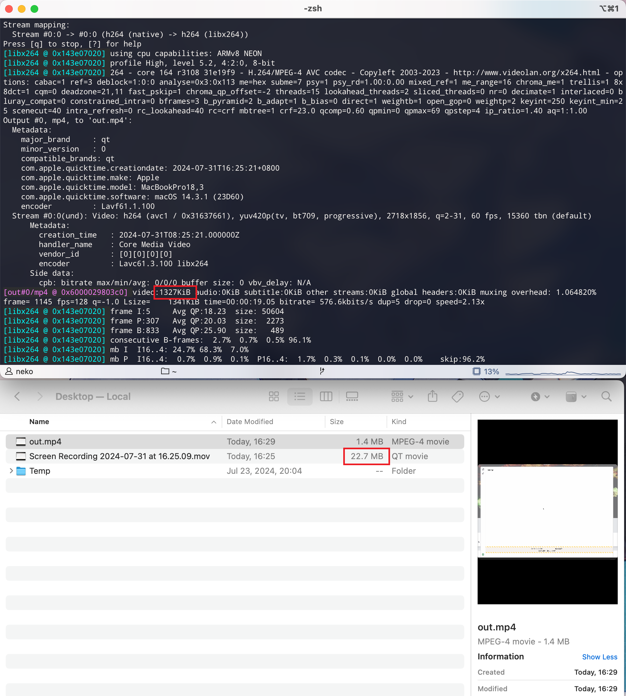

---
tags:
  - 软件
  - 工具
  - ffmpeg
  - 音视频
  - 命令行
categories:
  - 软件工具
title: 压缩 mov 到 mp4
---
# 压缩 `.mov` 到 `.mp4`

```shell
ffmpeg -i {in-video}.mov -vcodec h264 -acodec aac {out-video}.mp4
```



## 参考资料

- [macos - convert .mov video to .mp4 with ffmpeg - Super User](https://superuser.com/questions/1155186/convert-mov-video-to-mp4-with-ffmpeg)

<Citation type="转载" source="Nólëbase" url="https://nolebase.ayaka.io/zh-CN/%E7%AC%94%E8%AE%B0/%F0%9F%92%BE%20%E8%BD%AF%E4%BB%B6/ffmpeg/%E5%8E%8B%E7%BC%A9%20mov%20%E5%88%B0%20mp4.html" />
