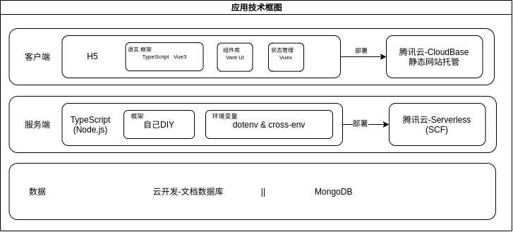
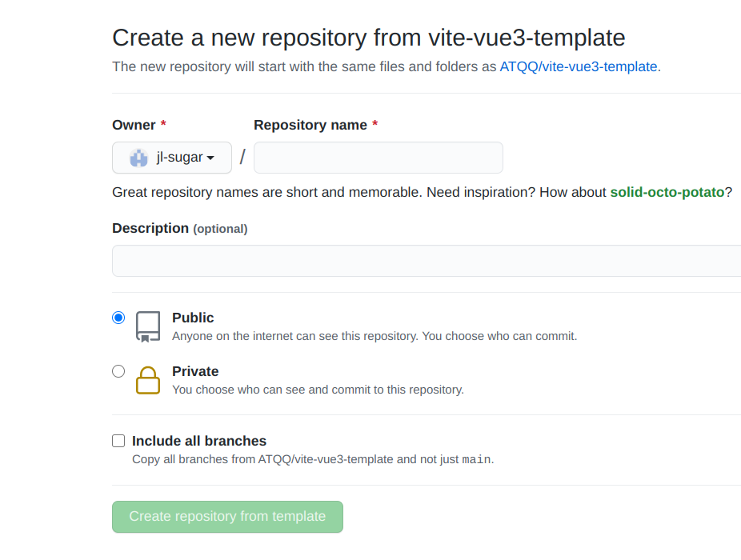
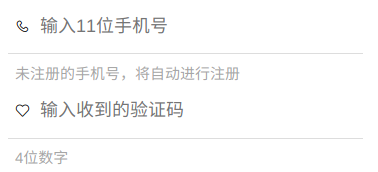
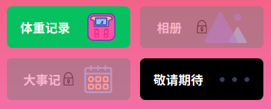
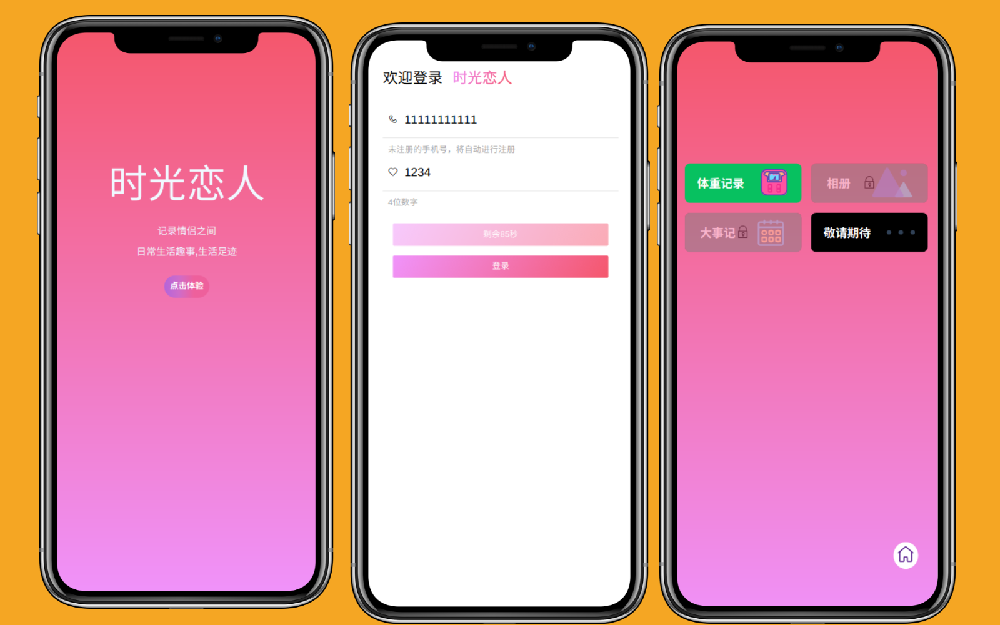

# 实践：给女朋友个性化定制应用-体重记录（一）

**此系列的目的是帮助前端新人，熟悉现代前端工程化开发方式与相关技术的使用，普及一些通识内容**

## 本文涉及内容
>提升阅读体验，文章将会分为多节发布，本节主要阐述前端部分
* 初始化Vue3+Vite+TS项目
* VantUI组件库引入
* 移动端适配
* 自定义组件开发
* @vue/compiler-sfc
* 彩色字体图标的使用


## 背景
女朋友天天都在念叨:"我又胖了,怎么不吃东西也没见轻"

为了记录每次体重数据的变化，就下载了记录体重的App，用了几个都不太满意（主要是不满意数据反映出的图表内容）

于是乎咱就拿出键盘⌨🖰就给她打造一个独一无二的

## 需求
长话短说：
* 基本的体重记录（CRUD）
* 多样化的数据统计报表
  * 反应每一次的变化
  * 最后一次与当天的第一次的比较
  * 指定时间区间里的变化
  * ...more

## 技术方案
明确了**目标用户**与**用户诉求**后，接下来直接定技术方案

应用形式：**H5（移动到Web应用）**

### 前端
* 框架：Vue3
* 语言：TypeScript
* 构建工具：Vite2
* 组件：Vant UI
* 网络：Axios
* CSS预处理：Sass

### 后端
* Node.js + TypeScript
* 数据库：菲关系型数据库（MongoDB或云开发用文档数据库）

### 部署
均使用Serverless服务部署，性能好又便宜

* 后端：[腾讯云Serverless应用](https://console.cloud.tencent.com/sls)
* 前端：[腾讯云开发-静态资源托管](https://console.cloud.tencent.com/tcb/env/index?rid=4)，这部分教程[戳此查看](https://juejin.cn/post/6964015528662794254)

### 概览


## 开发准备

### 项目初始化
直接使用搭建的[ATQQ/vite-vue3-template](https://github.com/atqq/vite-vue3-template)模板[初始化项目](https://github.com/ATQQ/vite-vue3-template/generate)




### 引入Vant UI
**添加依赖**
```sh
yarn add vant@next
```

**配置按需引入**
```ts
// vite.config.ts
import { defineConfig } from 'vite'
import vue from '@vitejs/plugin-vue'
import styleImport from 'vite-plugin-style-import'

// https://vitejs.dev/config/
export default defineConfig({
  plugins: [
    vue(),
    styleImport({
      libs: [
        {
          libraryName: 'vant',
          esModule: true,
          resolveStyle: (name) => `vant/es/${name}/style`,
        },
      ],
    }),
  ]
})

```
```ts
// src/utils/vantUI.ts
import { App } from '@vue/runtime-core'

// 按需引入
import { Button } from 'vant'

const conponents = [Button]

export default function mountVantUI(app: App<Element>) {
  conponents.forEach((c) => {
    app.component(c.name, c)
  })
}
```
### 页面
一期预计4个页面：
* 首页
* 登录
* 功能面板
* 体重记录

快速建立好4个页面的模板
```sh
# src/pages/
├── 404           # 404
|  └── index.vue
├── dashboard     # 功能面板
|  └── index.vue
├── funcs
|  └── weight     # 体重记录
|     └── index.vue
├── home          # 首页
|  └── index.vue
└── login         # 登录页
   └── index.vue

directory: 6 file: 5
```
### 路由配置
页面确定后，配置一下页面路由

`src/router/routes/index.ts`
```ts
import { RouteRecordRaw } from 'vue-router'
import Home from '../../pages/home/index.vue'

const NotFind = () => import('../../pages/404/index.vue')
const Login = () => import('../../pages/login/index.vue')
const DashBoard = () => import('../../pages/dashboard/index.vue')
const Weight = () => import('../../pages/funcs/weight/index.vue')

const routes: RouteRecordRaw[] = [
  { path: '/:pathMatch(.*)*', name: 'NotFound', component: NotFind },
  {
    path: '/',
    name: 'index',
    component: Home,
  },
  {
    path: '/login',
    name: 'login',
    component: Login,
  },
  {
    path: '/dashboard',
    name: 'dashboard',
    component: DashBoard,
  },
  {
    path: '/funs/weight',
    name: 'weight',
    component: Weight,
  },
]

export default routes
```

将顶层的`router-view`组件放在App.vue中

`src/App.vue`
```vue
<template>
  <div class="app">
    <router-view></router-view>
  </div>
</template>
```
### 移动端适配

首先在html模板中添加一句
```html
<meta name="viewport" content="width=device-width, initial-scale=1.0" />
```

尺寸单位使用**rem方案**，设计稿按375来定

通过调研现有的响应式网站与模拟器中实测，尺寸主要由`320`,`360`,`375`,`414`四种，得出以下结果：
* html根元素字体大小
  * 320：12px
  * 360：13.5px = 360/320*12
  * 375：14.0625px = 375/320*12
  * 414：沿用375方案

于是乎可以直接使用 `媒体查询` 处理单位的设置

在`App.vue`中加入得出的如下代码：
```html
<style>
@media screen and (min-width: 320px) {
  html {
    font-size: 12px;
  }
}
@media screen and (min-width: 360px) {
  html {
    font-size: 13.5px;
  }
}
@media screen and (min-width: 375px) {
  html {
    font-size: 14.0625px;
  }
}
</style>
```
注意：由于样式权重一样的情况下，会采用后定义的内容，所以大尺寸媒体查询代码的放在后面

**TODO**：补样式权重计算文章

不排除用户电脑访问应用的情况，为提升用户体验，将顶层`容器标签`固定为414px

在`App.vue`中加入如下代码：
```html
<style scoped>
.app {
  max-width: 414px;
  margin: 0 auto;
}
</style>
```

## 页面开发
准备工作基本完成后就开始糊页面

由于糊页面是个体力活儿，没有营养，文中只贴一些关键代码，完成代码，去仓库探索

页面使用`@vue/compiler-sfc`方案，开发提效，代码更直观

使用的渐变色来源：[webgradients](https://webgradients.com/)
### 首页
* [完整源码](https://github.com/ATQQ/timeLover/blob/main/src/pages/home/index.vue)

页面整体上只包含`应用名`，`简介`，`导航登录`3部分
```vue
<template>
  <div class="home">
    <h1 class="title">时光恋人</h1>
    <!-- 简介 -->
    <section class="introduce">
      <p v-for="(item, index) in introduces" :key="index">{{ item }}</p>
    </section>
    <section class="introduce">
      <p>
        <router-link to="/login">
          <van-button size="small" round :color="loginColor">点击体验</van-button>
        </router-link>
      </p>
    </section>
  </div>
</template>
<script lang="ts" setup>
import { reactive } from 'vue'

const introduces: string[] = reactive(['记录情侣之间', '日常生活趣事,生活足迹'])
const loginColor = 'linear-gradient(to right, #b8cbb8 0%, #b8cbb8 0%, #b465da 0%, #cf6cc9 33%, #ee609c 66%, #ee609c 100%)'
</script>
```

### 登录页
* [完整源码](https://github.com/ATQQ/timeLover/blob/main/src/pages/login/index.vue)

避免繁琐的注册流程，直接使用短信验证码登录方案

这个页面开发了一个自定义的 `Input` 组件

效果如下，包含`icon`，`输入区域`，`输入提示`，`注意提示`4部分内容



* [组件的完整源码](https://github.com/ATQQ/timeLover/blob/main/src/components/UnderInput.vue)

Dom结构如下
```vue
<template>
  <div class="under-input">
    <van-icon class="icon" v-if="icon" :name="icon" />
    <input
      :maxlength="maxLength"
      :placeholder="placeholder"
      :type="type"
      :value="modelValue"
      @input="handleInput"
    />
  </div>
  <p v-if="tips" class="tips">
    {{ tips }}
  </p>
</template>
```

输入内容使用简单的正则进行校验
```ts
// 手机号
export const rMobile = /^[1]\d{10}$/
// 验证码
export const rCode = /\d{4}/
```

### 功能页
* [完整源码](https://github.com/ATQQ/timeLover/blob/main/src/pages/dashboard/index.vue)

调研了一些类似的应用，最终选择采用**卡片**的形式展现各个功能入口

卡片组件主要包含**功能介绍**与**彩色图标**两部分，效果如下



Dom结构如下：
```vue
<template>
  <div
    class="fun-card"
    :class="{
      disabled,
    }"
  >
    <div>
      <h1 class="title">{{ title }}</h1>
    </div>
    <span v-if="icon" :class="[icon]" class="iconfont icon"></span>
    <!-- lock -->
    <div v-if="disabled" class="lock">
      <span class="icon-lockclosed iconfont"> </span>
    </div>
  </div>
</template>
```
### 彩色字体图标
* 彩色图标使用`iconfont`
* 项目中[引入步骤](https://at.alicdn.com/t/project/2609471/b1aed21a-fa33-4a1a-8b32-175e4b295c16.html?spm=a313x.7781069.1998910419.35)


只需要简单的在模板中引入css资源，使用的时候直接书写class即可

```html
<!-- index.html -->
<link rel="stylesheet" href="//at.alicdn.com/t/font_2609471_9womj4g1e15.css">
```

```html
<!-- 使用图标 -->
<span class="icon-lockclosed iconfont"> </span>
```
## 本期效果


* 线上[预览地址](https://lover.sugarat.top)

## 资料汇总
* [仓库源代码](https://github.com/ATQQ/timeLover)
* [项目模板：vite-vue3-template](https://github.com/atqq/vite-vue3-template)
* [使用模板初始化项目](https://github.com/ATQQ/vite-vue3-template/generate)
* [iconfont:《彩色字体图标的介绍文章》](https://mp.weixin.qq.com/s/qQ_8ICpAT3AMHFhavrsrgw)
* [彩色图标引入步骤](https://at.alicdn.com/t/project/2609471/b1aed21a-fa33-4a1a-8b32-175e4b295c16.html?spm=a313x.7781069.1998910419.35)
* [渐变色：webgradients](https://webgradients.com/)
* [@vue/compiler-sfc使用](https://github.com/vuejs/rfcs/blob/script-setup-2/active-rfcs/0000-script-setup.md)
* [在线带壳截图生成](https://deviceshots.com/app?device=apple-iphone-x)

