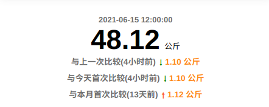
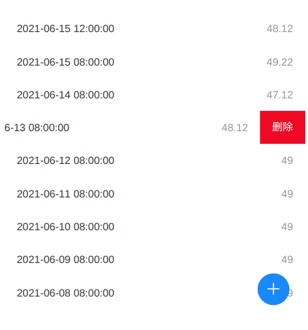
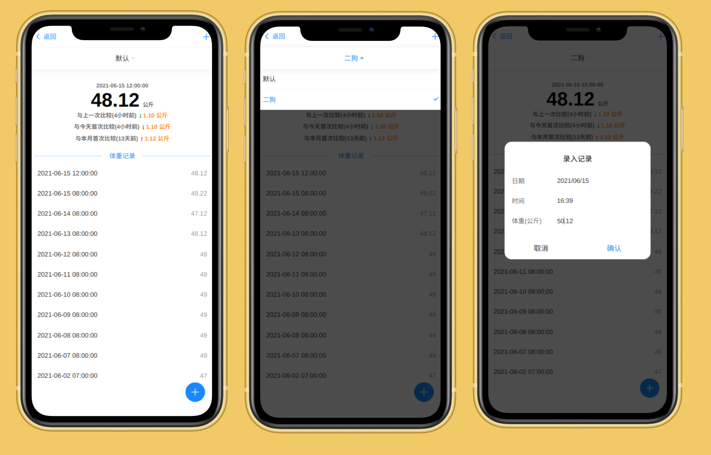
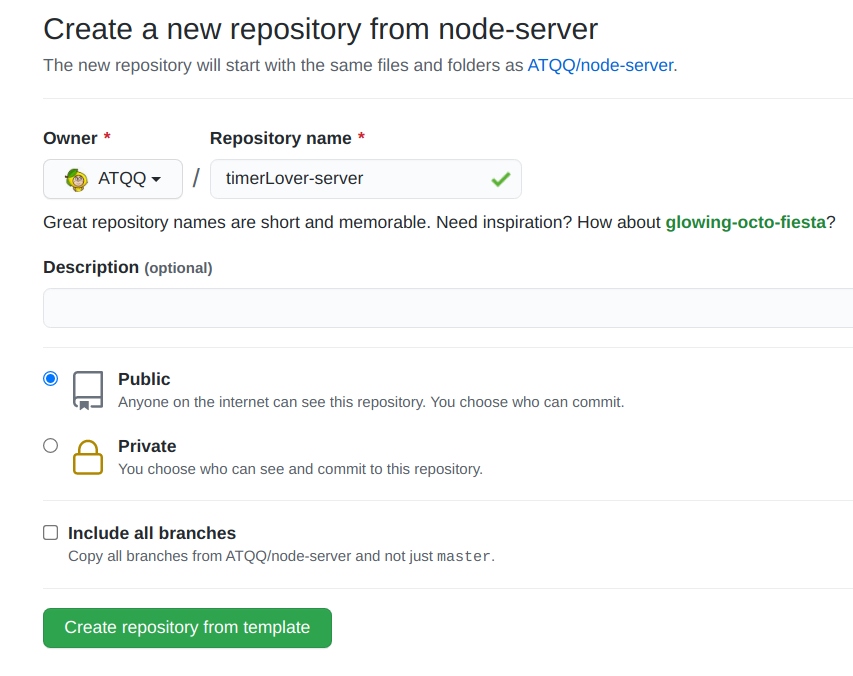
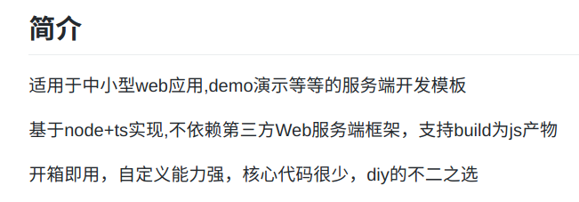
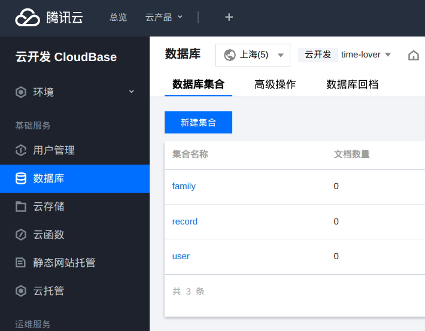

# 实践：给女朋友个性化定制应用-体重记录（二）

**此系列的目的是帮助前端新人，熟悉现代前端工程化开发方式与相关技术的使用，普及一些通识内容**

## 前景回顾
[上一篇文章](./timeLover-1.md)，主要阐述了应用前端工程的搭建与部分页面开发

本文简单介绍一下一期剩余的页面（**体重记录页**）开发，**着重阐述后端**部分的必要设计

## 本文涉及内容
* 体重记录页的开发
* 初始化后端Node+TypeScript项目
* 数据库设计
* 接口设计
* 云数据库初始化
## 体重记录页开发
* [完整源码](https://github.com/ATQQ/timeLover/blob/main/src/pages/funcs/weight/index.vue)

页面整体上由`导航`，`最近一次的记录`，`对比描述`，`历史记录`，`添加数据弹窗`等5部分组成

### 导航
直接使用[vant-nav-bar](https://vant-contrib.gitee.io/vant/v3/#/zh-CN/nav-bar)

**左按钮**返回上一页，**右按钮(icon)** 唤起添加添加成员的[弹窗: van-dialog](https://vant-contrib.gitee.io/vant/v3/#/zh-CN/dialog)
```vue
<van-nav-bar
  title="体重记录"
  @click-left="handleBack"
  @click-right="handleAddPeople"
  left-text="返回"
  left-arrow
>
  <template #right>
    <van-icon name="plus" size="18" />
  </template>
</van-nav-bar>
```
**效果**


**引入Dialog组件注意：** 由于`Dialog`支持直接当作方法使用`Dialog(options)`，再当作组件注册时与其它组件不太一样:

`src/utils/vantUI.ts`
```ts
import { Button, Dialog } from 'vant'

const conponents = [Button]
export default function mountVantUI(app: App<Element>) {
  conponents.forEach((c) => {
    app.component(c.name, c)
  })
  // 特别对待
  app.component(Dialog.Component.name, Dialog.Component)
}
```

### 最近一次的记录
展示一下时间与体重即可
```html
<h2 class="current-time">2021-06-15 12:00:00</h2>
<h1 class="current-weight">48.12<span>公斤</span></h1>
```
**效果**


### 对比描述
包含**最新的一次记录**与
* 上一次比较
* 与今天第一次比较
* 与本月第一次比较

展示间隔的时间，并反应上升/下降的体重

**页面结构**
```html
<p class="rank" v-for="(t, idx) in overviewData" :key="idx">
  {{ t.text }}
  <span :class="t.symbol"></span>
  <span class="res">{{ t.res }}</span>
</p>

<!-- 渲染结果示例 -->
<p class="rank">
  与上一次比较（5小时前）
  <span class="add"></span>
  <span class="res">5 公斤</span>
</p>
```
**效果**



其中↑与↓的表示采用伪元素`::after`表示
```scss
  .dec::after {
    content: '🠐';
    color: green;
    transform: rotate(-90deg);
  }
  .inc::after {
    content: '🠖';
    color: #ff6034;
    transform: rotate(-90deg);
  }
```

[日期差值计算的工具方法](https://github.com/ATQQ/timeLover/blob/7d401d3d7734fc2bf8794c9ffc24db4b5c77dccf/src/pages/funcs/weight/index.ts#L18)
```ts
const ONE_SECONDS = 1000
const ONE_MINUTE = ONE_SECONDS * 60
const ONE_HOUR = ONE_MINUTE * 60
const ONE_DAY = ONE_HOUR * 24
function getTimeDiffDes(d1: Date, d2: Date) {
  const diff = d1.getTime() - d2.getTime()
  //   天
  if (diff / ONE_DAY >= 1) {
    return `${Math.round(diff / ONE_DAY)}天前`
  }

  // 小时
  if (diff / ONE_HOUR >= 1) {
    return `${Math.round(diff / ONE_HOUR)}小时前`
  }
  // 分钟
  if (diff / ONE_MINUTE >= 1) {
    return `${Math.round(diff / ONE_MINUTE)}分钟前`
  }
  // 秒
  return `${Math.round(diff / ONE_SECONDS)}秒前`
}
```
### 历史数据展示
直接套用Vant的 [van-swipe-cell](https://vant-contrib.gitee.io/vant/v3/#/zh-CN/swipe-cell)与 [van-cell](https://vant-contrib.gitee.io/vant/v3/#/zh-CN/cell)

```html
<van-swipe-cell v-for="(t, idx) in weights" :key="idx">
  <van-cell :border="false" :title="formatDate(t.date)">
    {{ t.weight }}
  </van-cell>
  <template #right>
    <van-button @click="hadnleDeleteWeight(idx)" square type="danger" text="删除" />
  </template>
</van-swipe-cell>
```
**效果**



### 页面最终效果



* [线上预览](https://lover.sugarat.top/funs/weight)
## 初始化后端工程

直接使用搭建的[ATQQ/node-server](https://github.com/atqq/node-server)模板[初始化项目](https://github.com/ATQQ/node-server/generate)



### 模板工程简介



## 数据库设计
使用: 腾讯云开发CloudBase提供的[云数据库](https://cloud.tencent.com/document/product/876/19369) (文档型数据库)

这样从头到尾都不需要买云服务器

### 相关需求简单回顾
* 短信验证码登录
* 支持同时记录多个人的数据
* 每个数据包含 `日期`与`体重`两部分内容

简单捋一下思路，使用三张表`用户表（user）`，`成员表（family）`，`记录表（record）`，具体设计如下

### 用户表-user
|   字段   |  类型  |   描述   |
| :------: | :----: | :------: |
|  userId  | String | 唯一标识 |
|  phone   | String |  手机号  |
| joinTime |  Date  | 注册时间 |

### 成员表-family
|   字段   |  类型  |     描述     |
| :------: | :----: | :----------: |
| familyId | String |   唯一标识   |
|  userId  | String | 关联创建用户 |
|   name   | String |   成员名称   |

### 记录表-record
|   字段   |  类型  |     描述     |
| :------: | :----: | :----------: |
| recordId | String |   唯一标识   |
| familyId | String |   关联成员   |
|  userId  | String | 关联创建用户 |
|  weight  | Number |     体重     |
|   date   |  Date  |     日期     |

## 初始化云数据库
>服务端使用Node.js开发,使用云开发提供的Node SDK初始化集合（表）

**安装依赖**

```js
yarn add @cloudbase/node-sdk
```

### 初始化集合
```js
const cloudbase = require('@cloudbase/node-sdk')
const app = cloudbase.init({
    secretId:process.env.secretId,
    secretKey:process.env.secretKey,
    env:process.env.envId
})

const db = app.database();
db.createCollection('user')
db.createCollection('family')
db.createCollection('record')
```

可以在CloudBase-数据库面板看到结果：



## 接口设计
按数据库对接口进行分类，这里只阐述请求方法与路径

使用**Eolinker**管理与测试接口：[此处查看完整接口设计](https://easy2.w.eolinker.com/share/index?shareCode=nJMZ5t)

### User
| 方法  |    路径     |      描述      |
| :---: | :---------: | :------------: |
| POST  | /user/login |    用户登录    |
|  GET  | /user/code  | 获取登录验证码 |

### Family
| 方法  |    路径     |   描述   |
| :---: | :---------: | :------: |
| POST  | /family/add | 添加成员 |

### Record
|  方法  |       路径        |   描述   |
| :----: | :---------------: | :------: |
|  POST  | /record/:familyId | 添加记录 |
| DELETE | /record/:recordId | 删除记录 |

## 后端开发
### 数据库操作方法封装
根据文档[云开发 CloudBase > 开发指南 > 数据库 ](https://cloud.tencent.com/document/product/876/19369)编写

#### JS版本
```js
const cloudbase = require('@cloudbase/node-sdk')
const app = cloudbase.init({
    secretId:process.env.secretId,
    secretKey:process.env.secretKey,
    env:process.env.envId
})

const db = app.database();
function insertDocument(collection, data) {
    return db.collection(collection).add(data)
}

function deleteDocument(collection, query) {
    return db.collection(collection).where(query).remove()
}

function findDocument(collection, query) {
    return db.collection(collection).where(query).get()
}

function updateDocument(collection, query, data) {
    return db.collection(collection).where(query).update(data)
}
```
#### TS版本
```ts
import cloudbase from '@cloudbase/node-sdk'
const app = cloudbase.init({
    secretId: process.env.secretId,
    secretKey: process.env.secretKey,
    env: process.env.envId
})

export const db = app.database()
export function insertDocument<T>(collection: string, data: T | T[]) {
    return db.collection(collection).add(data)
}

export function deleteDocument(collection: string, query: any) {
    return db.collection(collection).where(query).remove()
}

export function findDocument(collection: string, query: any) {
    return db.collection(collection).where(query).get()
}

export function updateDocument<T>(collection: string, query: any, data:T) {
    return db.collection(collection).where(query).update(data)
}
```
### 未完待续
篇幅有限，下一章节再介绍后端部分的详细实现与前后端对接（/(ㄒoㄒ)/~~，主要还是没码完）

## 资料汇总
* [前端项目源代码](https://github.com/ATQQ/timeLover)
* [后端项目源代码](https://github.com/ATQQ/time-lover-server)
* [后端项目模板](https://github.com/ATQQ/node-server)
* [数据库设计](https://github.com/ATQQ/time-lover-server/blob/master/docs/db.md)
* [详细接口设计](https://easy2.w.eolinker.com/share/project/api/?groupID=-1&shareCode=nJMZ5t&shareToken=$2y$10$gNK48kATh9yIeQokemYpaefvSzmyUwCtpyZ6lEkHh7nQdoZ9PbGrm&shareID=322197)
* [腾讯云数据库地址](https://cloud.tencent.com/document/product/876/19369)
* [项目线上预览地址](https://lover.sugarat.top/dashboard)


