# ESCheck工具原理解析及增强实现
> 本文为稀土掘金技术社区首发签约文章，14天内禁止转载，14天后未获授权禁止转载，侵权必究！
## 前言

2022了，大家做的面向C端的产品（Web，小程序，其它跨端方案），涉及JS产物的还是避不开兼容性的话题（即使IE已官宣停止支持）

但就目前看来这个停止维护还是避免不了大家做开发还是要考虑兼容低端机，甚至`IE11`

针对js目前通常的手段都是通过工具对js进行语法降级至 ES5，同时引入对应的 polyfill（垫片）

工具首选还是老牌 [Babel](https://babeljs.io/)，当然现在还有 [SWC](https://swc.rs/) 这个冉冉升起的新星

经过一顿操作为项目配置 Babel 之后，为了保证产物不出现 ES5 之外的语法，通常都会搭配一个 Check 工具去检测产物是否符合要求

本文将阐述市面上已有工具的`实现原理`，`功能对比`，最后`实现增强型的es-check`，提供 CLI 和 Lib 两种使用方式

下面先分别介绍一下社区版的[es-check](https://github.com/yowainwright/es-check)和滴滴版的[@mpxjs/es-check](https://github.com/mpx-ecology/mpx-es-check)实现原理，最后再实现一个集大成者

## es-check
先看一下其效果，下面是用于测试的代码
```js
// test.js
var str = 'hello'
var str2 = 'world'

const varConst = 'const'
let varLet = 'let'
const arrFun = () => {
    console.log('hello world');
}
```
```sh
npx es-check es5 testProject/**/*.js
```
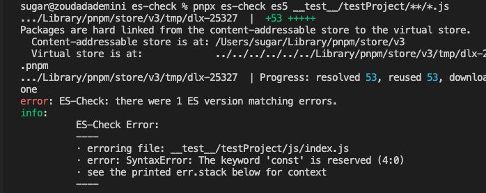

可以看到其报错信息比较简单，只输出了代码中的第一个ES语法问题`const`,然后对应的是行数和具体文件路径

我们再把这个测试文件`构建压缩混淆一下`(模拟build产物)

```sh
npx tsup __test__/testProject/js/index.js --sourcemap -d __test__/testProject/dist --minify
```
通过结果，可以看到，只说有解析问题，并未告知是什么问题，然后有对应的行列数

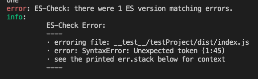

如果有`sourcemap`那么我们暂且是可以通过[source-map](https://www.npmjs.com/package/source-map)这个库解析一下，以上面的报错为例
```ts
// npx esno source-map.ts
import sourceMap from 'source-map'
import fs from 'fs'
import path from 'path'

const file = path.join(__dirname, 'testProject/dist/index.js.map')
const lineNumber = 1
const columnNumber = 45

;(async () => {
  const consumer = await new sourceMap.SourceMapConsumer(
    fs.readFileSync(file, 'utf-8')
  )
  const sm = consumer.originalPositionFor({
    column: columnNumber,
    line: lineNumber
  })
  // 对应文件的源码
  const content = consumer.sourceContentFor(sm.source!)
  // 错误行的代码
  const errCode = content?.split(/\r?\n/g)[sm.line! - 1]
  console.log(errCode)
})()
```
执行结果如下，可以得到对应的错误代码

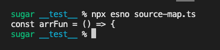

### 原理分析
打开[源码](https://github.com/yowainwright/es-check/blob/master/index.js)可以看到实现非常简单，关键不过100行。可以总结为3步骤

1. 使用 [fast-glob](https://www.npmjs.com/package/fast-glob) 获取目标文件
2. 使用 [acorn](https://github.com/acornjs/acorn/tree/master/acorn) 解析源码生层AST，并捕获解析错误
3. 判断是否存在解析错误，有就打印

`acorn` 是一个很常见的 js 解析库，可以用于AST的生成与CRUD操作，其包含1个 `ecmaVersion` 参数用于指定要解析的 `ECMAScript` 版本。`es-check`正是利用了这个特性

```ts
import * as acorn from 'acorn'

try {
  acorn.parse(`const a = 'hello'`, {
    ecmaVersion: 5,
    silent: true
    // sourceType: 'module'
    // allowHashBang:true
  })
} catch (err) {
  // The keyword 'const' is reserved (1:0)
  console.log(err)
  // err 除了继承常规 Error 对象，包含 stack 和 message 等内容外，还包含如下信息
  // {
  //   pos: 0,
  //   loc: Position { line: 1, column: 0 },
  //   raisedAt: 7
  // }
}
```

下面是`es-check`的精简实现，完整源码见 [Github](https://github.com/ATQQ/tools/blob/feature/es-check/packages/cli/es-check/__test__/es-check.ts)

```ts
// npx esno es-check.ts
import fg from 'fast-glob'
import path from 'path'
import * as acorn from 'acorn'
import fs from 'fs'

const testPattern = path.join(__dirname, 'testProject/**/*.js')
// 要检查的文件
const files = fg.sync(testPattern)

// acorn 解析配置
const acornOpts = {
  ecmaVersion: 5,// 目标版本
  silent: true
  // sourceType: 'module'
  // allowHashBang:true
}

// 错误
const errArr: any[] = []

// 遍历文件
files.forEach((file) => {
  const code = fs.readFileSync(file, 'utf8')
  try {
    acorn.parse(code, acornOpts as any)
  } catch (err: any) {
    errArr.push({
      err,
      stack: err.stack,
      file
    })
  }
})

// 打印错误信息
if (errArr.length > 0) {
  console.error(
    `ES-Check: there were ${errArr.length} ES version matching errors.`
  )
  errArr.forEach((o) => {
    console.info(`
        ES-Check Error:
        ----
        · erroring file: ${o.file}
        · error: ${o.err}
        · see the printed err.stack below for context
        ----\n
        ${o.stack}
      `)
  })
  process.exit(1)
}

console.info(`ES-Check: there were no ES version matching errors!  🎉`)
```
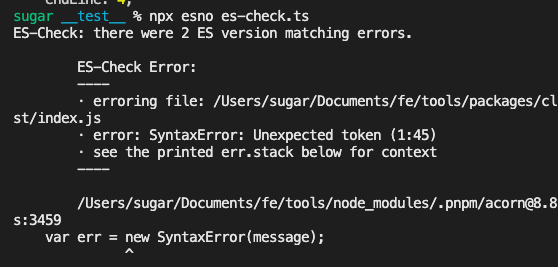


### 小结
1. 只能检测源码中是否存在不符合对应ECMAScript版本的语法
2. 只会反应出文件中第一个语法问题
3. 错误信息只包含所在文件中的`行列号`以及`parser error`
4. 不支持html

## mpx-es-check
>滴滴出品的 [mpx](https://mpxjs.cn/) (增强型跨端小程序框架)的配套工具 [@mpxjs/es-check](https://github.com/mpx-ecology/mpx-es-check)

咱们还是用上面的例子先实测一下效果
```sh
# 1
npm i -g @mpxjs/es-check
# 2
mpx-es-check --ecma=6 testProject/**/*.js
```
可以看到其将错误信息输出到了1个log文件中

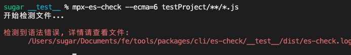

log日志信息如下，还是很清晰的指出了有哪些错误并标明了错误的具体位置，内置了`source-map`解析。

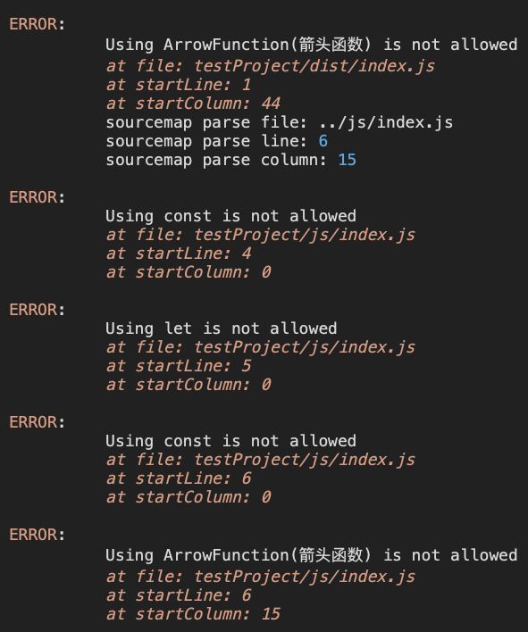

下面来探究一下实现原理
### 原理分析
打开源码，从[入口文件](https://github.com/mpx-ecology/mpx-es-check/blob/master/index.js)开始看，大体分为以下几步：
1. 使用`glob`获取要检测目标文件
2. 获取文件对应的`源码`和`sourcemap`文件内容
3. 使用[@babel/parser](https://babel.dev/docs/en/babel-parser)解析生成AST
4. 使用[@babel/traverse](https://babel.dev/docs/en/babel-traverse)遍历节点
5. 将所有非ES5语法的节点规则进行枚举，再遍历节点时，找出符合条件的节点
6. 格式化输出信息

其中`@babel/parser`与`@babel/traverse`是`babel`的核心构成部分。一个用于解析一个用于遍历

节点规则示例如下，这个方法准确，就是费时费力，需要将每个版本的特性都穷举出来
```ts
// 部分节点规则
const partRule = {
  // let and const
  VariableDeclaration(node) {
    if (node.kind === 'let' || node.kind === 'const') {
      errArr.push({
        node,
        message: `Using ${node.kind} is not allowed`
      })
    }
  },
  // 箭头函数
  ArrowFunctionExpression(node) {
    errArr.push({
      node,
      message: 'Using ArrowFunction(箭头函数) is not allowed'
    })
  }
}
```

下面是遍历规则与节点的逻辑
```ts
// 存放所有节点
const nodeQueue = []
const code = fs.readFileSync(file, 'utf8')
// 生成AST
const ast = babelParser.parse(code, acornOpts)
// 遍历获取所有节点
babelTraverse(ast, {
  enter(path) {
    const { node } = path
    nodeQueue.push({ node, path })
  }
})

// 遍历每个节点，执行对应的规则
nodeQueue.forEach(({ node, path }) => {
  partRule[node.type]?.(node)
})

// 解析格式化错误
errArr.forEach((err) => {
  // 省略 sourcemap 解析步骤
  problems.push({
    file,
    message: err.message,
    startLine: err.node.loc.start.line,
    startColumn: err.node.loc.start.column
  })
})
```
精简实现的运行结果如下，完整源码见[Github](https://github.com/ATQQ/tools/blob/feature/es-check/packages/cli/es-check/__test__/mpx-es-check.ts)

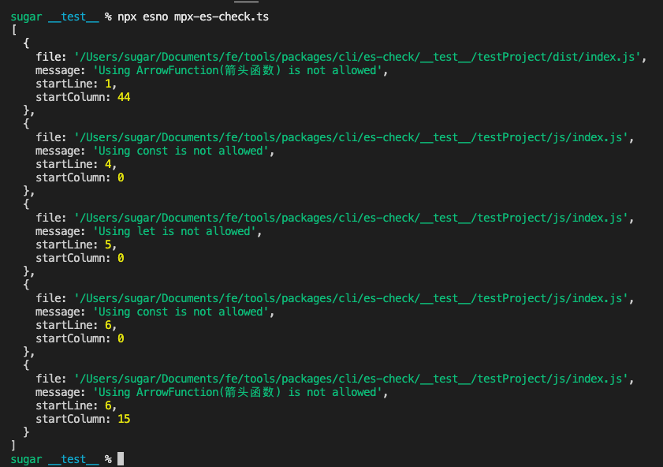

### 小结
1. 检测输出的结果相对友好（比较理想的格式），内置了sourcemap解析逻辑
2. 不支持html
3. 需要额外维护一套规则（相对ECMAScript迭代频率来说，可以接受）

## 增强实现es-check
综上2个对比，从源码实现反应来看 `es-check` 的实现更简单，维护成本也相对较低
<!-- 补超链接 -->
@sugarat/es-check 也将基于`es-check`做1个增强实现，弥补`单文件多次检测`,`支持HTML`、`sourcemap解析`等能力

### 单文件多次检测
现状：利用`acorn.parse`直接对`code`进行解析时候，将会直接抛出`code`中的一处`解析错误`，然后就结束了

那咱们只需要将`code`拆成多个代码片段，那这个问题理论上就迎刃而解了

现在的问题就是怎么拆了？

我们这直接简单暴力一点，**对AST直接进行节点遍历，然后分别检测每个节点对应的代码是否合法**

首先使用`latest`版本生成这棵AST
```ts
const ast = acorn.parse(code, {
  ecmaVersion: 'latest'
})
```
接下来使用[acorn-walk](https://github.com/acornjs/acorn/tree/master/acorn-walk)进行遍历

```ts
import * as acornWalk from 'acorn-walk'

acornWalk.full(ast, (node, _state, _type) => {
  // 节点对应的源码
  const codeSnippet = code.slice(node.start, node.end)
  try {
    acorn.parse(codeSnippet, {
        ecmaVersion,
    })
  } catch (error) {
    // 在这里输出错误片段和解析报错原因
    console.log(codeSnippet)
    console.log(error.message)
  }
})
```
还是以前面的测试代码为例，输出的错误信息如下
```ts
var str = 'hello'
var str2 = 'world'

const varConst = 'const'
let varLet = 'let'
const arrFun = () => {
    console.log('hello world');
}
```
[完整demo1代码](https://github.com/ATQQ/tools/blob/feature/es-check/packages/cli/es-check/__test__/demos/more-error/1.ts)

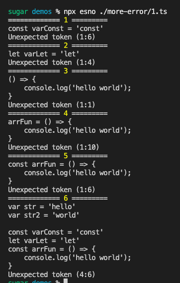

部分节点对应的片段可能不完整，会导致解析错误

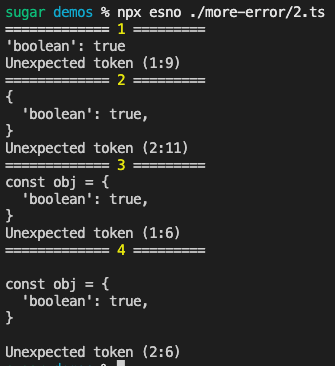

用于测试的片段如下

```ts
const obj = {
  'boolean': true,
}
```

这里可以再`parse`检测`error`前再parse一次`latest` 用于排除语法错误，额外逻辑如下
```ts
let isValidCode = true
// 判断代码片段 是否合法
try {
  acorn.parse(codeSnippet, {
    ecmaVersion: 'latest'
  })
} catch (_) {
  isValidCode = false
}
// 不合法不处理
if (!isValidCode) {
  return
}
```

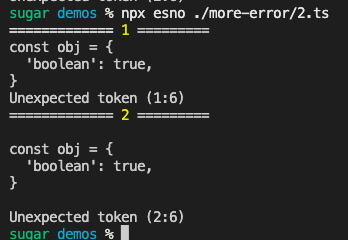

[完整demo2代码](https://github.com/ATQQ/tools/blob/feature/es-check/packages/cli/es-check/__test__/demos/more-error/2.ts)

此时输出的错误存在一些重复的情况，比如`父节点包含子节点的问题代码`，这里做一下过滤
```ts
const codeErrorList: any[] = []
acornWalk.full(ast, (node, _state, _type) => {
  // 节点对应的源码
  const codeSnippet = code.slice(node.start, node.end)
  // 省略重复代码。。。
  try {
    acorn.parse(codeSnippet, {
      ecmaVersion: '5'
    } as any)
  } catch (error: any) {
    // 与先存错误进行比较
    const isRepeat = codeErrorList.find((e) => {
      // 判断是否是包含关系
      return e.start >= node.start && e.end <= node.end
    })

    if (!isRepeat) {
      codeErrorList.push({
        codeSnippet,
        message: error.message,
        start: node.start,
        end: node.end
      })
    }
  }
})
console.log(codeErrorList)
```
修正后结果如下

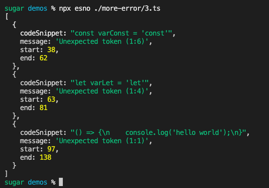

[完整demo3代码](https://github.com/ATQQ/tools/blob/feature/es-check/packages/cli/es-check/__test__/demos/more-error/3.ts)

如有一些边界情况也是在 `catch err`部分根据 `message`做一下过滤即可

比如下代码

```ts
var { boolean:hello } = {}
```
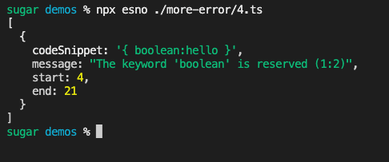

[完整demo4代码](https://github.com/ATQQ/tools/blob/feature/es-check/packages/cli/es-check/__test__/demos/more-error/4.ts)

做一下过滤，`catch message`添加过滤逻辑

```ts
const filterMessage = [/^The keyword /]
if (filterMessage.find((r) => r.test(error.message))) {
  return
}
```
调整后的报错信息就是`解构赋值`的语法错误了

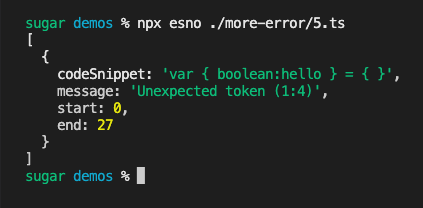

[完整demo5代码](https://github.com/ATQQ/tools/blob/feature/es-check/packages/cli/es-check/__test__/demos/more-error/5.ts)

至此基本能完成了`单文件的多次es-check检测`，虽然不像`mpx-es-check`那样用直白的语言直接说面是什么语法。但还有改进空间嘛，后面再单独写个文章做个工具检测目标代码用了哪些`ES6+`特性。就不再这里赘述了

### sourcemap解析
这个主要针对检测资源是`build产物`的一项优化，通过`source-map`解析报错信息对应的源码

前面的代码我们只获取了`问题源码`的起止字符位置`start`,`end`

通过source-map解析，首先要获取报错代码在资源中的行列信息

这里通过`acorn.getLineInfo`方法可直接获取行列信息

```ts
// 省略了重复代码
const codeErrorList: any[] = []
acornWalk.full(ast, (node, _state, _type) => {
  // 节点对应的源码
  const codeSnippet = code.slice(node.start, node.end)
  try {
    acorn.parse(codeSnippet, {
      ecmaVersion: '5'
    } as any)
  } catch (error) {
    const locStart = acorn.getLineInfo(code, node.start)
    const locEnd = acorn.getLineInfo(code, node.end)
    codeErrorList.push({
      loc: {
        start: locStart,
        end: locEnd
      }
    })
  }
})
console.dir(codeErrorList, {
  depth: 3
})
```
结果如下，[完整demo1代码](https://github.com/ATQQ/tools/blob/feature/es-check/packages/cli/es-check/__test__/demos/source-map/1.ts)

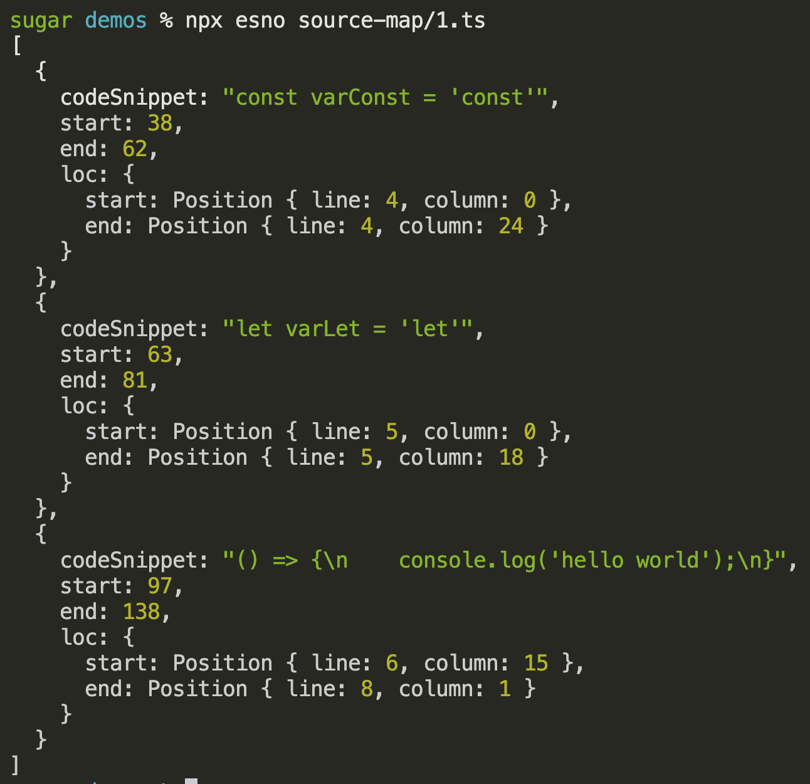

有了行列号，我们就可以根据`*.map`文件进行源码的解析

默认`map`文件由原文件名加`.map`后缀
```ts
function getSourcemapFileContent(file: string) {
  const sourceMapFile = `${file}.map`
  if (fs.existsSync(sourceMapFile)) {
    return fs.readFileSync(sourceMapFile, 'utf-8')
  }
  return ''
}
```
解析`map`文件直接使用 `sourceMap.SourceMapConsumer`,返回的实例是1个`Promise`,使用时需注意
```ts
function parseSourceMap(code: string) {
  const consumer = new sourceMap.SourceMapConsumer(code)
  return consumer
}
```
根据前面`source-map`解析的例子，把这块逻辑放到`checkCode`之后即可
```ts
const code = fs.readFileSync(file, 'utf-8')
// ps: checkCode 即为上一小节实现代码检测能力的封装
const codeErrorList = checkCode(code)
const sourceMapContent = getSourcemapFileContent(file)
if (sourceMapContent) {
  const consumer = await parseSourceMap(sourceMapContent)
  codeErrorList.forEach((v) => {
    // 解析获取原文件信息
    const smStart = consumer.originalPositionFor({
      line: v.loc.start.line,
      column: v.loc.start.column
    })
    const smEnd = consumer.originalPositionFor({
      line: v.loc.end.line,
      column: v.loc.end.column
    })

    // start对应源码所在行的代码
    const sourceStartCode = consumer
      .sourceContentFor(smStart.source!)
      ?.split(/\r?\n/g)[smStart.line! - 1]
    const sourceEndCode = consumer
      .sourceContentFor(smEnd.source!)
      ?.split(/\r?\n/g)[smEnd.line! - 1]
    // 省略 console 打印代码
  })
}
```
[完整demo2代码](https://github.com/ATQQ/tools/blob/feature/es-check/packages/cli/es-check/__test__/demos/source-map/2.ts)

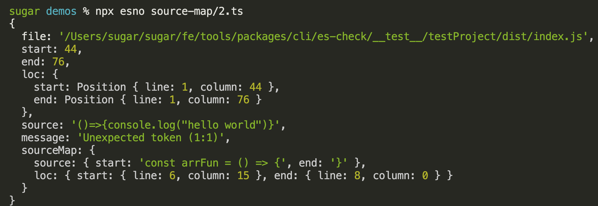

这块就对齐了`mpx-es-check`的`source-map`解析能力
### HTML支持
这个就比较好办了，只需要将`script`里的内容提取出来，调用上述的`checkCode`方法，然后对结果进行一个行列号的优化即可

这里提取的方法很多，可以
1. `正则匹配`
2. [cheerio](https://cheerio.js.org/)：像jQuery一样操作
3. [parse5](https://github.com/inikulin/parse5)：生成AST，递归遍历需要的节点
4. [htmlparser2](https://github.com/fb55/htmlparser2)：生成AST，相比`parse5`更加，解析策略更加”包容“

小试对比了一下，最后发现是用`parse5`更符合这个场景（编写代码更少）

```ts
import * as parse5 from 'parse5'

const htmlAST = parse5.parse(code, {
  sourceCodeLocationInfo: true
})
```
下面是生成的AST示例: https://astexplorer.net/#/gist/03728790dcd82e64204cdf4641a43d8f/c988f350916bfe04c642333b0839ed35e7578ca6

通过`nodeName`或者`tagName`就可以区分节点类型，这里简单写个遍历方法

节点可以通过`childNodes`属性区分是否包含子节点

```ts
function traverse(ast: any, traverseSchema: Record<string, any>) {
  traverseSchema?.[ast?.nodeName]?.(ast)
  if (ast?.nodeName !== ast?.tagName) {
    traverseSchema?.[ast?.tagName]?.(ast)
  }
  ast?.childNodes?.forEach((n) => {
    traverse(n, traverseSchema)
  })
}
```

这里遍历一下demo代码生成的ast
```ts
traverse(htmlAST, {
  script(node: any) {
    const code = `${node.childNodes.map((n) => n.value)}`
    const loc = node.sourceCodeLocation
    if (code) {
      console.log(code)
      console.log(loc)
    }
  }
})
```
[完整demo1代码](https://github.com/ATQQ/tools/blob/feature/es-check/packages/cli/es-check/__test__/demos/html-check/1.ts)

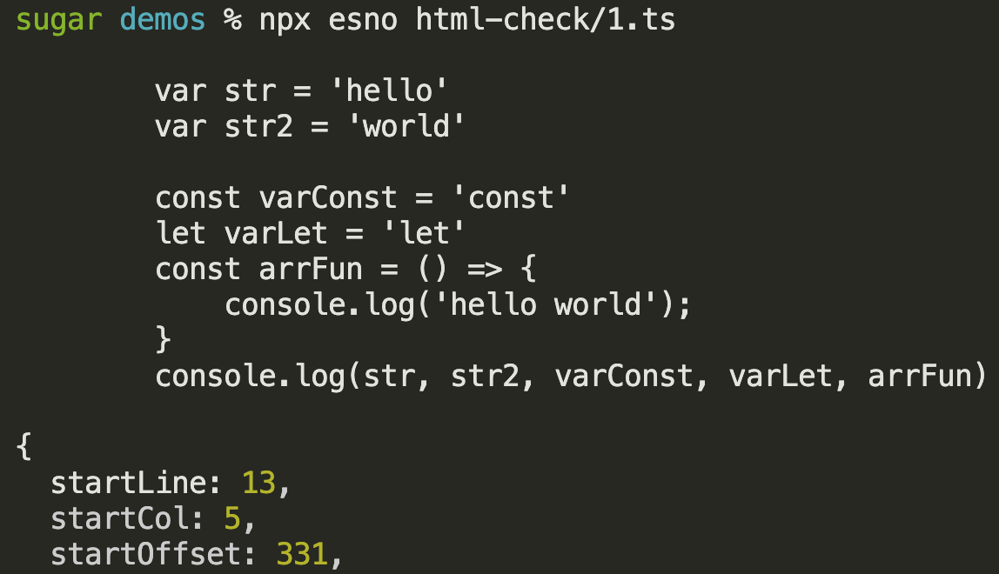

获得对应的源码后就可以调用之前的`checkCode`方法，对错误行号做一个拼接即可得到错误信息

```ts
traverse(htmlAST, {
  script(node: any) {
    const code = `${node.childNodes.map((n) => n.value)}`
    const loc = node.sourceCodeLocation
    if (code) {
      const errList = checkCode(code)
      errList.forEach((err) => {
        console.log(
          'line:',
          loc.startLine + err.loc.start.line - 1,
          'column:',
          err.loc.start.column
        )
        console.log(err.source)
        console.log()
      })
    }
  }
})
```
[完整demo2代码](https://github.com/ATQQ/tools/blob/feature/es-check/packages/cli/es-check/__test__/demos/html-check/2.ts)

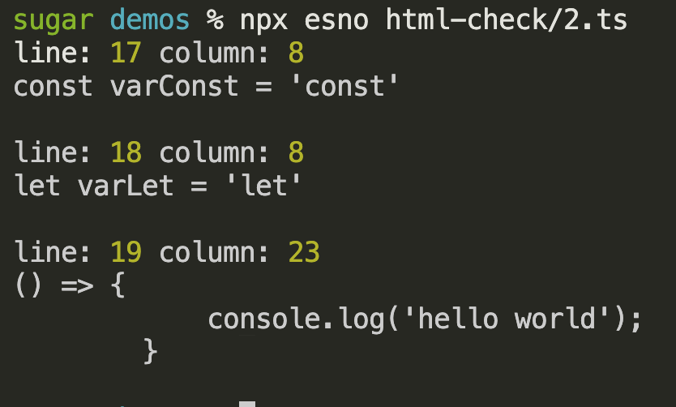

### 组建CLI能力
这里就不再赘述CLI过程代码，核心的已在前面阐述，这里直接上最终成品的使用演示，参数同`es-check`保持一致
```sh
npm i @sugarat/es-check -g
```

检测目标文件
```sh
escheck es5 testProject/**/*.js testProject/**/*.html
```
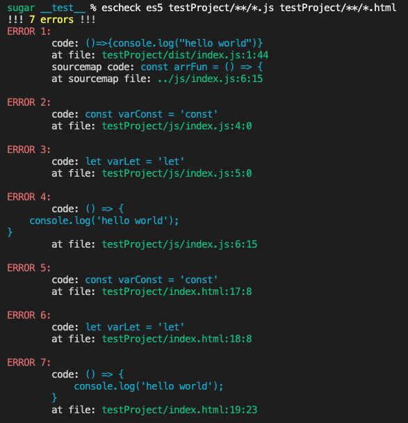

日志输出到文件

```sh
escheck es5 testProject/**/*.js testProject/**/*.html --out
```
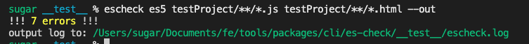
## 最终对比
| Name              | JS  | HTML | Friendly |
| ----------------- | --- | ---- | -------- |
| es-check          | ✅   | ❌    | ❌        |
| @mpxjs/es-check   | ✅   | ❌    | ✅        |
| @sugarat/es-check | ✅   | ✅    | ✅        |

取了2者的优点相结合然后做了一定的增强
## 最后
当然这个工具可能存在bug，遗漏部分场景等情况，读者试用可以评论区给反馈，或者库里直接提`issues`

有其它功能上的建议也可评论区留言交流

完整源码移步=>[Github](https://github.com/ATQQ/tools/tree/main/packages/cli/es-check)

## 参考
* [es-check](https://github.com/yowainwright/es-check)：社区出品
* [mpx-es-check](https://github.com/mpx-ecology/mpx-es-check)：滴滴出品 [MPX](https://mpxjs.cn/) 框架的配套工具


