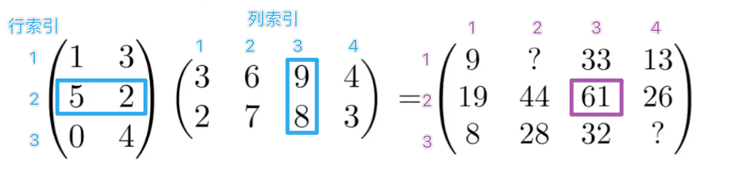
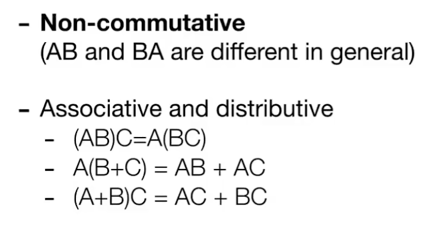

---
tags:
  - 图形学
  - 数学
  - 计算机图形学
  - 矩阵
categories:
  - 图形学
title: 🔢 矩阵乘法
---
# 🔢 矩阵乘法

假设有 a 和 b 两个矩阵，那么只有 a 的列数和 b 的行数相等时才可以进行矩阵乘法。得到的结果矩阵的大小是 a 的行数和 b 的列数：

(M x N)(N x P) = (M x P)

注：*(行数 x 列数)*

#### 每个单项的计算方法

计算 x 行 y 列 位置的结果时，只需将 **a 矩阵中 x 行** 和 **b 矩阵中 y 列**的向量进行**点乘**即可。
$$
\begin{equation}\begin{split}
(5, 2) \cdot (9, 8)= 61 \\
= 5*9+2*8

\end{split}\end{equation}
$$

#### 矩阵乘法**没有交换律**，但是**符合结合律**

 

<Citation type="转载" source="Nólëbase" url="https://nolebase.ayaka.io/zh-CN/%E7%AC%94%E8%AE%B0/%F0%9F%93%90%20%E5%9B%BE%E5%BD%A2%E5%AD%A6/%F0%9F%94%A2%20%E7%9F%A9%E9%98%B5%E4%B9%98%E6%B3%95.html" />
