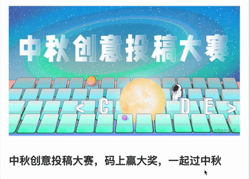
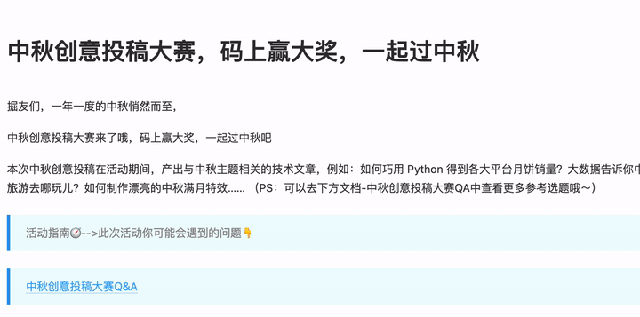

# 马上中秋了，把鼠标指针变为小玉兔

>我正在参加中秋创意投稿大赛，详情请看：[中秋创意投稿大赛](https://juejin.cn/post/7003154195826081800)”

## 前言
马上中秋节啦，掘金又开始[整活](https://juejin.cn/post/7003154195826081800)了，恰巧最近准备做的工具会涉及到鼠标指针的变动，就顺手先写个demo蹭蹭活动了。

顺便提前祝大家🎑中秋节快乐。

当然这个鼠标指针的变动只在Web应用中生效

方便的话可以[原文](https://juejin.cn/post/7006592666846625823)戳个赞
## 效果如下


emmmmm...动图时间较长，需要等一会儿效果才出来

## 码上体验
在devtools中运行下面这段神秘代码即可，实现源码见[此处](https://github.com/ATQQ/demos/blob/main/yuebingCursor/index.js)
```js
const script = document.createElement('script')
script.src = './mid-autumn-festival/index.js?s1=https%3A//img.cdn.sugarat.top/demo/js-sdk/zq-rabbit/0.0.2/index.js'
document.body.append(script)
```
将此部分代码加入到目标页面中即可
## 实现思路
从动图中看到共有两种元素：
1. 鼠标移动时，鼠标被替换成了玉兔
2. 玉兔的尾巴处跟着一串月饼🥮

下面通过QA的方式，将开发中涉及到的问题先过一下。

### 获得鼠标指针的位置

通过监听`window`上的`mousemove`事件，即可获取到鼠标移动时的位置参数

### 隐藏原来的指针

css有一个属性[cursor](https://developer.mozilla.org/zh-CN/docs/Web/CSS/cursor)可以用于设置指针的类型。我们将捕获事件的dom(event.target)的cursor设置为`none`即可

### 实现指针的变更

解决了上述两个问题后，我们可以通过创建一个简单的`dom`元素来替代我们的指针，通过实时获取到鼠标的位置，实时更新我们的dom元素位置即可

### 实现鼠标轨迹
每个一段时间（如30ms）记录一下鼠标的位置，然后与绘制指针一样的逻辑，将轨迹用月饼🥮绘制出来


这里只描述了开发中初期会遇到的问题，还有一些其它问题将在下面详细实现部分进行介绍

## 玉兔指针实现
监听`mousemove`事件，获取指针相对屏幕顶部与左侧位置信息
```js
window.addEventListener('mousemove', function (e) {
    const { clientX, clientY } = e
})
```

创建一个元素，设置其背景图为玉兔，并将其插入到主文档中，并初始化一些位置/形状相关的css属性。
```js
const size = '30px'
function createCursor() {
    const cursor = h()
    cursor.id = 'cursor'

    addStyles(cursor, `
    #cursor{
        background-image:url(./mid-autumn-festival/MTYzMTMyNDYwNTgzMQ==631324605831.png);
        width:${size};
        height:${size};
        background-size:${size} ${size};
        position:fixed;
        display:none;
        cursor:none;
        transform: translate(-30%, -20%);
    }
    `)
    document.body.append(cursor)
    return cursor
}
const cursor = createCursor()

// 工具方法
function addStyles(target, styles) {
    const style = document.createElement('style')
    style.textContent = styles
    target.append(style)
}

function h(tag = 'div') {
    return document.createElement(tag)
}
```

编写更新玉兔位置的方法`refreshCursorPos`，并在一段时间后，让指针恢复原状
```js
function refreshCursorPos(x, y) {
    cursor.style.display = 'block'
    cursor.style.cursor = 'none'
    cursor.style.left = `${x}px`
    cursor.style.top = `${y}px`

    // 一段时间后隐藏
    if (refreshCursorPos.timer) {
        clearTimeout(refreshCursorPos.timer)
    }
    refreshCursorPos.timer = setTimeout(() => {
        cursor.style.display = 'none'
    }, 500)
}
```

与此前的方法结合，并将目标元素的指针隐藏一段时间，隐藏与恢复这里用`WeakMap`来做一个辅助，存储节点与定时器的映射关系，做个简单的防抖

```js
const weakMap = new WeakMap()
window.addEventListener('mousemove', function (e) {
    const { clientX, clientY } = e

    // 隐藏捕获mousemove事件的元素的指针，并在一段时间后恢复
    e.target.style.cursor = 'none'
    let timer = weakMap.get(e.target)
    if(timer){
        clearTimeout(timer)
    }
    timer = setTimeout(()=>{
        e.target.style.cursor = 'auto'
    },500)
    weakMap.set(e.target,timer)

    // 更新玉兔位置
    refreshCursorPos(clientX, clientY)
})
```

到这里你以为就结束了？当然没有，此时会有一个问题，你的玉兔指针无法正常工作，如下所示



当月兔出现的时候，无法正常点击跳链，选择文字元素

原因是由于，所有的事件都被你的"月兔"所捕获了

如何避免事件被目标元素捕获？ 通过css设置元素[pointer-events](https://developer.mozilla.org/zh-CN/docs/Web/CSS/pointer-events)属性为`none`即可，设置为`none`后，目标元素永远不会成为鼠标事件的`target`

于是为`#cursor`元素的css，添上一行样式`pointer-events: none;`即可

## 月饼轨迹实现

有了上面实现玉兔指针的经验实现月饼轨迹就很容易了

每个月饼元素均用一个div绘制，将月饼的初始样式表先加入到页面中
```js
const orbitSize = '40px'
addStyles(document.body, `
    .orbit{
        background-image:url(./mid-autumn-festival/MTYzMTMyNDMwODg2Nw==631324308867.png);
        width:${orbitSize};
        height:${orbitSize};
        background-size:${orbitSize} ${orbitSize};
        position:fixed;
        display:none;
        cursor:none;
        pointer-events: none;
    }
`)
```

月饼轨迹上限的月饼设置为**5**个，简单的循环创建一下
```js
const ybCounts = 5
const domList = []
for (let i = 0; i < ybCounts; i++) {
    const d = h()
    d.classList.add('orbit')
    domList.push(d)
    document.body.append(d)
}
```

创建一个数组用于存储指针最近的**5**个位置，一个临时变量用于后续辅助存储轨迹点信息
```js
const posList = []
let now = 0
```

编写`refreshOrbit`方法用于更新轨迹：
* 由于轨迹有个缩放的效果，越到后面的圆饼越小，这里通过`maxScale`确定最大的放大倍数
* 根据轨迹点个数，确定每个`月饼`最终的缩放倍数
* 根据存储的指针位置信息，一一对应的更新月饼位置即可
```js
function refreshOrbit(x, y) {
    // 刷新位置
    const maxScale = 1.5
    const minScale = maxScale / domList.length
    posList.forEach(({ x, y }, idx) => {
        const dom = domList[idx]
        dom.style.display = 'block'
        dom.style.left = `${x}px`
        dom.style.top = `${y}px`
        dom.style.transform = `scale(${(idx + 1) * minScale}) translate(10%,10%)`
        if (dom.timer) {
            clearTimeout(dom.timer)
        }
        dom.timer = setTimeout(() => {
            dom.style.display = 'none'
        }, 50 * (idx + 1))
    })

    const nowTime = Date.now()
    // 隔一段时间存储一个
    if (now + 50 > nowTime) {
        return
    }
    now = nowTime
    posList.push({
        x, y
    })
    // 只存储限定的个数
    if (posList.length === ybCounts+1) {
        posList.shift()
    }
}
```

时间回掉中调用更新轨迹的方法
```js
window.addEventListener('mousemove', function (e) {
    const { clientX, clientY } = e
    // ...省略其它代码
    // 更新月饼轨迹
    refreshOrbit(clientX, clientY)
})
```

## 支持移动端
这个简单，监听`touchmove`事件即可
```js
window.addEventListener('touchmove', function (e) {
    const { clientX, clientY } = e.changedTouches[0]
    refreshCursorPos(clientX, clientY)

    // 更新月饼轨迹
    refreshOrbit(clientX, clientY)
})
```

## 最后
后续准备把这个设置指针样式的脚本抽成一个通用的js sdk和大家分享，这样想怎么改指针样式就怎么改

大家有更好的方案可以评论区交流一波

<Citation type="转载" source="粥里有勺糖的博客" url="https://sugarat.top/technology/learn/mid-autumn-festival.html" />
