---
tags:
  - 前端
  - 技术笔记
description: 记录分享在小程序中使用 lottie 播放AE动画的方法，以及踩坑经验。
categories:
  - 大前端
  - 技术文章
---
# 小程序中使用 lottie 动画 | 踩坑经验分享

本周被拉去支援紧急需求（赶在五一节假日前上线的，双休需要加班😱），参与到项目中才知道，开发的项目是微信小程序技术栈的。由于是临时支援，笔者也很久没开发过微信小程序了，所以挑选了相对独立，业务属性相对轻薄的模块参与。

其中有个营销活动（领红包🧧😁）的弹窗动画就要用到 lottie 动画。

本文就分享一下在小程序中使用 lottie 过程中遇到的问题与解决办法。

## 关于 lottie

[lottie](https://airbnb.io/lottie/#/README) 是 Airbnb 开源的一个动画库，用于在端上直接播放 AE ( Adobe After Effects)动画。

通过 [bodymovin](https://github.com/airbnb/lottie-web/tree/master/build/extension) AE 插件将动画文件导出为 json 文件，lottie SDK 通过可以通过 JSON 文件直接播放动画。

具体 demos 效果可以上 [LottieFiles](https://lottiefiles.com/) 网站查看。

## 如何使用 AE 导出动画需要的JSON文件
完成 AE 软件安装后，参照 [Lottie Web GitHub 官方文档](https://github.com/airbnb/lottie-web/tree/master?tab=readme-ov-file#plugin-installation) 完成 `bodymovin` 插件的安装。

打开动画文件后，只需简单几步操作

① window 中选择 Bodymovie

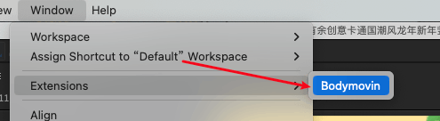

② 选择需要导出的动画资源

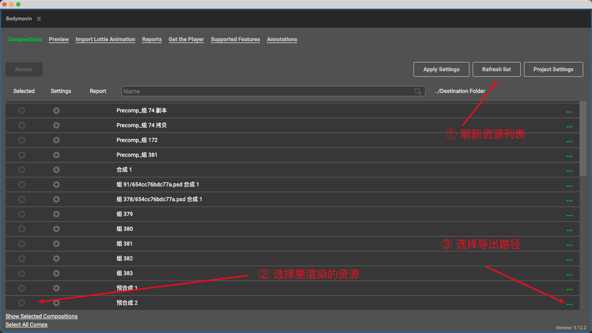

③ 导出配置（小程序相关）

点击对应动画的设置

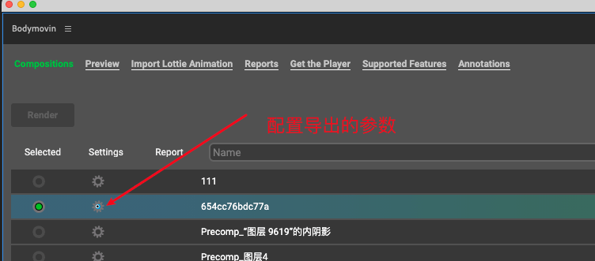

勾选 `Glyphs` 将用到的文字+字体导出为图形。

小程序里渲染不支持加载外部字体。

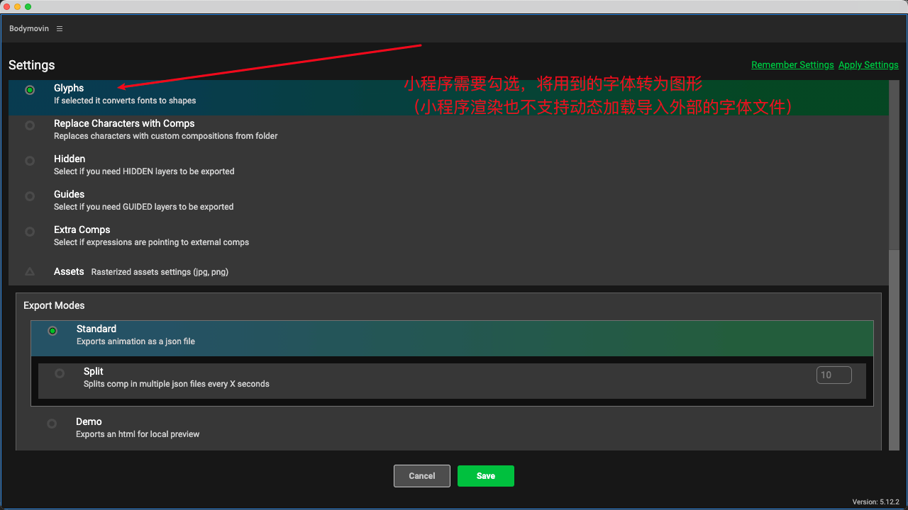

*这个就会有 tree shake的效果，如果动画里没有用到的文字，做动态替换的时候就会不显示，后面会详细介绍到*。

勾选 `Convert expressions to keyframes` 将表达式转为关键帧，因为小程序里不支持使用 `eval` 等动态执行脚本的能力。

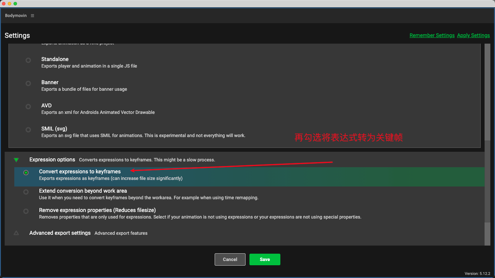

修改完成后点击`Save`保存配置。

④ 渲染导出 JSON 文件

最后点击 Render 按钮，导出 JSON 文件。

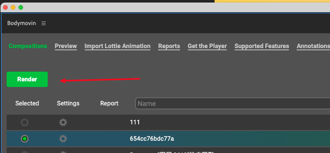

导出文件如下，data.json 文件就是我们需要的 JSON 文件，images 里存储的就是播放要用到的图片文件。

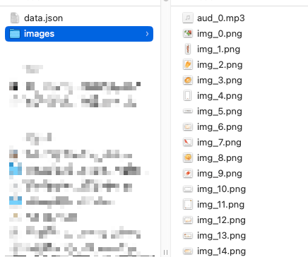

## 小程序中使用

可以使用小程序官方封装的 [lottie-miniprogram](https://github.com/wechat-miniprogram/lottie-miniprogram) 库。

>快速验证的话可以打开微信开发者工具，在点击👉🏻 [demo代码片段](https://developers.weixin.qq.com/s/2TYvm9mJ75bF) 进行创建。

① 安装依赖

```sh
npm install --save lottie-miniprogram
```
② 使用

**tip：开发者工具中验证的话，渲染模式需要选择 webview ，[Skyline](https://developers.weixin.qq.com/miniprogram/dev/framework/runtime/skyline/introduction.html) 目前还不支持调试 canvas**

index.wxml
```html
<canvas id="lottie-canvas" type="2d"></canvas>
```

index.js
```js
import lottie from 'lottie-miniprogram'

Page({
  onReady() {
    this.createSelectorQuery().select('#lottie-canvas').node((res) => {
      // 取得 canvas 节点
      const canvas = res[0].node

      // 设置 cavnas 画布尺寸
      canvas.width = 600
      canvas.height = 600

      lottie.setup(canvas)

      const context = canvas.getContext('2d')
      const lottieInstance = lottie.loadAnimation({
        loop: true, // 循环播放
        autoplay: true, // 自动播放
        // 本地使用 http-server 启动服务后，指定本地资源地址
        path: 'http://127.0.0.1:8080/lottie-demo-sources/data.json', // 通过http 制定json资源路径

        // 也可以用下面这种方式，直接传入 lottie json内容
        // (需要动态替换文案就需要用到这种方式)
        // animationData: {/* lottie json 格式内容 */},
        // 静态资源目录，通常与 animationData 配合使用
        // assetsPath: 'http://127.0.0.1:8080/lottie-demo-sources/images/',

        rendererSettings: {
          context,
        },
      })
    }).exec()
  }
})
```

我这个 demo 的效果（网上找的动画素材）如下。

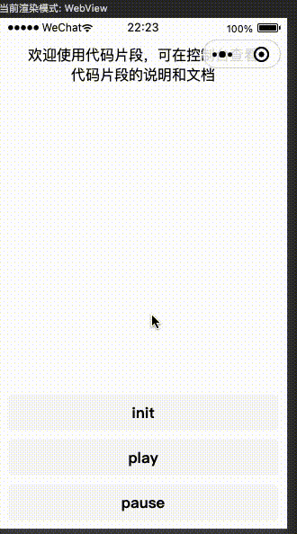

## 问题&解决
下面介绍在实际业务接入使用中遇到的一些问题和解决办法。

### expression 表达式
报错信息如下，这是遇到的第一个问题（也是上面导出配置中有特别说明的）。

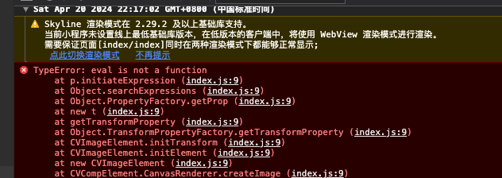

细看了一下文档，有特别说明，expression 表达式特性是不支持的，因此需要再导出 JSON 文件时禁用相关特性。

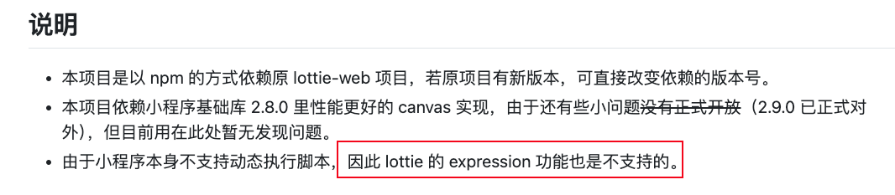

解决办法：导出JSON文件时，禁用掉表达式特性即可。

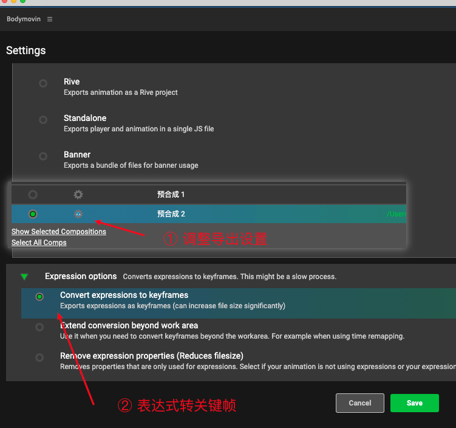

当然禁用后，JSON 文件大小会有所增加。

比如我这个 demo 从 40kb 增加到了 240kb（当然动画不一样，增长的大小会有所不同。有些前后可能只有1-2kb的变化）。

### 模糊

由于需要全屏展示，动画文件的尺寸不确定，手动只设置 canvas 尺寸会有模糊的问题。

这个通过掘金搜索了一下就得到了 [lottie动画模糊问题的解决方法](https://juejin.cn/post/7171273016762974216#heading-7)。

微调一下上面的代码，就可以解决模糊问题。

```js
const canvas = res[0].node
canvas.width = 600
canvas.height = 600

// 下面是新增的代码
const dpr = wx.getSystemInfoSync().pixelRatio
canvas.width = canvas.width * dpr
canvas.height = canvas.height * dpr
context.scale(dpr, dpr)

lottie.setup(canvas)
```

### 全屏动画
弹窗的动画需要全屏展示，因此需要设置 `canvas` 宽高为页面宽高。

index.wxss
```css
#lottie-canvas{
    position: fixed;
    left: 0;
    top: 0;
    width: 100vw;
    height: 100vh;
}
```

index.js，使用 `wx.getSystemInfoSync` 获取设备的信息
```js
const { windowWidth, windowHeight, pixelRatio } = wx.getSystemInfoSync()
canvas.width = windowWidth * pixelRatio
canvas.height = windowHeight * pixelRatio
```


### 动态文案
由于是红包，需要动态展示金额（当然也可能是不固定内容的动态标题）。

思路可以参考这篇文章[知乎： 动态修改 Lottie 中的文本](https://zhuanlan.zhihu.com/p/102334701?s_r=0)

可以使用固定格式的文本 `${文本}` 进行替换

```js
// 伪代码
get('sourceUrl').then((res) => {
  const jsonText = res.data
  const animationData = JSON.parse(jsonText.replace('${金额}', '目标金额'))
})
```

比如我在 demo 里加一个文字
* 需要展示的文本里放入 `${num}` 用于替换匹配
* 在添加一个文本藏在看不见的地方,里面写入替换后需要用到的文字（确保和上面的文本为同一种字体）

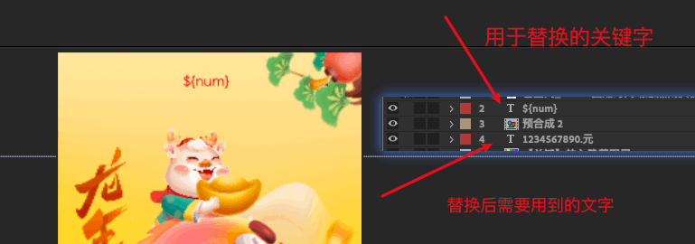

接着导出 JSON 文件。

调用方法如下
```js
// 拉取JSON文件内容
const jsonData = await new Promise((resolve) => {
  wx.request({
    url: 'http://127.0.0.1:8080/json/text-replace/data.json',
    success: (res) => {
      resolve(res.data)
    }
  })
})

// 随机生成1-100元的数字，保留两位小数
const num = (Math.random() * 100).toFixed(2)
// 替换内容
const animationData = JSON.parse(
  JSON.stringify(jsonData)
    .replace(/\$\{num\}/g, `${num}元`)
)

lottie.loadAnimation({
  // 指定json内容
  animationData,
  // 设置依赖的图片资源位置
  assetsPath: 'http://127.0.0.1:8080/json/text-replace/images/',
  // ...省略其它配置
})
```

效果如下

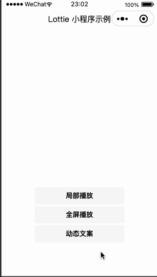


### style 引发的渲染错误

在 canvas 标签上设置 `display`控制显隐，偶现会提示渲染层错误。

```html
<canvas style="display:{{show?'block':'none'}}" id="c1" type="2d"></canvas>
```

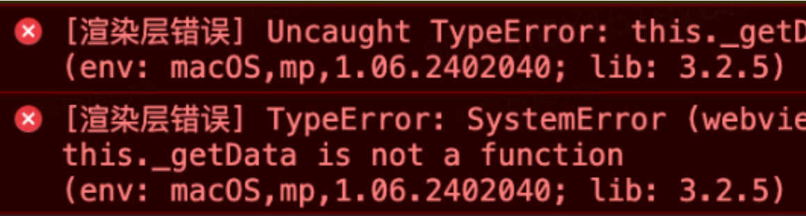

解决办法，给套了一层 `view`，用`wx:if`控制咯。
```html
<view  wx:if="{{show}}">
  <canvas id="c1" type="2d"></canvas>
</view>

```

### iOS 播放闪退问题

现象是，非冷启动小程序的时候，动画还没播放完毕就提前结束了。

看代码log，3s的动画，播放不到 1s 就触发了 `complete` 事件，看现象就是一闪而逝。

```js
const ani = lottie.loadAnimation({
  // 3s 的动画
  animationData,
  // ...省略其它配置
})

ani.addEventListener('complete', () => {
  console.log('动画播放结束')
})
```

问题排查：

① 翻看源码[lottie-miniprogram](https://github.com/wechat-miniprogram/lottie-miniprogram/tree/master)

在 `src/adapter/index.js` 中看到[下面这段代码](https://github.com/wechat-miniprogram/lottie-miniprogram/blob/49066a6479d710b5863754613a518c65487912db/src/adapter/index.js#L89-L101)

```js
window.requestAnimationFrame = function requestAnimationFrame(cb) {
  let called = false
  setTimeout(() => {
    if (called) {
      return
    }
    called = true
    typeof cb === 'function' && cb(Date.now())
  }, 100)
  canvas.requestAnimationFrame((timeStamp) => {
    if (called) {
      return
    }
    called = true
    typeof cb === 'function' && cb(timeStamp)
  })
}
```
在翻看一下小程序文档里 [canvas.requestAnimationFrame](https://developers.weixin.qq.com/miniprogram/dev/api/canvas/Canvas.requestAnimationFrame.html) 文档说明。

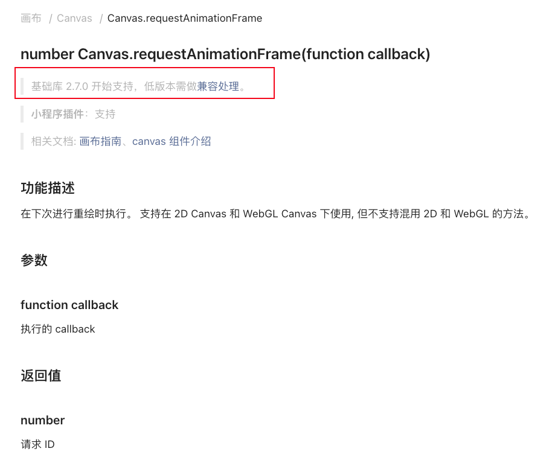

有点悟了上面的 `setTimeout` 代码，应该是为了兼容低版本的小程序，里面还有 `called` 变量控制，不重复执行。

猜测可能是在播放的时候执行了 `setTimeout` 里的逻辑导致动画提前结束。

于是我就加上了 `console.log` 发布到线上验证一下。

```js
setTimeout(() => {
  if (called) {
    return
  }
  called = true
  console.log('setTimeout', Date.now()) // [!code ++]
  typeof cb === 'function' && cb(Date.now())
}, 100)

canvas.requestAnimationFrame((timeStamp) => {
  if (called) {
    return
  }
  console.log('canvas.requestAnimationFrame', timeStamp) // [!code ++]
  called = true
  typeof cb === 'function' && cb(timeStamp)
})
```

vconsole 打印结果如下：

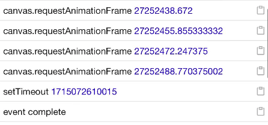

*一点补充，针对 `canvas.requestAnimationFrame` 回到函数的入参，小程序文档里虽没有详细介绍，但可以对标 Web 的
 [Window：requestAnimationFrame() 方法](https://developer.mozilla.org/zh-CN/docs/Web/API/window/requestAnimationFrame) 看一下 MDN 上的解释。*

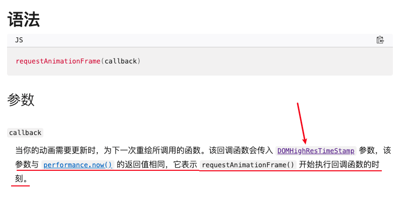

从上面的 `console` 日志看，原因确实是执行 setTimeout 里面的逻辑导致的动画结束。

可以得到引发bug的原因：↓

**某种情况下，`setTimeout(callback, 100)` 比 `canvas.requestAnimationFrame` 更快执行。**

*这个库很久没迭代了（现有版本是3年前发布的），每周还是有一些下载量，issue 里也没有提到 iOS 有这个问题！（切换渲染模式为 skyline 也没有触发这个问题，问题只在 webview 模式下有，且仅使用简单Demo也无法复现这个问题）*

*也不清楚小程序里 canvas.requestAnimationFrame 实现机制。*

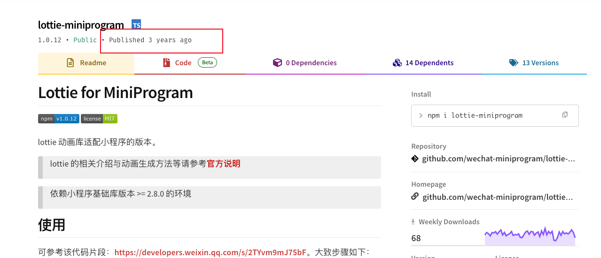

大胆揣测一下原因：

**页面实现可能过于复杂，复杂的业务逻辑执行阻塞在逻辑层，导致 setTimeout 时间到了以后回调函数入栈，接着就在逻辑层调用执行了**

解决办法：

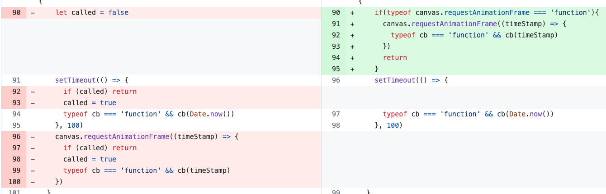

**既然是兼容实现，就判断一下是否存在 `requestAnimationFrame` 方法，存在就不执行 `setTimeout` 相关逻辑。**

完整解决 PR 见：https://github.com/wechat-miniprogram/lottie-miniprogram/pull/50

将打包后的产物替换到 `node_modules` 里对应位置后，再使用 [patch-package](https://www.npmjs.com/package/patch-package) 生成 patch，以便后续安装依赖自动更新

## 最后
时间匆忙，介绍的不是非常的详细，感兴趣的同学可以评论区交流。

`demo` 完整源码见 [GitHub：lottie-demo](https://github.com/ATQQ/demos/tree/main/miniprogram/lottie-demo)

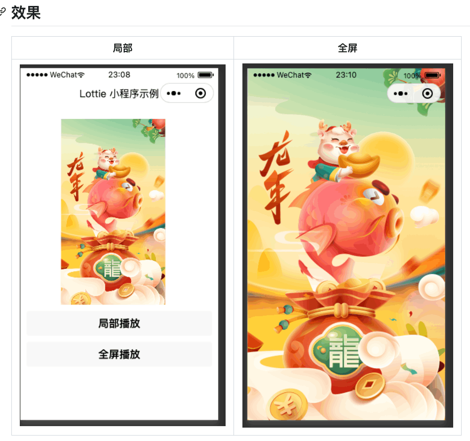

<Citation type="转载" source="粥里有勺糖的博客" url="https://sugarat.top" />
