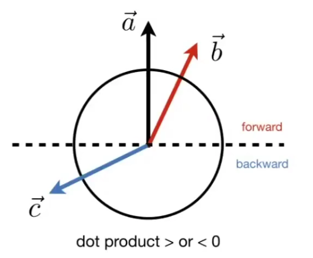
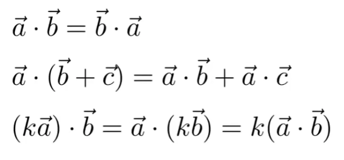
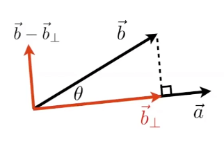

---
tags:
  - 图形学
  - 数学
  - 计算机图形学
  - 向量运算
categories:
  - 图形学
title: 🔘 点乘
---
# 🔘 点乘

### $a \cdot b$

点乘被用于**向量和一维矩阵的计算**，点乘的结果是一个**值**(标量)。

#### 计算公式

$$
a \cdot b = a_1b_1 +a_2b_2+...+a_nb_n
$$

> 向量 a 和向量 b 的每个元素一一对应的进行乘法运算，然后将结果用加法求和。

点乘的几何意义是可以用来表征或计算两个**向量之间的夹角**，以及在b向量在a向量方向上的**投影**

#### 代码参考

```typescript
export function dotProduct(mA: number[], mB: number[]) {
  return mA.map((_, i) => mA[i] * mB[i]).reduce((a, b) => a + b)
}
```

#### 结果的几何意义

两个向量的方向越接近则值越大，完全同向时值为 1，完全相反时值为 -1，90度夹角时值为 0。可用于判断两个向量之间的**距离远近**、**朝向是否相同**。



#### 满足交换律



#### 计算向量投影



向量 b 到向量 a 的投影称为 $\vec b_\bot$ , 它的长度（标量投影）公式是：
$$
|\vec b_\bot| = |\vec b|\cos\theta
$$
得出 $\vec b_\bot$ 的向量投影公式：
$$
\vec b_\bot = |\vec b|\cos\theta \hat a
$$
通过 $\vec b - \vec b_\bot$ 可以得到 $\vec b$ 另一个方向上的分量

<Citation type="转载" source="Nólëbase" url="https://nolebase.ayaka.io/zh-CN/%E7%AC%94%E8%AE%B0/%F0%9F%93%90%20%E5%9B%BE%E5%BD%A2%E5%AD%A6/%F0%9F%94%98%20%E7%82%B9%E4%B9%98.html" />
