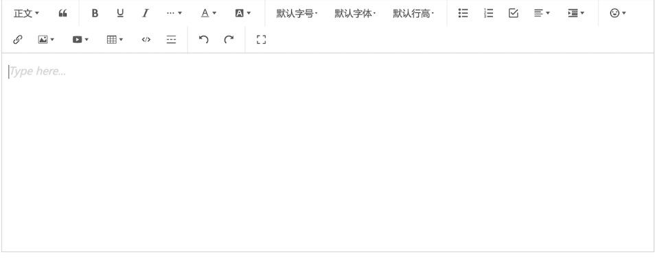
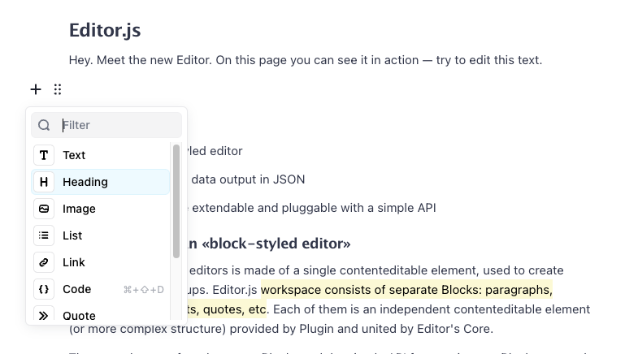
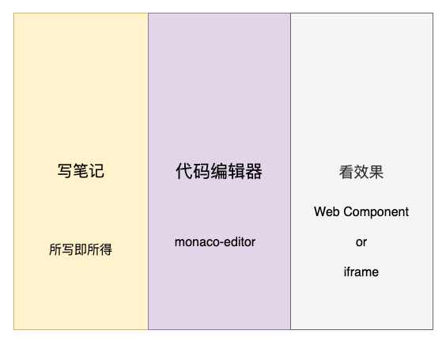

# 组装个支持记笔记的CodePen
## 前言
emmm。。。，有好长一段时间没码文了（近几个月实在是太忙了），这个玩具刚好是这两周抽空`拼`的拿出来和大家分享一下

朋友最近刚学前端，经常问一些问题，通过聊天软件发代码和贴图实在是不太方便，就给它推荐了[CodePen](https://codepen.io/) 和 [🐴上掘金](https://code.juejin.cn/)

前者国内访问实在不稳定，后者emm有个内容审核，导致内容`实时性`较差。

就搜了搜GitHub上有不有类似的项目，搜了一圈还真有不少，这里贴两个感觉不错的 [CodeRun](https://wanglin2.github.io/code-run-online/#/) 和 [CodePan](https://codepan.egoist.sh/)

朋友使用后反馈，问了问有不有啥支持直接在旁边 **写笔记**，**贴图片（这个）**，方便做记录

emm...，检索了一圈记忆中除了 `VsCode` 好像还真没有这种东西（可能是我孤陋寡闻了，读者有推荐的可以评论区补充）

那就给他造个吧，练练手，有段时间没写自己的代码了

等不及了？先体验体验👉🏻 [示例1：应用首页](https://code.sugarat.top)，[示例2：分享代码](https://code.sugarat.top/share/63035c10a6ea447087355f55)

## 技术选型
行动肯定是要站在巨人的"键盘上"(手滑打错了，那就这样吧)，先看看有哪些可用的 "零件"

### 内容编辑器
先是写笔记部分，挑了几个库玩了一下
* [wangEditor](https://www.wangeditor.com/) - 开源 Web 富文本编辑器，开箱即用，配置简单
* [prosemirror](https://prosemirror.net/) - 支持部分MarkDown语法，可拓展定制的富文本编辑器
* [🧴 Lotion](https://lotion.dashibase.com/) - 基于Vue3开发的块编辑器
* [Editor.js](https://editorjs.io/) - 官方:"Next generation block styled editor.",下一代块编辑器

因为屏幕中需要展示 笔记/代码/预览 3个部分，直接使用markdown语法会有个切换的动作（这里就不考虑markdown格式做编辑了）

上述的几个库分大体上分为两类`富文本编辑器`，`块编辑器`

|                                富文本编辑器                                 |                                  块编辑器                                   |
| :-------------------------------------------------------------------------: | :-------------------------------------------------------------------------: |
|  |  |

前者是比较传统的编辑器，后者从社区反应来看像是`下一代趋势`，但国内好像还没看到使用此方案的成熟产品（可能是我孤陋寡闻了，读者有推荐的可以评论区补充）

最后本着技术尝鲜（喜欢折腾）的精神选了[Editor.js](https://editorjs.io/)，官方提供了一系列的基础插件，提供了简单的API支持自定义的插件（后面单独开文章介绍）

### 代码编辑器
这个就[monaco-editor](https://github.com/microsoft/monaco-editor) 没得跑了

不过在使用之前先看了一下最近阿里开源的[OpenSumi](https://opensumi.com/zh)，看之前以为是个可直接用的`NPM`包，文档翻了半天，只给了个demo，emm 拉下来，果然如官方预料 卡在了 `yarn install`，感觉有一定上手成本，先不看了


### 后端部分
思考了一下都是简单的`CRUD`场景，存储和鉴权`MongoDB`与`Redis`感觉就够了（也没有配置成本，安装即用）

服务端框架部分就直接拿自己的之前写的玩具[flash-wolves](https://github.com/ATQQ/flash-wolves)开整

接下来就是组装了


## 实现
### 项目搭建
粗糙的原型图如下



布局也比较简单
```html
<header>工具条...</header>
<!-- 主体内容 -->
<main>
    <Note />
    <Code />
    <Render />
</main>
```

直接拿之前整的模板进行创建[vite-vue3-template](https://github.com/ATQQ/vite-vue3-template)出前端工程
### 文本编辑部分
示例代码在线演示：https://code.sugarat.top/share/630b8793789c242a31e57c40

直接[参照官方文档](https://editorjs.io/configuration)，CV起来就能运行，这里仅仅贴几个关键部分（避免代码占用太大篇幅，降低文章可读性）
```ts
 const editor = new EditorJS({
    holder: 'note-editor',
    placeholder: '在这里开始记录你的笔记',
    onReady: () => {
      console.log('Editor.js is ready to work!')
      // 内容初始化
      // 下方拿到的outputData直接塞进来就行
      // 可以在页面加载的时候从数据库取历史数据进行展示
      editor.render(xxx)
    },
    onChange: (api, e) => {
      editor
        .save()
        .then((outputData) => {
            // 取得编写的内容
            // 可以将这个内存存起来
            // 在合适的时机调接口存入数据库即可
        })
        .catch((error) => {
          console.log('Saving failed: ', error)
        })
    },
    tools: {
      // 图片处理
      image: {
        class: Image,
        config: {
          uploader: {
            uploadByFile(file: File) {
              // 需要自己处理图片上传逻辑
              // 按结构进行返回即可
              return {
                success: 1,
                file: {
                  url: './codeNote/pupza3m486.png'
                }
              }
            }
          }
        }
      },
    // 一系列官方插件
      header: Header,
      list: List,
    //   ...
    },
    i18n: {
      // 国际化相关配置
    }
  })
```

### 代码编辑
参照[官方文档](https://github.com/microsoft/monaco-editor/blob/main/docs/integrate-esm.md)，几步就起飞，直接调用 `monaco-editor` 进行初始化，以HTML编辑器为例
```js
import * as monaco from 'monaco-editor'

const htmlEditor = monaco.editor.create(
  document.getElementById('html-editor'),
  {
    // 初始化展示的内容
    value: '<h1>hello world</h1>',
    language: 'html',
    theme: 'vs-dark',
    fontSize: 18,
    automaticLayout: true
  }
)
// 如果数据是异步从接口拿，那么可以调用setValue方法，设置内容
setTimeout(() => {
  htmlEditor.setValue('<h2>hello world</h2>')
}, 2000);

// 在这个方法监听编辑器的内容变动
htmlEditor.onDidChangeModelContent(() => {
  const newValue = htmlEditor.getValue()
})
```
通过上述`3`个简单的方法即可实现1个简单编辑器的内容读写

当然笔者这里用的Vite + Vue3，**这里还有几个坑**

导入worker，参考[尤大给的示例](https://github.com/vitejs/vite/discussions/1791#discussioncomment-321046)
>
```ts
// main.ts
import EditorWorker from 'monaco-editor/esm/vs/editor/editor.worker?worker'
import JSONWorker from 'monaco-editor/esm/vs/language/json/json.worker?worker'
import CSSWorker from 'monaco-editor/esm/vs/language/css/css.worker?worker'
import HTMLWorker from 'monaco-editor/esm/vs/language/html/html.worker?worker'
import TSWorker from 'monaco-editor/esm/vs/language/typescript/ts.worker?worker'
self.MonacoEnvironment = {
  getWorker(_: any, label: string) {
    if (label === 'json') {
      return new JSONWorker()
    }
    if (label === 'css' || label === 'scss' || label === 'less') {
      return new CSSWorker()
    }
    if (label === 'html' || label === 'handlebars' || label === 'razor') {
      return new HTMLWorker()
    }
    if (label === 'typescript' || label === 'javascript') {
      return new TSWorker()
    }
    return new EditorWorker()
  }
}
```
editor使用ref绑定调用的时候需要toRaw，不然应用就会卡死
```ts
const htmlEditor = ref<monaco.editor.IStandaloneCodeEditor>(null as any)
// 根据props更新
watchEffect(() => {
  if (htmlEditor.value && props.html) {
    toRaw(htmlEditor.value).setValue(props.html)
  }
})
onMounted(()=>{
  // 初始化实例
  htmlEditor.value = monaco.editor.create({...ops})
    toRaw(htmlEditor.value).onDidChangeModelContent(() => {
    console.log(toRaw(htmlEditor.value).getValue())
  })
})

```
### 代码渲染
这里使用`iframe`承载内容，期望iframe里页面最终结构如下
```html
<head>
  <style>
    /* 内置一些样式重载 */
  </style>
  <style>
    /* 用户书写样式 */
  </style>
</head>
<body>
  <!--console信息面板 -->
  <script src="//cdn.jsdelivr.net/npm/eruda"></script>
  <script>
    if(window.eruda){
      window.eruda.init({
        defaults: {
          displaySize: 25,
          transparency: 0.9,
        }
      })
      window.eruda.show()
    }
  </script>

  <div>
    <!-- ...用户html代码 -->
  </div>

  <script>
    // 用户js代码
  </script>
</body>
```
其中 [eruda](https://github.com/liriliri/eruda) 主要用于展示 iframe 页面的 log 日志信息、 Dom 结构等，避免打开Chrome DevTools

所有dom的创建均通过 Dom API 完成

**在线预览示例代码效果：https://code.sugarat.top/share/6312ffa045a77f0bc4b881dc**

下面简单过一下实现的代码

先给iframe搞个样式,避免看不到
```html
<style>
iframe {
  width: 100%;
  height: 500px;
}
</style>
```
然后来3个dom承载我们的`三剑客`代码
```ts
// 一系列用户编写的代码
const cssCode = `h1{
    color:red;
}`;
const htmlCode = `<h1>hello world</h1>`;
const jsCode = `console.log("hello world")`;

// 3个dom
const $style = document.createElement("style");
$style.innerHTML = cssCode;

const $html = document.createElement("div");
$html.innerHTML = htmlCode;

const $userScript = document.createElement("script");
$userScript.textContent = jsCode;
```

紧接着创建`iframe`将其装进去 就okk了
```ts
const $iframe = document.createElement("iframe");
$iframe.addEventListener("load", () => {
  $iframe.contentDocument?.head.append($style);
  $iframe.contentDocument.body.append($html, $userScript);
});

document.body.append($iframe);
```

如果要引入eruda，咱们需要先等eruda加载完再插入咱们得`script`，不然捕获不到代码`console`

详细如下
```ts
$iframe.addEventListener("load", () => {
  $iframe.contentDocument.head.append($style);

  // eruda cdn资源
  const $eruda = document.createElement("script");
  $eruda.src = "//cdn.jsdelivr.net/npm/eruda";
  // 打开面板的代码
  const debugExec = document.createElement("script");
  debugExec.textContent = `window.eruda.init({
      defaults: {
        displaySize: 25,
        transparency: 0.9,
      }
    })
    eruda.show()
    `;
  $iframe.contentDocument?.body.append($eruda);

  // eruda 加载完再加载HTML与用户脚本
  $eruda.onload = function () {
    $iframe.contentDocument?.body.append(debugExec, $html, $userScript);
  };
});
```

### 代码格式化
写完代码后，格式化是很有必要的，避免乱糟糟

笔者这里直接采用`prettier`，啥都提供好了，CV一下就能用

出参入参都比较简单
```ts
import prettier from 'prettier/standalone'
import htmlPlugin from 'prettier/parser-html'
import cssPlugin from 'prettier/parser-postcss'
import jsPlugin from 'prettier/parser-babel'

export function formatHTML(html: string) {
  return prettier.format(html, {
    parser: 'html',
    plugins: [htmlPlugin]
  })
}
export function formatJS(tsCode: string) {
  return prettier.format(tsCode, {
    parser: 'babel',
    plugins: [jsPlugin]
  })
}

export function formatCSS(css: string) {
  return prettier.format(css, {
    parser: 'css',
    plugins: [cssPlugin]
  })
}
```

到这里构成应用的几个主要`开源库`的使用介绍差不多完了

`前人栽树后人乘凉`，对UI/UE要求不高的时候，拼凑出一个新的应用花费时间不高

当有一丝想法的时候，得及时抓住。
## 最后
`EditorJS`还是有很大的可玩性，后面有机会围绕输出一些插件实践，试着整个编辑器替代日常的Markdown

这个在线的Code也会在后续中会把一些想法迭代进去，目前看主要是代码编辑部分不太友好（代码提示这一块），访问了其它的在线编码的，基本都有这个问题（无论怎么搞都达不到本地VS Code的地步）

后面准备另辟蹊径搞一搞，先把Web版的交互优化一下下

**三连破X，更新下一期（手动滑稽）**

读者对其它实现细节感兴趣的话，可以[试玩后](https://code.sugarat.top/)，评论区留言，下一期送上解读

项目完整源码见[GitHub](https://github.com/ATQQ/onlineDemoEditor)

*-------------华丽的分割线------------*

成签约作者了，后面几个月输出可能会稍微频繁一点了，到时候就打扰了，大家不要吝啬3连


<Citation type="转载" source="粥里有勺糖的博客" url="https://sugarat.top" />
