# 从0-1实现文件下载CLI工具
> 本文为稀土掘金技术社区首发签约文章，14天内禁止转载，14天后未获授权禁止转载，侵权必究！

## 前言
在日常学习/生活中，下载资源时，大部分情况是通过别人分享的资源站点，找到下载入口然后触发下载。

当资源通过url传播的时候，一般也是直接打开，通过浏览器触发下载。

资深的冲浪选手，一般会用一些客户端工具（还记得Win上的各种下载器），Mac上笔者有时候会使用 [NeatDownloadManager](https://www.neatdownloadmanager.com/index.php/en/)，无 🪜 时也能拥有不错的下载速度

**Coder**们用命令行下载文件的方式就很多了，比如最常使用的内置库 [curl](https://github.com/curl/curl)

下面是最常用的拉取资源的例子
```sh
# 链接是第三方服务缩短后的
# -L 参数表明自动对资源进行重定向
curl -L http://mtw.so/5YIGGb -o 码上掘金logo.image

# 通过管道
curl -L http://mtw.so/6647Rc >码上掘金logo.image

# 原图链接 https://p6-juejin.byteimg.com/tos-cn-i-k3u1fbpfcp/759e2aa805c0461b840e0f0f09ed05fa~tplv-k3u1fbpfcp-zoom-1.image
```

当然 **curl** 也支持上传下载，以及多种传输协议，具体用法这里就不展开了，感兴趣的读者可以前往[Quick Reference: Curl 备忘清单](https://wangchujiang.com/reference/docs/curl.html) 进一步了解。

本文从 0-1 使用Node实现一个 `url文件下载` 工具，读者可以收获包含但不限于如下知识点，

`Node实现下载文件`，`如何通过Proxy（🪜）代理下载资源`，`通用的Node本地持久化存储方法`，`fs/path/http等模块的常见用法`等。

对包含文件下载场景的**CLI**提供一个实践参考。

下面是简单的使用演示，对实现感兴趣的读者可以接着往下阅读
```ts
npx efst http://mtw.so/66eO7c
```

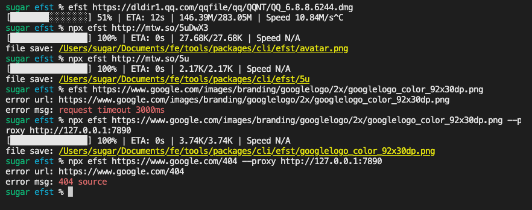

## url资源下载
先是纯 **url资源下载** 的场景，本小节将详细展开相关小功能的实现。

### Node原生实现
基于`读写流`操作，可以看到代码还是十分的简洁
```ts
import https from 'https'
import fs from 'fs'
import path from 'path'
function downloadByUrl(url: string, filename?: string) {
  const filepath = path.resolve(filename || randomName())
  https.get(url, (response) => {
    // 创建1个可写流
    const writeStream = fs.createWriteStream(filepath)
    response.pipe(writeStream).on('close', () => {
      console.log(`file save to ${filepath}`)
    })
  })
}

// sourceUrl 为前面的原图链接
downloadByUrl(sourceUrl,'test.image')
```

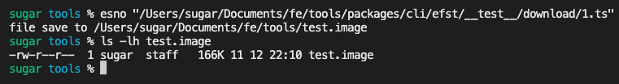

[示例代码1](https://github.com/ATQQ/tools/blob/main/packages/cli/efst/__test__/download/1.ts)

### 下载进度获取
大一点的文件肯定无法实现秒下载，需要获取一下进度，了解现在下载了多少

资源的总大小可以一般可以通过`response headers`中的`content-length`字段获取
```ts
const sumSize = +response.headers['content-length']
```

流的传输进度可以通过`on data`事件间接获取

在不通过`response.setEncoding(BufferEncoding)`修改的编码时，`chunk`默认是`Buffer`类型

```ts
let receive = 0
response.on('data', (chunk: Buffer) => {
  receive += chunk.length
  const percentage = receive / sumSize
})
```
到此进度`percentage`就可以获取到了

对上面的方法进行稍加改造，增加`progress`，`end`两个方法（支持链式调用的丐版实现）

```ts
function downloadByUrl(url: string, filename?: string) {
  let receive = 0

  // 支持链式调用相关逻辑
  let progressFn: (cur: number, rec: number, sum: number) => void
  let endFn: (filepath: string) => void

  const thisArg = {
    progress: (fn: typeof progressFn) => {
      progressFn = fn
      return thisArg
    },
    end: (fn: typeof endFn) => {
      endFn = fn
      return thisArg
    }
  }

  https.get(url, (response) => {
    // 输出文件路径
    const filepath = path.resolve(filename || randomName())
    // 创建一个可写流
    const writeStream = fs.createWriteStream(filepath)

    const sumSize = +response.headers['content-length']! || 0
    response.on('data', (chunk: Buffer) => {
      receive += chunk.length
      progressFn && progressFn(chunk.length, receive, sumSize)
    })

    response.pipe(writeStream).on('close', () => {
      endFn && endFn(filepath)
    })
  })
  return thisArg
}

// 调用示例
downloadByUrl(sourceUrl, 'test.image')
  .progress((current, receive, sum) => {
    console.log(receive, ((receive / sum) * 100).toFixed(2), '%')
  })
  .end((filepath) => {
    console.log('file save:', filepath)
  })
```
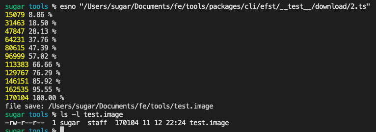

[示例代码2](https://github.com/ATQQ/tools/blob/main/packages/cli/efst/__test__/download/2.ts)

### 重定向处理
部分资源在对外直接暴露时，可能是一个短链，此时就需要做重定向处理

重定向的状态码常见`301`和`302`，当然还有其它的3开头的这里不赘述

除了状态码，重定向的目标url由`response.headers.location`表示

这里稍微改造一下之前的代码，添加一个重定向逻辑即可
```ts
// 通过url 简单区分一下 资源是 https 还是 http
const _http = url.startsWith('https') ? https : http
_http.get(
  url,
  {
    // 添加一个UA，避免404
    // 部分短链服务网站没有UA会响应404
    headers: {
      'User-Agent': 'node http module'
    }
  },
  (response) => {
    const { statusCode } = response
    // 判断状态码是否3开头
    if (Math.floor(statusCode! / 100) === 3) {
      // 且存在 location
      if (response.headers.location) {
        // 递归
        downloadByUrl(response.headers.location, filename)
          // 透传事件
          .progress(progressFn)
          .end(endFn)
        return
      }
      // 不存在抛出错误
      throw new Error(
        `url:${url} status ${statusCode} without location header`
      )
    }
  }
)
```

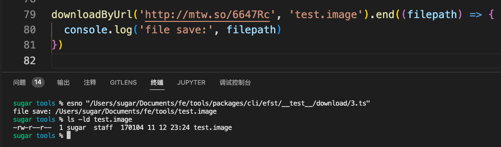

[示例代码3](https://github.com/ATQQ/tools/blob/main/packages/cli/efst/__test__/download/3.ts)

为了防止无限重定向，还需要加个次数限制，再简单改造一下上述代码，添加一个配置属性作为入参

```ts
interface Options {
  filename: string
  maxRedirects: number
}
function downloadByUrl(url: string, option?: Partial<Options>) {
  const ops: Options = { filename: randomName(), maxRedirects: 10, ...option }
  // 省略一些重复代码
  _http.get(
    url,
    (response) => {
      const { statusCode } = response
      if (Math.floor(statusCode! / 100) === 3 && ops.maxRedirects) {
        ops.maxRedirects -= 1
        // 递归调用
        if (response.headers.location) {
          downloadByUrl(response.headers.location, ops)
          return
        }
      }
    }
  )
  return thisArg
}
```
[示例代码4](https://github.com/ATQQ/tools/blob/main/packages/cli/efst/__test__/download/4.ts)

### 请求超时
部分资源由于网络原因可能出现超时，为了避免长时间无反馈等待，可以设置超时时间

`http`模块支持`timeout`属性设置

```ts
// 接着之前的例子修改部分代码即可
const request = _http.get(
  url,
  {
    // 设置超时时间，单位ms
    timeout: ops.timeout || 300000,
  },
  (response) => {
    // 省略response 逻辑
  }
)
request.on('timeout', () => {
  // 中断请求，输出错误
  request.destroy()
  console.error(`http request timeout url:${url}`)
})
```
下面是请求 google logo 失败示例

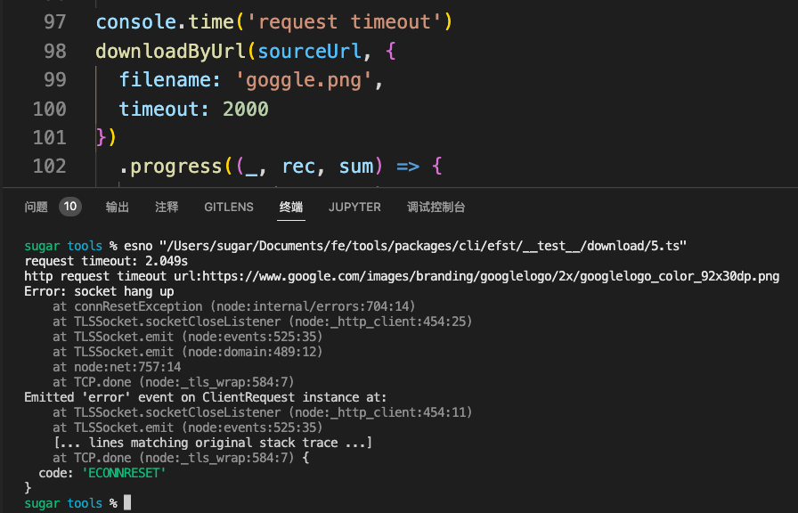

[示例代码5](https://github.com/ATQQ/tools/blob/main/packages/cli/efst/__test__/download/5.ts)

### Proxy
部分资源访问不顺畅的时候，通常会走服务代理（🪜）

以谷歌的`logo`资源链接`https://www.google.com/images/branding/googlelogo/2x/googlelogo_color_92x30dp.png`

要让前面的方法`downloadByUrl`顺利执行，就需要其走代理服务

为`http`模块添加代理也非常简单，原生提供了一个`agent`参数，可用于设置代理

```ts
import http from 'http'

const request = http.get(url,{
  agent: Agent,
})
```

这个`Agent`的构造可以直接用社区已经封装好的[http-proxy-agent](https://www.npmjs.com/package/http-proxy-agent)

```ts
const HttpProxyAgent = require('http-proxy-agent')

const proxy = new HttpProxyAgent('http://127.0.0.1:7890')
```

在调用时只需将这个`proxy`实例传入即可

```ts
http.get(url, {
  agent: proxy
})
```

原有的方法只需要添加一个`proxy`入参即可，
```ts
const request = _http.get(url, {
  agent: ops.proxy ? new HttpProxyAgent(ops.proxy) : undefined,
})
```

下面是使用代理成功请求的示例

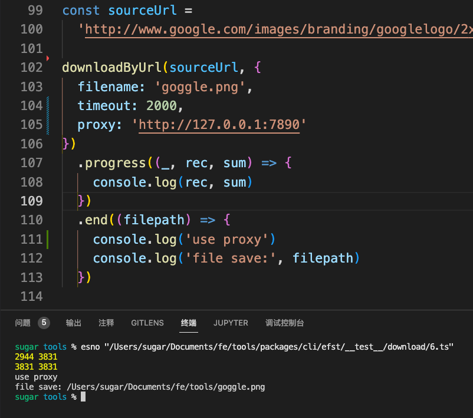

[示例代码6](https://github.com/ATQQ/tools/blob/main/packages/cli/efst/__test__/download/6.ts)

### 合法文件名生成
文件下载到本地肯定需要有个名字，如果用随机的或者用户手动输入那肯定体验较差

最常见的就是通过`url`的`pathname`生成

比如上面的谷歌图片资源，咱们使用`URL`构造出一个示例，查看url的构成

```ts
new URL(sourceUrl)
```

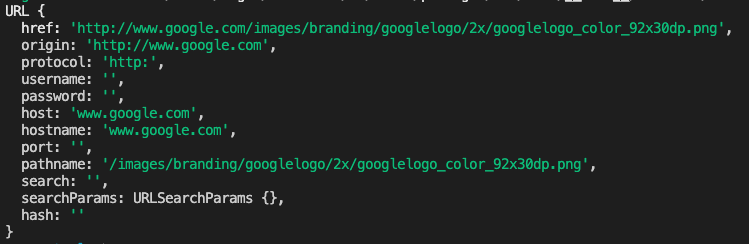

文件名就可以取`pathname`最后一截，通过`path.basename`即可获取

```ts
import path from 'path'

const url = new URL('http://www.google.com/images/googlelogo_color_92x30dp.png')
const filename = path.basename(url.pathname) // googlelogo_color_92x30dp.png
```
当然文件名也可能会重复，再非覆盖写入的前提下，通过会在文件名后添加"分隔符+数字"，比如`x.png`,`x_1.png`,`x 1.png`

提取文件名与后缀可以用`path.parse`直接获取
```ts
import path from 'path'

// { ext: '.png', name: 'google' }
path.parse('google.png')

// { ext: '', name: 'hashname' }
path.parse('hashname')

// { ext: '.ts', name: 'index.d' }
path.parse('index.d.ts')

// { ext: '.', name: 'index' }
path.parse('index.')

// { ext: '', name: '.gitkeep' }
path.parse('.gitkeep')
```
但是针对带有多个 **.** 的文件名不太友好，比如`.d.ts`是期望被当做完整的`ext`处理

所以咱们可以对其简单递归包装一下实现1个`nameParse`，确保最后`parse(input).name === input`即可
```ts
function nameParse(filename: string, suffix = '') {
  const { name, ext } = path.parse(filename)
  if (name === filename) {
    return { name, ext: ext + suffix }
  }
  return nameParse(name, ext + suffix)
}
```
下面是运行示例

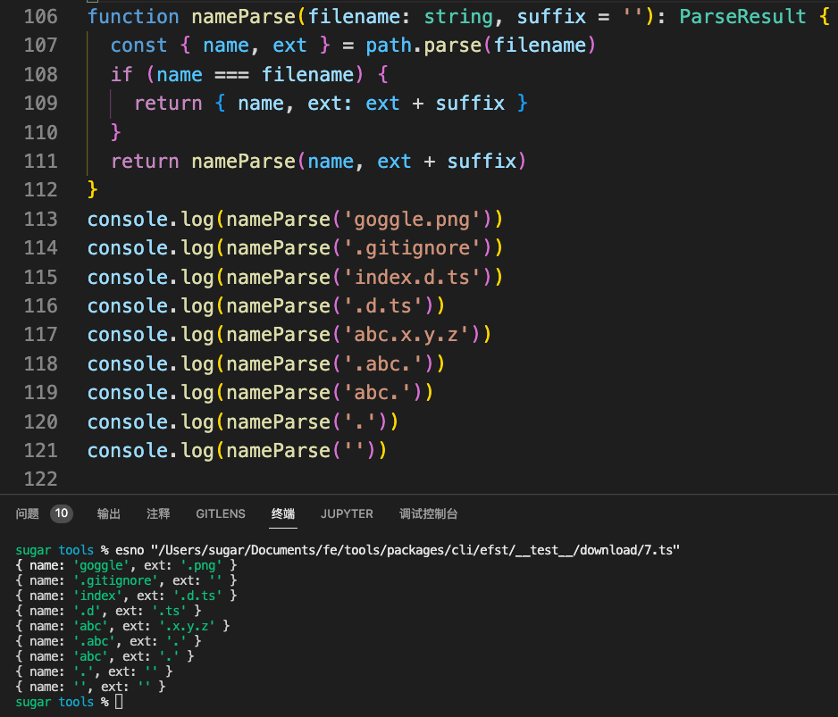

到此完成了`name`和`ext`的分离

文件名分离后简单进行一下`name`的合法性替换，避免出现操作系统不支持的字符

>正则来自于Google

```ts
function normalizeFilename(name: string) {
  return name.replace(/[\\/:*?"<>|]/g, '')
}
```

再做文件名去重只需要给`name`添加后缀数字即可

`url`上的内容还可能存在`encode`的情况，比如`掘金.png` => encode => `%E6%8E%98%E9%87%91.png`

因此咱们在处理从`pathname`提取的`filename`前先进行必要的`decode`

```ts
decodeURIComponent('%E6%8E%98%E9%87%91.png') // 掘金.png
```

有了前面的准备工作咱们就可以组装出一个从`url`提取合法可用的文件名的方法嘞

```ts
function getValidFilenameByUrl(url: string) {
  const urlInstance = new URL(url)
  return decodeURIComponent(path.basename(urlInstance.pathname))
}
getValidFilenameByUrl('http://a/b/c.png?width=100&height') // c.png
```

然后是获取不重复的文件路径
```ts
function getNoRepeatFilepath(filename: string, dir = process.cwd()) {
  const { name, ext } = nameParse(filename)
  let i = 0
  let filepath = ''
  do {
    filepath = path.join(dir, `${name}${i ? ` ${i}` : ''}${ext}`)
    i += 1
  } while (fs.existsSync(filepath))
  return filepath
}
```

最后集成到`downloadByUrl`方法中，使输出的文件名可控

```ts
// ...code
const filename = normalizeFilename(
  ops.filename || getValidFilenameByUrl(url) || randomName()
)
const filepath = ops.override
  ? path.resolve(filename)
  : getNoRepeatFilepath(filename)

const writeStream = fs.createWriteStream(filepath)

// ...code
```

测试案例运行结果如下

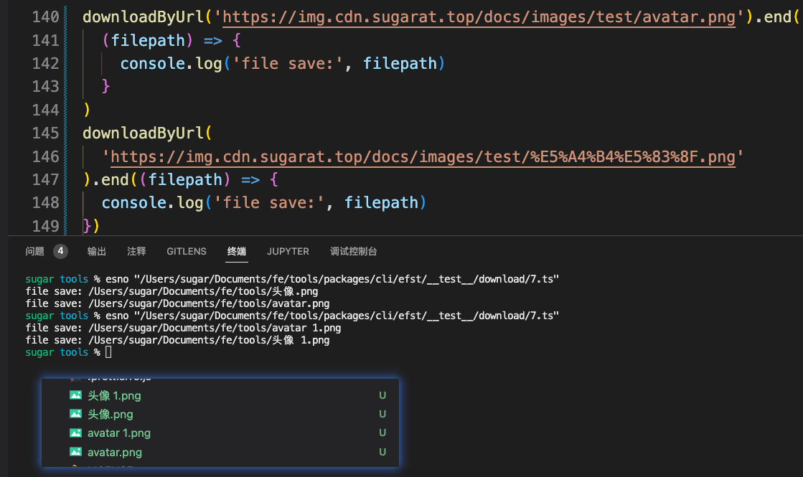

[示例代码7](https://github.com/ATQQ/tools/blob/main/packages/cli/efst/__test__/download/7.ts)

### 异常错误情况处理
对于非法的`url`，资源不存在通常会响应`404`等没考虑到的异常场景

可以在上述的`downloadByUrl`方法中拓展1个`error`方法，用于错误处理

```ts
let request: http.ClientRequest

let errorFn = (err, source) => {
  console.log('error url:', source)
  console.log('error msg:', err.message)
  console.log()
}

const responseCallback = (response: http.IncomingMessage) => {
  const { statusCode } = response
  // 404
  if (statusCode === 404) {
    request.emit('error', new Error('404 source'))
    return
  }
}

// ...code
try {
  request = _http.get(url, reqOptions, responseCallback)
  request.on('error', (err) => {
    request.destroy()
    errorFn && errorFn(err, url)
  })
  request.on('timeout', () => {
    request.emit('error', new Error('request timeout'))
  })
} catch (error: any) {
  setTimeout(() => {
    errorFn && errorFn(error, url)
  })
}
```
除特殊情况外，统一用`request.on('error')`处捕获错误

下面是示例代码及运行结果

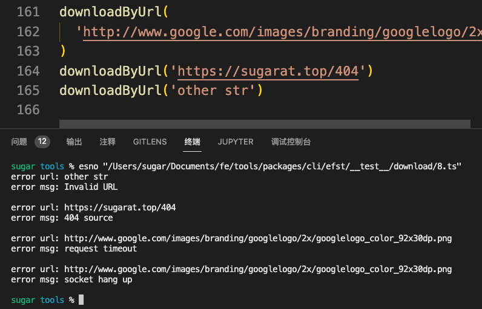

[示例代码8](https://github.com/ATQQ/tools/blob/main/packages/cli/efst/__test__/download/8.ts)

## 封装CLI
上一小节阐述了功能的核心实现方法，此部分将上述能力集成到CLI中，方便对外分享与使用。

### Options定义
```ts
import { Command } from 'commander'
const program = new Command()

program
  .argument('<url>', 'set download source url')
  .option('-f,--filename <filename>', 'set download filename')
  .option('-L,--location <times>', 'set location times', '10')
  .option('-t,--timeout <timeout>', 'set the request timeout(ms)', '3000')
  .option('-p,--proxy <proxy server>', 'set proxy server')
  .option('-o,--override', 'override duplicate file', false)
  .action(defaultCommand)
```

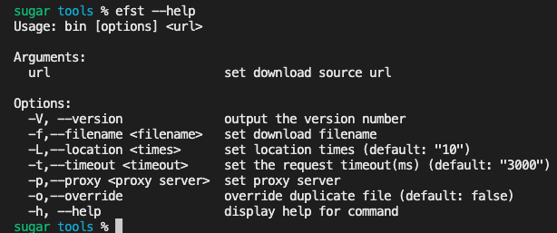

### 参数转换传递

下面是`defaultCommand`的逻辑，只需要将相关参数处理后透传给定义的`download`方法即可

`option` 不支持 **number** 所以需要对数字字符串做一下显示转换
```ts
export default function defaultCommand(url: string, options: CLIOptions) {
  const { filename, location, timeout, proxy, override } = options
  downloadByUrl(url, {
    maxRedirects: +location,
    timeout: +timeout,
    proxy,
    override,
    filename
  })
    .error((err) => {
      console.log('error url:', url)
      console.log('error msg:', redStr(err.message))
      process.exit()
    })
    .end((filepath) => {
      console.log('file save:', underlineStr(yellowStr(filepath)))
    })
}
```

下面是使用演示


### 下载进度展示
小文件还能无感等待，大文件咱就得整个进度条来显示了，方遍了解进度。

在`npm`中检索，除了推荐了老牌库 [progress](https://www.npmjs.com/package/progress)，还看到了1个 [cli-progress](https://www.npmjs.com/package/cli-progress)

咱们这里就用后者（最近更新时间看着近一些）

最简单的示例与结果如下
```ts
import cliProgress from 'cli-progress'

const progressBar = new cliProgress.SingleBar({})
downloadByUrl(url)
  .progress((cur, rec, sum) => {
    // 初始化
    if (progressBar.getProgress() === 0) {
      progressBar.start(sum, 0)
    }

    // 更新进度
    progressBar.update(rec)

    // 结束
    if (rec === sum) {
      progressBar.stop()
    }
  })
```
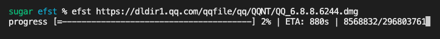

展示内容过于简单，可以自定义一下显示，展示文件大小和下载速度，[参考文档](https://www.npmjs.com/package/cli-progress)，结合内置的一些值设定初始化如下

```ts
const format = '[{bar}] {percentage}% | ETA: {eta}s | {rec}/{sum} | Speed {speed}'

const progressBar = new cliProgress.SingleBar(
  {
    format,
    barsize: 16
  },
  cliProgress.Presets.shades_classic
)
```

紧接着是`start`时设置`sum`和`speed`默认值
```ts
// 初始化的时候计算总大小
progressBar.start(sum, 0, {
  sum: formatSize(sum)
})

// 过程中更新进度
progressBar.update(rec, {
  rec: formatSize(rec),
  speed: speed(cur)
})
```

`formatSize`方法实现如下(来源于谷歌推荐代码)，短小精悍的代码，将B转换为其它单位展示。
```ts
export function formatSize(
  size: number,
  pointLength?: number,
  units?: string[]
) {
  let unit
  units = units || ['B', 'K', 'M', 'G', 'TB']
  while ((unit = units.shift()) && size > 1024) {
    size /= 1024
  }
  return (
    (unit === 'B'
      ? size
      : size.toFixed(pointLength === undefined ? 2 : pointLength)) + unit!
  )
}

formatSize(1234) // 1.21K
formatSize(10240) // 10.00K
```

### 计算下载速度

`speed`方法实现如下
* 使用闭包
* 一段时间计算一次速度（1000ms / 时间周期 * 周期内下载量B）
```ts
/**
 * @param cycle 多久算一次（ms）
 */
function getSpeedCalculator(cycle = 500) {
  let startTime = 0
  let endTime = 0
  let speed = 'N/A' // 记录速度
  let sum = 0 // 计算之前收到了多少B

  return (chunk: number) => {
    sum += chunk
    if (startTime === 0) {
      startTime = Date.now()
    }
    endTime = Date.now()
    // 计算一次
    if (endTime - startTime >= cycle) {
      speed = `${formatSize((1000 / (endTime - startTime)) * sum)}/s`
      startTime = Date.now()
      sum = 0
    }
    return speed
  }
}

// 获取到计算速度的方法
const speed = getSpeedCalculator()

setTimeout(speed, 200, 4000)
setTimeout(speed, 300, 5000)
setTimeout(speed, 1000, 10240)
setTimeout(() => {
  console.log(speed(0)) // 23.49K/s
}, 1100)
```

优化后的下载效果如下

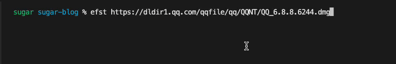

### 持久化配置存储
像`proxy`，`timeout`参数不希望每次都设置，就需要将这些配置存起来，下次直接读取。

通常的CLI工具都会在`/Users/$username/.xxx`目录中存放自己的配置文件，即`HOME`目录下。

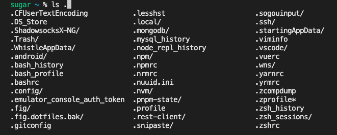

同理我们可以开辟一个文件存放`.efstrc`，`process.env.HOME`即可获取到`HOME`目录,`process.env.USERPROFILE`用于兼容`win32`平台。
```ts
const configPath = path.join(
  process.env.HOME || process.env.USERPROFILE || process.cwd(),
  '.efstrc'
)
```

读写配置实现如下,利用`Array.prototype.reduce`方法在遍历的过程中做存取值操作
* 支持**多级的key**的读写
* 兼容异常场景，返回空或空对象
```ts
function getCLIConfig(key = '') {
  try {
    const value = JSON.parse(fs.readFileSync(configPath, 'utf-8'))
    return !key
      ? value
      : key.split('.').reduce((pre, k) => {
          return pre?.[key]
        }, value)
  } catch {
    return !key ? {} : ''
  }
}

function setCLIConfig(key: string, value: string) {
  if (!key) {
    return
  }
  const nowCfg = getCLIConfig()
  // 支持传入多级的key
  const keys = key.split('.')

  // 遍历设置的所有都配置都与nowCfg直接或间接的进行了引用关联
  keys.reduce((pre, k, i) => {
    // 赋值
    if (i === keys.length - 1) {
      pre[k] = value
    } else if (!(pre[k] instanceof Object)) {
      pre[k] = {}
    }
    return pre[k]
  }, nowCfg)

  // 输出到文件
  fs.writeFileSync(configPath, JSON.stringify(nowCfg, null, 2))
}

setCLIConfig('proxy', 'http://127.0.0.1:7890')
setCLIConfig('timeout', '2000')
setCLIConfig('github.name', 'ATQQ')
setCLIConfig('github.info.url', 'https://github.com/ATQQ')
```

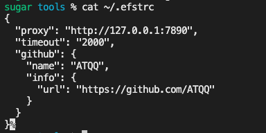

再添加一个移除配置的方法，与设置的的方法类似只是使用`delete`操作符删除相关的`key`
```ts
function delCLIConfig(key: string) {
  if (!key) {
    return
  }
  const nowCfg = getCLIConfig()
  const keys = key.split('.')
  keys.reduce((pre, k, i) => {
    // 移除
    if (i === keys.length - 1) {
      delete pre[k]
    }
    return pre[k] instanceof Object ? pre[k] : {}
  }, nowCfg)
  fs.writeFileSync(configPath, JSON.stringify(nowCfg, null, 2))
}

delCLIConfig('timeout')
delCLIConfig('github.info.name')
delCLIConfig('github.name')
```

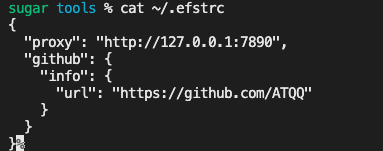

有了这3个方法支撑就可以封装成一个`config`指令用于配置的`CRUD`

### config指令实现
先是定义
```ts
program
  .command('config <type> <key> [value]')
  .alias('c')
  .description('crud config <type> in [del,get,set]')
  .action(configCommand)
```

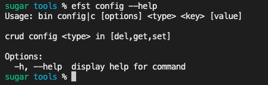

`configCommand`封装实现，将上述实现的方法按场景放入即可
```ts
export type ConfigType = 'set' | 'get' | 'del'

function defaultCommand(
  type: ConfigType,
  key: string,
  value: string
) {
  if (type === 'set') {
    setCLIConfig(key, value)
  }
  if (type === 'del') {
    delCLIConfig(key)
  }
  if (type === 'get') {
    console.log(getCLIConfig(key) || '')
  }
}
```
使用演示如下

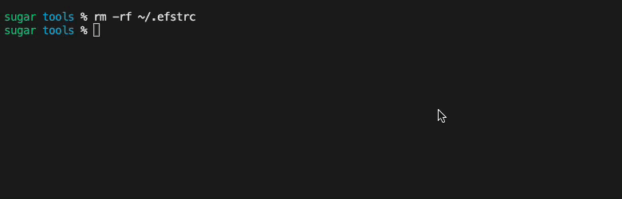

config 指令这部分逻辑完全可以分离成一个通用的 `commander` 模块，在需要的CLI里直接注册即可，简化后大概如下

```ts
import { Command } from 'commander'
const program = new Command()

registerConfigCommand(program,'.efstrc')
```

## 最后
笔者对这个工具的想法还有很多，后续先把功能🐴出来再写续集，本文就先到这里。

内容有不妥的之处，还请评论区斧正。

CLI完整源码见[GitHub](https://github.com/ATQQ/tools/tree/main/packages/cli/efst)

<Citation type="转载" source="粥里有勺糖的博客" url="https://sugarat.top/technology/works/fs-cli.html" />
