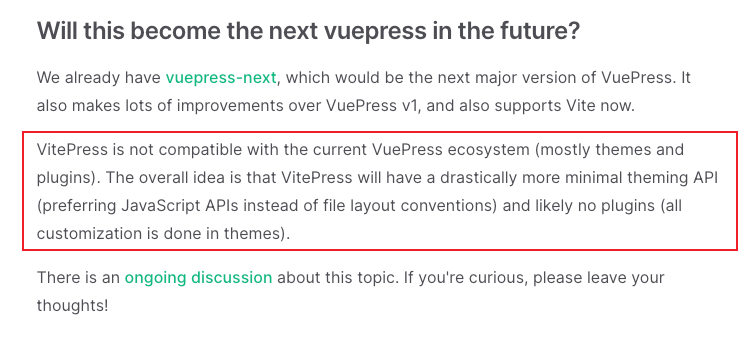
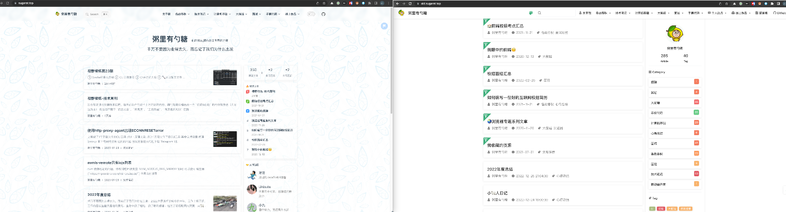
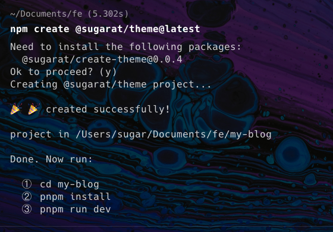
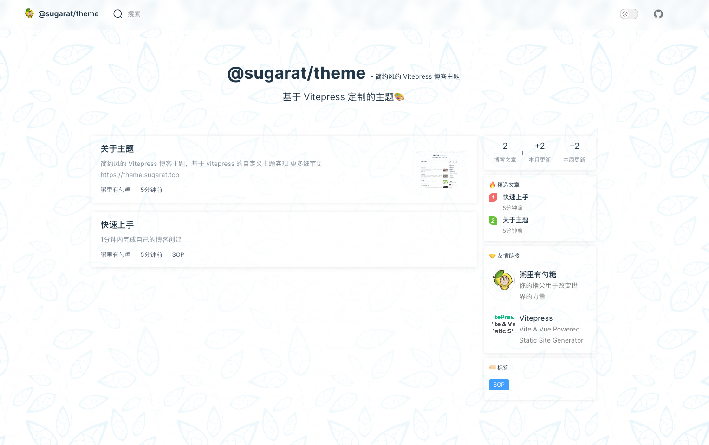

# 一个简约风的vitepress博客主题

## 前言
笔者的博客之前是使用 [VuePress](https://vuepress.vuejs.org/) + [reco主题](https://vuepress-theme-reco.recoluan.com/)

随着博客文章数量越来越多（md文件已经300+了），博客本地启动和构建越来越来慢了emmm

当然使用频率最高的就是本地启动，构建是个相对比较低频的动作。

恰好此时 [VitePress](https://vitepress.dev/) 也比较成熟了（alpha），相比 VuePress 更加的简洁，可玩性强，上手成本也低。

按照官方的给的定位，VitePress 主打是主题（个人感觉就像[Hexo](https://hexo.io/zh-cn/)丰富多彩的主题一样），不提供插件系统



在笔者进行博客迁移的时候，将主题分离了出来，可供单独使用

新旧对比



风格借鉴了 [reco](https://vuepress-theme-reco.recoluan.com/) ，[掘金](https://juejin.cn/)，[surmon](https://surmon.me/)等等，组件部分用了 [element-plus](https://element-plus.gitee.io/zh-CN/)

下面介绍食用指南（[主题](https://www.npmjs.com/package/@sugarat/theme)实现内容比较多，后面单开一个专栏介绍 😋嘿嘿！）

## 快速体验
只需3步，即可体验

① 拉取 Github 模板

:::code-group
```bash [npm]
npm create @sugarat/theme@latest
```

```bash [yarn]
yarn create @sugarat/theme
```

```bash [pnpm]
pnpm create @sugarat/theme
```
:::

也可以指定项目名

:::code-group
```bash [npm]
npm create @sugarat/theme@latest my-first-blog
```
```bash [yarn]
yarn create @sugarat/theme my-first-blog
```
```bash [pnpm]
pnpm create @sugarat/theme my-first-blog
```
:::




② 安装依赖
::: code-group

```sh [pnpm]
pnpm install
```

```sh [安装 PNPM]
# 如果你没有 PNPM 请先安装
npm i -g pnpm
```
:::

③ 启动
```sh
pnpm dev
```

就能得到如下的页面



## 已支持功能
介绍一下主要的，非所有，详见[主题文档](https://theme.sugarat.top/)

* 博客首页
  * 文章列表
  * 精选文章
  * 友链
  * 标签分类
* 图片预览
* 搜索（标题+简介）
* [giscus](https://giscus.app/zh-CN) 评论系统
* 推荐文章（同目录）
* 阅读时间计算
* 全局的提示弹窗 (由 [el-alert](https://element-plus.gitee.io/zh-CN/component/alert.html) 驱动)
* 全局的公告弹窗，支持设置图片，文字，按钮
* 全文搜索
* RSS
* ...

## 规划中功能
* Valine 评论系统
* 文章合集
* 更多可定制的主题样式
* 。。。

## 最后

读者有建议的 功能&想法 欢迎 私信&评论区 交流

* 主题地址：https://theme.sugarat.top/
* 主题包：[@sugarat/theme](https://www.npmjs.com/package/@sugarat/theme)
* 项目地址：https://github.com/ripplejourney/ripplejourney.github.io/tree/master/packages/theme

<Citation type="转载" source="粥里有勺糖的博客" url="https://sugarat.top" />
