# Chrome 调试技巧-Console

控制台面板是使用频率最高的面板之一,这篇摘抄一些实用性高的内容

## $
### $number

**$0** 是对我们当前在 **Element面板** 中选中的 html 节点的引用

**$1** 是对上一次我们选择的节点的引用， **$2** 是对在那之前选择的节点的引用以此类推,直到 **$4**

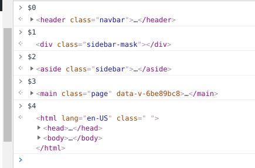

### \$与$$
* **$** 等价于 document.querySelector()
* **$$** 等价于 document.querySelectorAll()

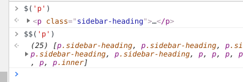

### $_
上次打印结果的引用

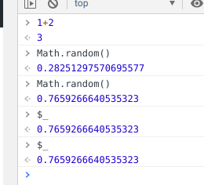

## 直接await
大多数异步API 都会返回Promise,需要.then才能拿到结果

在console面板中可以直接await 不需要 async 包裹

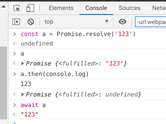

## 条件断点
TODO: 添加一个合适的示例

source面板中选择文件,右击行号，选择 Add conditional breakpoint 添加代码

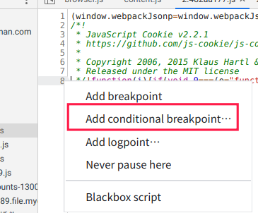

## Custom Formatter
自定义输出对象的函数

TODO: 补充实用例子

## queryObjects

TODO: 补充实用例子

## monitor

用于监控函数的入参,自动打印函数名与入参
```js
function sum(a,b){
  return a+b
}
monitor(sum)
```
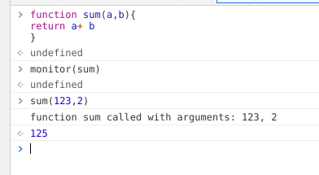


## monitorEvents

事件监控

```js
monitorEvents(window,['click','resize'])
```

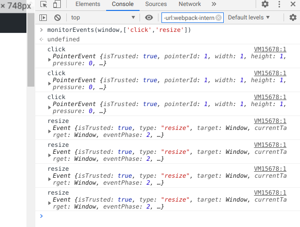

## window.console

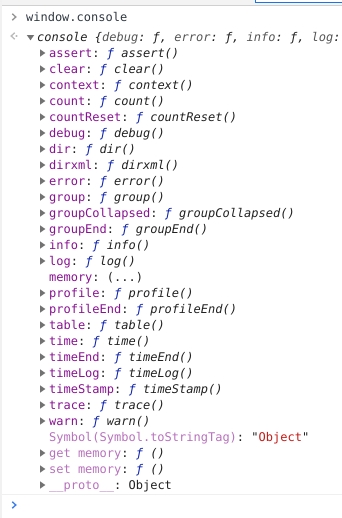

除了常用的console.log外其它实用的方法

### assert

当第一个参数为 false 时， console.assert 打印跟在这个参数后面的值
```js
console.assert(100==='100','no equal')
console.assert(100=='100','yes')
```

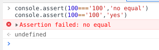

### table

可以将 数组 (或者是 类数组 的对象)打印成一个漂亮的表格

第二个参数指定要展示的列

```js
console.table(document.querySelectorAll('a'),['textContent','href'])

console.table(location)
```

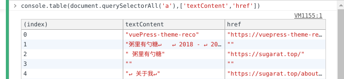

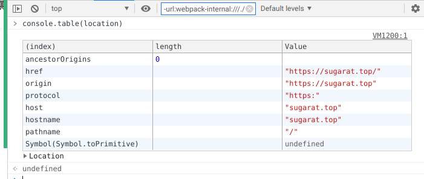

### time与timeEnd

两个方法配合计算并打印时间戳,用处用于测试方法的执行时间

```js
console.time('a')
setTimeout(console.timeEnd,1000,'a')
```
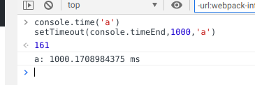

### dir
可以用于查看某个dom的属性

```js
console.log(document.body)
console.dir(document.body)
```

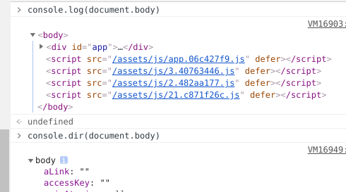

### log添加样式

给打印文本加上 **%c** ,%c后面的内容就会被样式参数所影响

console.log 除第一个参数外的参数都是css规则

```js
console.log("%cred","color:red;")
console.log("%cred%cblue","color:red;","color:blue")
```

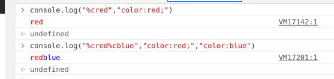

## 实时表达式
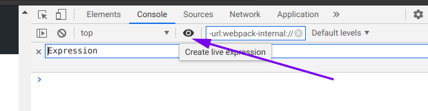


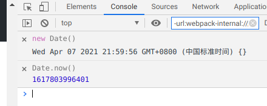

<Citation type="转载" source="粥里有勺糖的博客" url="https://sugarat.top/technology/study/chrome-debug2.html" />
