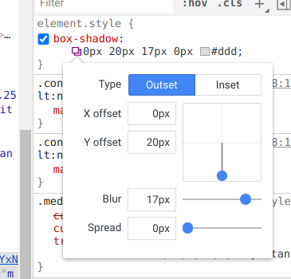
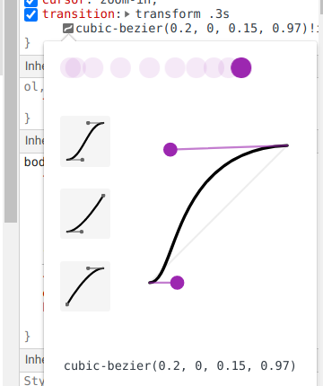
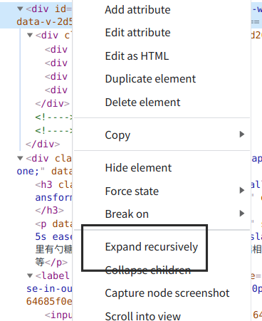
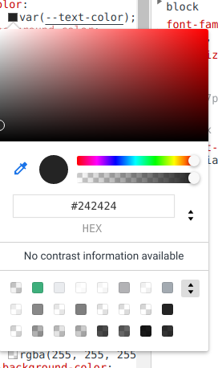
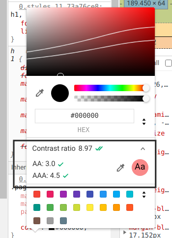

# Chrome 调试技巧-Elements

这一篇主要记录元素面板相关的技巧内容
## 快速隐藏元素
选中元素然后按 `h` 切换元素的可见状态，本质上是自动控制 `visibility:hidden`

## 上下移动元素

Ctrl+方向键

## 阴影编辑器

## 贝塞尔曲线编辑

## 展开所有子节点

快捷键`alt`+`鼠标左键`

## 调色盘

上方双箭头切换颜色格式，下方双箭头切换调色盘

通过文字的color属性打开的面板可以看到字体颜色与背景色的对比度评分

<Citation type="转载" source="粥里有勺糖的博客" url="https://sugarat.top/technology/study/chrome-debug4.html" />
