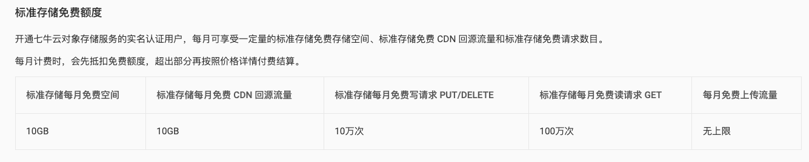
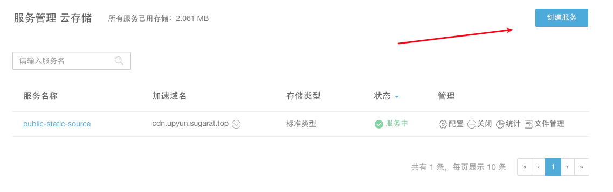
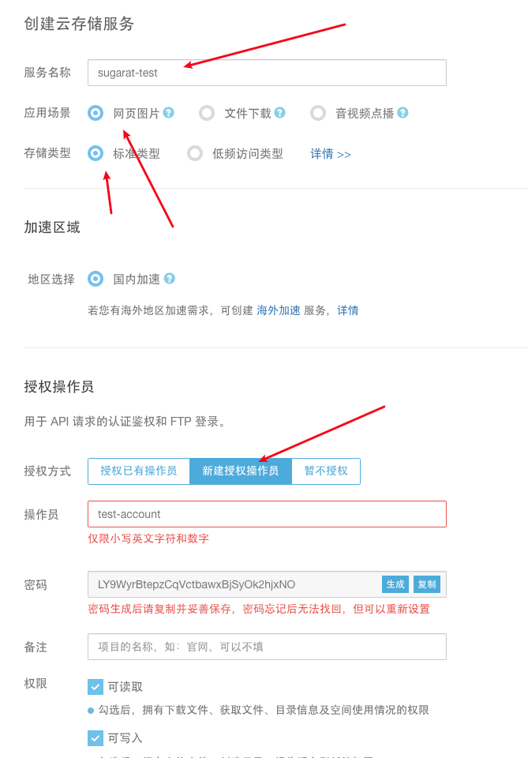
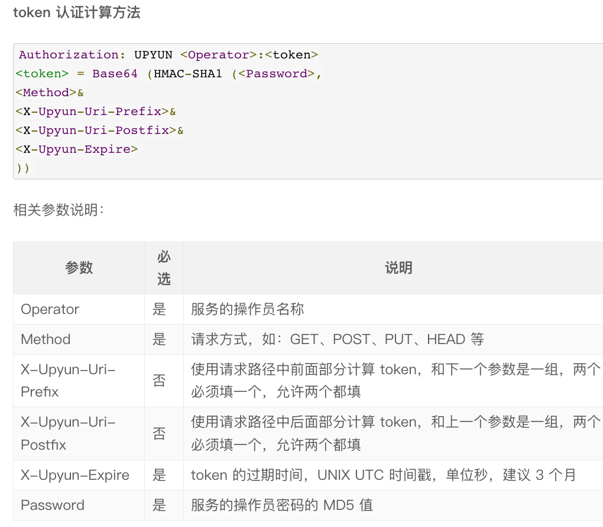
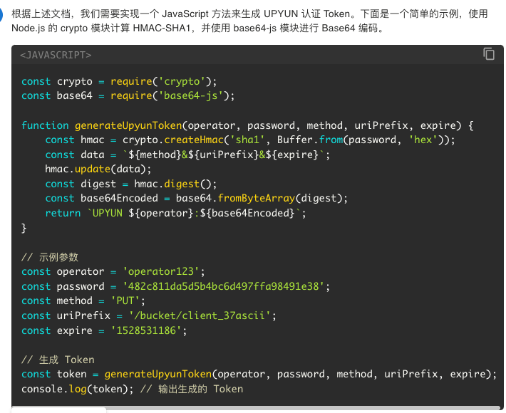
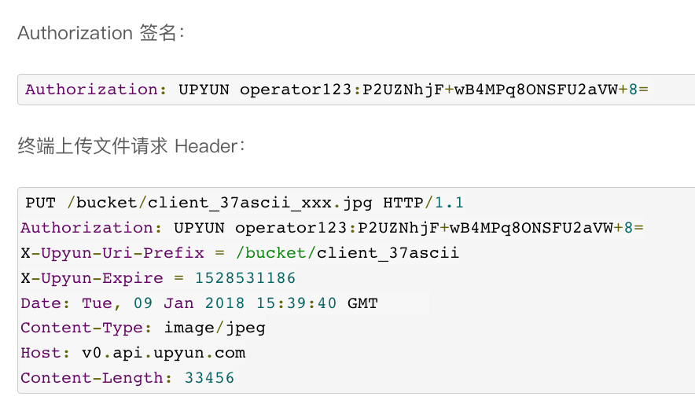
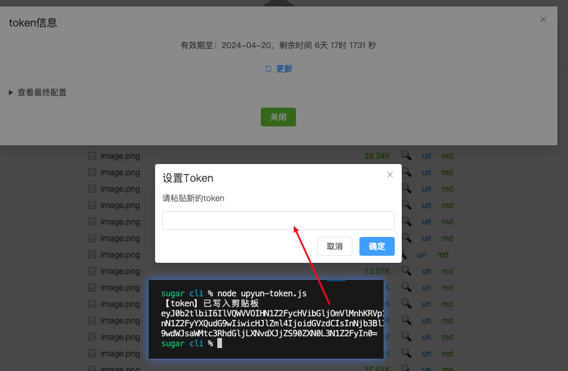

# 使用又拍云极速搭建图床

## 前言

某天在群里摸 🐟 ，聊到了图床相关的话题，群友推荐了 [又拍云](https://www.upyun.com/league)。

说有活动，可以白嫖存储，`10G + 15G（HTTP/HTTPS 流量）` 。笔者之前一直用的[七牛云](https://www.qiniu.com/prices/kodo) `10G + 10G（回源流量）`。

|                                    又拍云                                     |                                    七牛云                                     |
| :---------------------------------------------------------------------------: | :---------------------------------------------------------------------------: |
|  |  |
|                   注册送1个月的代金券 + 网站挂推广送1年代金券                   |                              注册即可送每月都有                               |

笔者就花了点时间研究了一下又拍云的 SDK 和对象存储，能力上完全可以平替七牛云，于是就花了一点时间给[图床应用](https://imgbed.sugarat.top/)加上了又拍云的支持。

## 效果

大家可以访问 https://imgbed.sugarat.top/ 直接体验，默认已配置 又拍云 存储

下面将介绍 又拍云对象存储配置，关键API用法，如何接入上述图床。

## 对象存储服务创建
这里直接省略账号注册，参加推广活动等步骤，直接进入对象存储配置页面。

访问[对象存储控制台](https://console.upyun.com/services/file/)，点击创建服务



这个"服务"和其它平台的 `Bucket(桶)` 类似，可以理解为存储空间的概念。

填一下服务名称（`全平台唯一`），绑定账号即可



**服务创建完，需要的东西基本都有了，是不是非常简单！**

* 服务名：自定义
* 账号：自定义
* 密码：自动生成
* 域名：测试域名 `serviceName.test.upcdn.net`


## API 使用
### token 生成
这里推荐使用 token 认证 根据[文档：认证鉴权](https://help.upyun.com/knowledge-base/object_storage_authorization/#token-e8aea4e8af81)可知生成方式如下：



看不懂？没关系 GPT 可以帮你，直接复制丢给它。



这不代码就来了。

我们可以适当优化一下，不需要用到第三方库`base64-js`，直接使用 Node.js 的内置模块`crypto` 即可。
```js
import crypto from 'crypto'

/**
 * 生成 upyun 上传token
 * @param {*} operator 账号
 * @param {*} password 密码
 * @param {*} method 方法（PUT）
 * @param {*} uriPrefix 请求公共前缀
 * @param {*} date 过期时间
 * @returns 上传凭证
 */
function generateUpyunToken(operator, password, method, uriPrefix, date) {
  // 密码的md5值，秘钥
  const secret = crypto.createHash('md5').update(password).digest('hex')

  // 构造用于计算校验值的字符串
  const value = `${method}&${uriPrefix}&${date}`

  // 使用 hmac-sha1 算法生成token
  const token = crypto.createHmac('sha1', secret) // 使用密码的MD5值作为秘钥
    .update(value) // 设置用于计算校验值的字符串
    .digest() // 计算校验值
    .toString('base64') // 转换为base64 格式

  // 组合成要求的格式
  return `UPYUN ${operator}:${token}`
}
```
代码非常简洁明了，使用方式如下
```js
const token = generateUpyunToken('账号',
  '密码',
  'PUT',
  '服务名/资源公共前缀路径', // 服务名 + 公共资源前缀路径构成
  new Date().getTime() + 1000 * 60 * 60 * 24 * 90 // 计算过期时间 90天后的日期
)
```

理论上这个 token 也可以在前端生成，调用和后端一致的算法即可。

### 前端上传
① 安装 upyun sdk

```sh
npm i upyun
```

② 上传示例

根据文档，可以看到客户端上传需要的参数。



* `Authorization`：前面通过生成的token
* `X-Date`：请求日期时间，GMT 格式字符串
* `X-Upyun-Uri-Prefix`：服务名 + 资源公共前缀路径
* `X-Upyun-Expire`：过期时间

下面就是核心的上传方法。
```ts
import upyun from 'upyun'

const service = new upyun.Service('服务名')
const client = new upyun.Client(service, () => ({
  'Authorization': '前面通过生成的token',
  'X-Date': new Date().toUTCString(),
  'X-Upyun-Uri-Prefix': '服务名/资源公共前缀路径',
  'X-Upyun-Expire': date, // 前面生成 Token 时的 date 参数
}))

const sourceKey = '资源公共前缀路径/资源名' // 'test/imgs/abc.png'

// 调用上传
client.putFile(sourceKey, file) // 返回值 Promise<boolean>
```

③ 方法封装

我们可以简单封装一下，方便调用
```ts
interface UPYunConfig {
  /**
   * 服务名
   */
  serviceName: string
  /**
   * 上传凭证
   */
  token: string
  /**
   * 资源公共前缀
   */
  prefix: string
  /**
   * 过期时间 new Date().getTime() + 1000 * 60 * 60 * 24 * 90
   */
  date: number
  /**
   * 域名（用于拼接最后的访问链接）
   */
  domain: string
  /**
   * 最后的资源名，建议使用 uuid 或者文件的 MD5
   */
  filename?: string
}
async function uploadFile(file: File, ops: UPYunConfig) {
  const { serviceName, prefix, token, date, domain, filename } = ops

  const service = new upyun.Service(serviceName)
  const client = new upyun.Client(service, () => ({
    'Authorization': token,
    'X-Date': new Date().toUTCString(),
    'X-Upyun-Uri-Prefix': `${serviceName}/${prefix}`,
    'X-Upyun-Expire': date,
  }))

  const key = `${prefix}/${filename || file.name}`

  const isSuccess = await client.putFile(key, file)
  // 返回最后可以用于访问的链接
  return isSuccess ? Promise.resolve(`${domain}/${key}`) : Promise.reject(new Error('上传失败'))
}
```

## 接入纯静态图床

上述逻辑我都封装在了自己的图床应用中：[GitHub: image-bed-qiniu](https://github.com/ATQQ/image-bed-qiniu/tree/master/packages/client#-%E5%9F%BA%E4%BA%8E-oss%E5%AF%B9%E8%B1%A1%E5%AD%98%E5%82%A8%E5%BA%93-%E5%9B%BE%E5%BA%8A-)

只需要在 [cli](https://github.com/ATQQ/image-bed-qiniu/tree/master/packages/cli) 目录下，修改 [.env](https://github.com/ATQQ/image-bed-qiniu/blob/master/packages/cli/.env) 配置文件

```sh
# 又拍云相关配置
UPYUN_OPERATOR=operator
UPYUN_PASSWORD=password
UPYUN_BUCKET=service-name
UPYUN_DOMAIN=http://service-name.test.upcdn.net
UPYUN_PREFIX=image
UPYUN_SCOPE=default
# token有效期，默认3个月，单位秒，你可以自行设置（60*60*24*30）
# UPYUN_EXPIRES=2592000
```

执行 `node upyun-token.js` 即可生成需要的 token。

将其粘贴配置到 [线上的图床应用](https://imgbed.sugarat.top/)，或者自己部署的均可 [image-bed-qiniu:client](https://github.com/ATQQ/image-bed-qiniu/tree/master/packages/client#%E8%BF%90%E8%A1%8C%E9%A1%B9%E7%9B%AE)



## 其它
线上使用，推荐 绑定自定义域名 和 开启HTTPS 支持。

这两个直接在平台里根据指引操作即可，步骤也很简单。

## 最后
后续准备提供一个图床的 Docker 镜像，这样部署起来也更加方便。

大家有其它可白嫖的图床也可推荐推荐一下。

<Citation type="转载" source="粥里有勺糖的博客" url="https://sugarat.top/technology/learn/upyun.html" />
