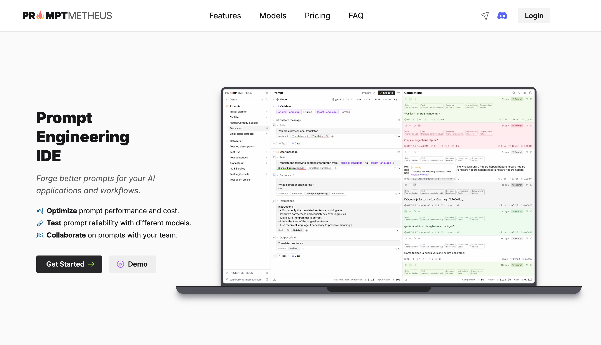

---
tags:
  - AI
  - 人工智能
  - 提示词
  - Prompt
  - LLM
categories:
  - AI 人工智能
  - AI 领域应用
title: 开发工具
---
# 开发工具

Promptmetheus · Prompt Engineering IDE
https://promptmetheus.com/

promptslab/Promptify: Prompt Engineering | Prompt Versioning | Use GPT or other prompt based models to get structured output. Join our discord for Prompt-Engineering, LLMs and other latest research
https://github.com/promptslab/Promptify

deepset-ai/haystack: :mag: LLM orchestration framework to build customizable, production-ready LLM applications. Connect components (models, vector DBs, file converters) to pipelines or agents that can interact with your data. With advanced retrieval methods, it's best suited for building RAG, question answering, semantic search or conversational agent chatbots.
https://github.com/deepset-ai/haystack

<Citation type="转载" source="Nólëbase" url="https://nolebase.ayaka.io/zh-CN/%E7%AC%94%E8%AE%B0/%F0%9F%9B%A0%EF%B8%8F%20%E5%BC%80%E5%8F%91/%E2%99%A6%EF%B8%8F%20%E5%8C%BA%E5%9D%97%E9%93%BE/Polygon/%E5%BC%80%E5%8F%91%E5%B7%A5%E5%85%B7.html" />
